# Omi v4 Architecture

*Generated from a read-only pass over the repository on 2026-07-22. Every claim below is grounded in code under `app/`, `worker/`, and `PLAN.md`; file paths are cited inline so each statement is checkable against the source. This describes what exists in the repository right now, not the eventual product vision.*

## 1. Product summary

Omi v4 is a cross-platform personal assistant ("second brain") built as a single Flutter application (macOS, Windows, iOS, Android, web) backed by two service layers: an embedded Rust runtime (`app/native/hub`, a Rinf-bridged crate nicknamed "the hub") that owns the assistant chat session, live speech-to-text, personal memory, and desktop computer-use; and a Cloudflare Worker (`worker/`, Bun/Hono/TypeScript) that owns authentication verification, D1-backed persistence, Stripe billing, and channel delivery (Telegram/Blooio). The user's Firebase UID is the single tenant key threaded through both the Rust hub's `zkr` memory engine and the Worker's D1 schema. The product's core loop is: capture (voice, screen, workspace scan, messages) → store as evidenced memory in `zkr` → converse with an LLM-backed assistant that can cite that memory and, on desktop, request approved computer-use actions → surface proactive "Currents" recommendations back into the same chat surface.

## 2. Top-level system diagram

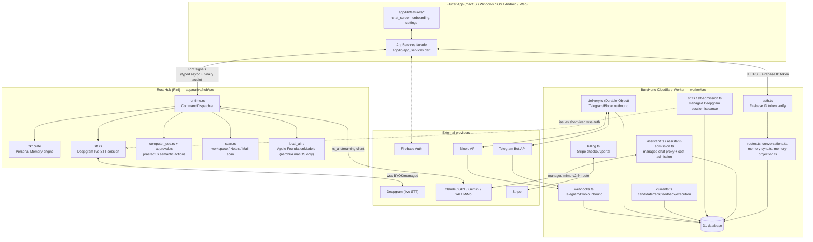

The Flutter app is the only UI surface. It talks to the Rust hub in-process via Rinf's generated typed signal channel (`app/native/hub/src/signals.rs`, `app/lib/native/native_hub.dart`) and to the Worker over HTTPS with a bearer Firebase ID token (`app/lib/api/worker_http.dart`, enforced by `worker/src/auth.ts`). `zkr` (external crate `zkr = "0.3.0"`, see `app/native/hub/Cargo.toml`) is the memory engine living inside the hub process, not a separate service — the Worker never touches raw memory storage directly; it only reads a D1 *projection* of memory used for chat context and Currents generation (`worker/src/memory-projection.ts`, `worker/src/memory-sync.ts`).

## 3. Per-capability sections

### 3.1 Authentication

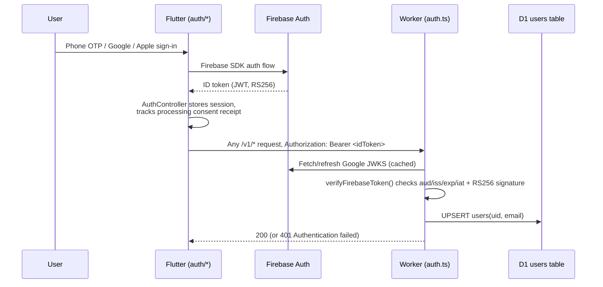

Firebase phone OTP is primary, Google/Apple OAuth optional per `PLAN.md`. The Worker verifies every request itself (`worker/src/auth.ts`): it fetches Google's Firebase JWKS, validates `aud`, `iss`, `exp`/`iat` clock skew, and the RS256 signature via WebCrypto before trusting the `uid` claim — there is no library dependency, it's hand-rolled JWT verification. `requireAuth` gates every route under `/v1/*` except `/v1/webhooks` and `/v1/auth/desktop` (`worker/src/index.ts`). Processing consent is a separate, versioned receipt bound to the Firebase UID and enabled scopes (`app/lib/auth/consent_store.dart`, `PLAN.md` "Onboarding") — authentication alone does not authorize memory/screen/audio/channel processing. Desktop-specific browser-handoff sign-in for macOS/Windows lives in `app/lib/auth/desktop_auth_handoff.dart` and `worker/src/desktop-auth.ts`. **Status**: implemented and wired end-to-end; requires real Firebase project credentials to run live (`PLAN.md` "Known constraints").

### 3.2 Personal Memory (zkr)

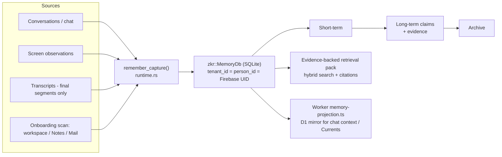

Memory lives entirely inside the Rust hub via the `zkr` crate (`zkr = "0.3.0"` in `app/native/hub/Cargo.toml`), opened per-user as a local SQLite file at a path keyed by a SHA-256 hash of the Firebase UID (`app/lib/app_services.dart::_defaultMemoryDatabasePath`). `runtime.rs::configure_memory` enforces `tenant_id == person_id == <Firebase UID>` before opening the database (`firebase_memory_scope`), and `advance_memory_authority` bumps a configuration generation on every UID change to fence stale in-flight operations. Captures (`capture()` in `runtime.rs`) require non-empty text and a configured memory context; they are written through `zkr::RememberInput` with evidence and, for transcripts, a `TranscriptLocator` (device/provider/stream/segment ids and time range) so every fact traces back to its source. The engine implements the `source -> short_term -> long_term -> archive` lifecycle described in `PLAN.md`, with correction (`correct_memory`), deletion with retraction of derived facts (`delete_memory_source`), export (`export_memory`), and search (`list_memory_items`) all delegated to `zkr` APIs (`MemoryDb`, `CorrectInput`, `DeleteInput`, `SearchInput`, `ProfilesInput`, `ReviewsInput`) rather than reimplemented in the hub. The Worker maintains a separate, rebuildable D1 projection of memory (claims, evidence, profile entries — `worker/src/memory-projection.ts`, `worker/src/memory-sync.ts`) used for Currents generation and chat context on the Worker side, but D1 is not the memory's source of truth; the local `zkr` database is. **Status**: implemented — `zkr` integration is described as production-audited through 0.3.0 (`PLAN.md`); the `rx4` extraction/ranking crate is currently only used for version reporting, not real extraction, and `rotary` is not yet wired in (`PLAN.md` "Active build checklist").

### 3.3 Chat / assistant

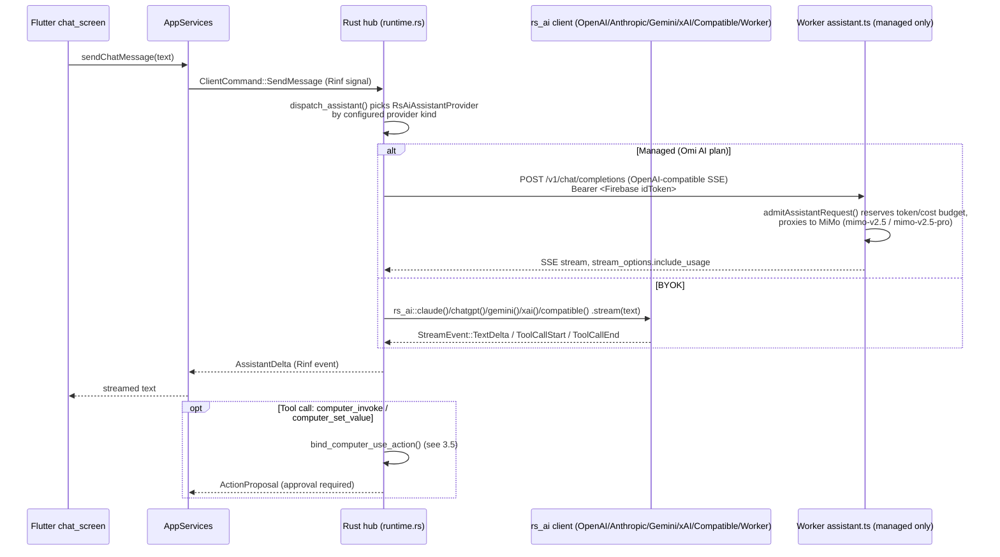

Chat is dispatched through `RsAiAssistantProvider` (`runtime.rs`), which wraps the external `rs_ai` crate's per-provider builders (`rs_ai::chatgpt()`, `claude()`, `gemini()`, `xai()`, or `compatible(endpoint)` for BYOK-compatible/managed-worker routing). Endpoint validation is strict: HTTPS only, no credentials/query/fragment in the URL, no IP literals or localhost, and for the managed "Worker" route the endpoint must resolve to the exact allow-listed Worker origin (`validate_endpoint`, `managed_worker_base`) plus a DNS public-IP preflight (`endpoint_resolves_publicly`) before every dispatch. `AppServices.configureAssistant` (`app/lib/app_services.dart`) selects BYOK when the user has stored a `ProviderCredential`, else falls back to the managed route using the live Firebase ID token as the bearer credential against the Worker's `/v1` origin, provided the account has an active `pro` entitlement. The Worker's managed endpoint (`worker/src/assistant.ts`) strictly allow-lists request shape (only `messages/model/stream/max_tokens/temperature/top_p/stream_options`), enforces per-request/message byte and token ceilings, proxies only to Xiaomi's `mimo-v2.5*` chat-completions endpoint, and wraps every request in an admission/settlement cost-reservation pass (`assistant-admission.ts`) so a UID's rolling spend is reserved before the call and reconciled after (including a scheduled reconciliation sweep, `reconcileManagedAssistantRequests`, wired into the Worker's `scheduled()` handler in `worker/src/index.ts`). When computer-use is available and enabled, the assistant is given two tool schemas (`computer_invoke`, `computer_set_value`) and any tool call becomes an `ActionProposal` requiring user approval (section 3.5) rather than being auto-executed. **Status**: implemented for both managed and BYOK routing and streaming; requires real provider/Firebase/Worker credentials for a live end-to-end run.

### 3.4 Live voice / STT

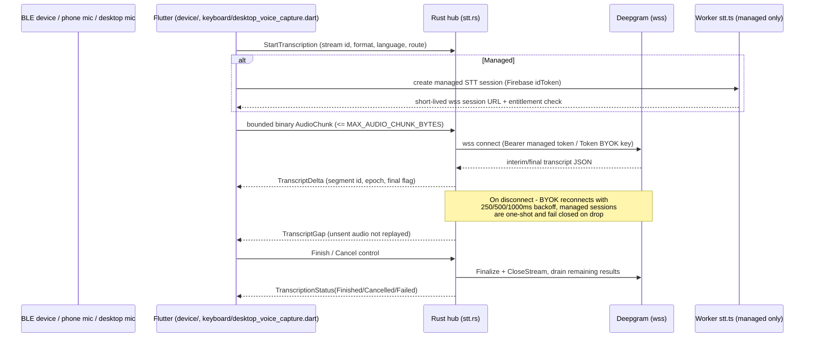

Deepgram Nova-3 is the only implemented live STT provider (`stt.rs`); local STT is a typed `SttError::Unavailable`/`TranscriptionAuth::Local` path that fails closed, exactly as `PLAN.md` states, until a real local provider exists. Managed sessions get a `wss://` URL pinned to the trusted Worker origin with a strict path shape check (`v1/stt/sessions/<64-hex>/stream`) and are marked non-reconnectable (`reconnectable: false`) — losing that socket ends the session rather than silently reusing a stale credential. BYOK sessions connect directly to `api.deepgram.com/v1/listen` with the user's own API key and *are* reconnectable, using bounded 250/500/1000 ms backoff (`recover()`), a 64 KiB pending-audio ceiling enforced by an atomic counter (`SttHandle::send_audio`), and an explicit `TranscriptGap` event on any dropped span since already-sent audio is never replayed. Every transcript segment carries a stable `segment_id` of the form `{stream}:epoch:{n}:segment:{m}`, a monotonic STT epoch that increments on reconnect, and a final/interim flag; only final segments are captured into `zkr` (`transcription.rs`/`runtime.rs` capture path). PCM8 is upsampled to 16-bit little-endian before being sent (`encode_audio`). The desktop both-Shift gesture (`app/lib/keyboard/shift_gesture.dart`, `desktop_gesture_controller.dart`, `desktop_voice_capture.dart`) drives `AppServices.startDesktopVoice/continueDesktopVoice/stopDesktopVoice`, which requests microphone permission, mints a managed transcription auth via the Worker, and fences the whole flow against Firebase-account/authority-generation changes mid-flight. Mobile capture is BLE-relayed through `app/lib/device/` (`UniversalBleDeviceRelayAdapter`), decoupled from Rust except for the bounded audio-chunk signal path. **Status**: architecture and unit-tested logic are complete; `PLAN.md` explicitly still requires credentialed live-provider proof and physical-device stress testing (both mobile Omi hardware and desktop Windows/macOS shortcuts).

### 3.5 Computer use (praefectus)

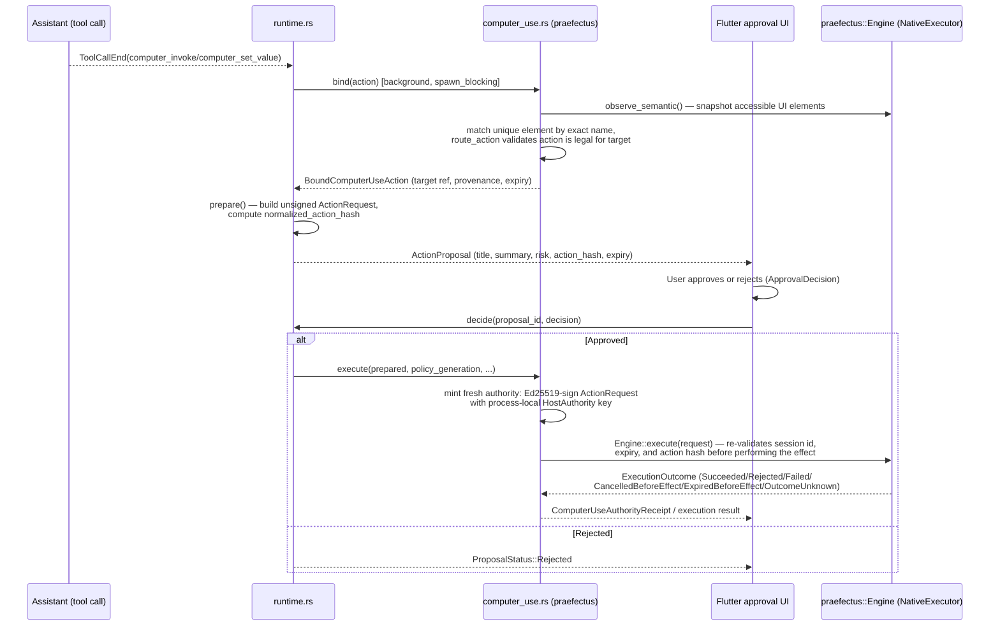

Computer use is delegated to the external `praefectus` crate (pinned `=0.3.0`), which only compiles for macOS/Windows/Linux desktop targets and only when the `computer-use` Cargo feature is enabled (default on) — iOS/Android/web never link it (`Cargo.toml`, `PLAN.md`). The flow is strictly two-phase: `bind()` takes a semantic snapshot of the UI (`observe_semantic`), finds the *unique* element matching an exact target name, and validates the requested action is routable against it — ambiguous or missing targets fail closed. `prepare()` then builds an unsigned `ActionRequest` and its `normalized_action_hash`, which becomes the identity clients approve against; nothing is signed yet. Only after explicit user approval (`approval.rs::ProposalRegistry::decide`, keyed by UID + authority generation, with capacity bounds of 64 pending / 256 terminal proposals and TTL-based expiry) does `execute()` mint a fresh Ed25519 signature over the now-finalized `ActionRequest` using a process-local, randomly generated signing key (`host_authority()`, never persisted, never leaves the process) and re-verify the session id, deadline, and action hash haven't drifted since binding. `praefectus::Engine` then performs the actual OS-level effect and returns a typed terminal outcome that is written to an append-only ledger under the memory database's directory (`computer_use_ledger_path`). Every action is one of two typed variants: `Invoke` (click/activate a named element) or `SetValue` (set a named editable element's value), both size- and name-bounded. **Status**: implemented with full unit-test coverage of the authority/approval state machine; `PLAN.md` flags that Windows' `rs_peekaboo` UI-Automation path and physical-device/OS proof are still outstanding, and macOS requires the Accessibility TCC grant to actually observe/act.

### 3.6 Currents / recommendations

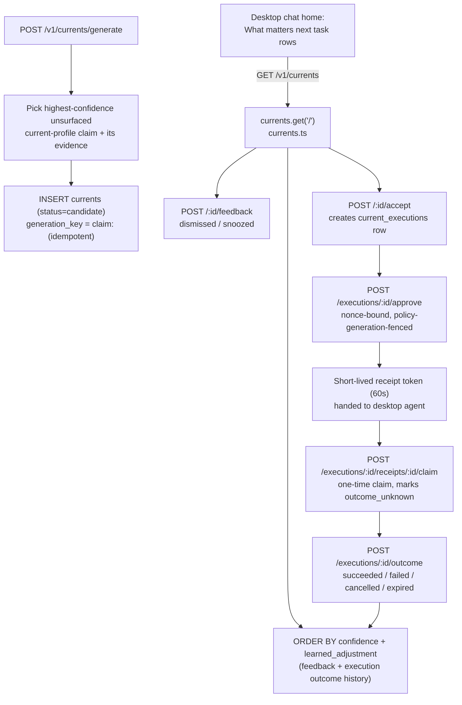

Currents are entirely Worker/D1-side (`worker/src/currents.ts`), generated from the Worker's D1 projection of `zkr` memory (`ensureZkrMemoryProjected` runs before every Currents request). `POST /generate` picks the single highest-confidence, not-yet-surfaced `current`-profile claim with supporting evidence and inserts one idempotent candidate row keyed by `claim:<claimId>` — calling it twice returns the same row rather than duplicating. Listing (`GET /`) lazily transitions `candidate → surfaced` and `snoozed → surfaced` based on wall-clock timestamps, and ranks by stored confidence plus a `learned_adjustment` computed from the *same source kind's* prior feedback (dismiss/snooze penalties) and prior execution outcomes (success bonus, failure/unknown penalty) — this is the "feedback changes future ranking" mechanism from `PLAN.md`. Accepting a Current creates a `current_executions` row in `awaiting_approval` state bound to a random nonce and the account's current settings `policy_generation`; approval exchanges the nonce for a short-lived (60s) signed receipt token that only the legitimate holder can claim once, transitioning the execution to `outcome_unknown` until an explicit `succeeded/failed/cancelled_before_effect/expired_before_effect` outcome is reported — this ties a Current's approved action to the same praefectus-style claim/receipt discipline used for computer use, just orchestrated over HTTP instead of process-local signing. `PLAN.md` confirms this surfaces directly in the desktop chat home as "What matters next" task rows rather than a separate screen (`app/lib/currents/`, `app/lib/features/currents_screen.dart` if present). **Status**: implemented end-to-end for a single idempotent cited recommendation per load; nightly Daily Review batch generation and cross-Current reflection are explicitly not wired yet (`PLAN.md` "Known constraints").

### 3.7 Onboarding

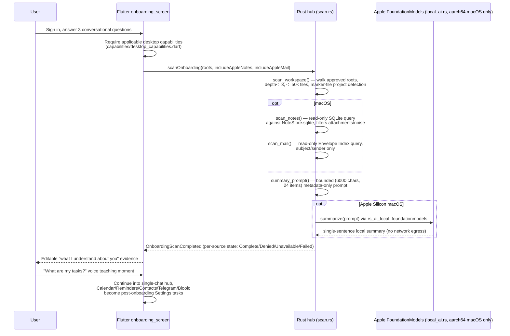

Onboarding scanning is native and read-only (`scan.rs`): workspace scanning walks only explicitly-approved absolute roots (rejecting relative paths or `..` components), skips VCS/build/dependency directories, and only records file counts and detected project names via known manifest markers (`Cargo.toml`, `package.json`, `pubspec.yaml`, etc.) — file contents are never read or transmitted, verified by an inline test (`workspace_keeps_metadata_not_contents`). On macOS only, `scan_notes()` and `scan_mail()` open the platform's Notes/Mail SQLite databases read-only (`SQLITE_OPEN_READ_ONLY`), detect Full-Disk-Access denial vs. absence, and filter out attachment/scan artifacts using upstream-derived heuristics. All scan results feed a strictly bounded prompt (`summary_prompt`: max 6,000 chars, 24 items, 400 chars/item) that is metadata-only and never invents facts. Where available (Apple Silicon macOS, gated by `#[cfg(all(target_os = "macos", target_arch = "aarch64"))]`), a local Apple FoundationModels model (`rs_ai_local` dependency) can turn that into a private on-device one-sentence summary with no network call at all; everywhere else `local_ai::summarize` returns `None`. `AppServices.scanOnboardingSources` (`app/lib/app_services.dart`) requires native initialization and reads the approved workspace root from `PlatformDesktopCapabilityGateway` before invoking the scan. Onboarding is gated by platform capability states (`unsupported/notApplicable/unknown/notDetermined/denied/requiresSettings/requiresSelection/limited/granted`, `app/lib/capabilities/desktop_capabilities.dart`) rather than plain booleans. **Status**: scan logic and local summarization are implemented and unit-tested; end-to-end onboarding flow rendering/accessibility across platforms is still flagged unverified in `PLAN.md`.

### 3.8 Channels (Telegram / Blooio)

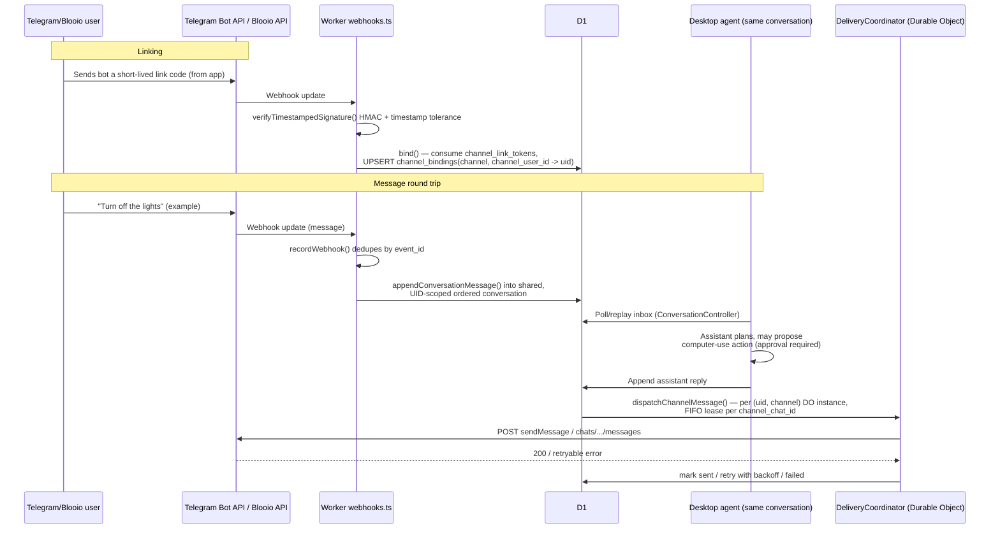

Both channels are server-side-only integrations for this pass (`PLAN.md`): the app never holds Telegram/Blooio credentials. `worker/src/webhooks.ts` verifies inbound authenticity via timestamped HMAC signatures with a 300-second tolerance window and constant-time comparison, deduplicates by `(channel, event_id)` (`webhook_events` table), and links a channel identity to a Firebase UID only via a short-lived, hashed, single-use link token consumed atomically alongside an audit-event insert (`bind()`). Inbound messages are appended into the same UID-scoped ordered conversation transport used by the app/web/desktop clients (`appendConversationMessage`, shared with `worker/src/conversations.ts`), so a Telegram or iMessage/Blooio message becomes an ordinary turn the desktop agent picks up — including the ability to trigger an audited computer-use action under the same approval policy (section 3.5). Outbound delivery is serialized per `(uid, channel)` through a Durable Object (`DeliveryCoordinator`), which claims one delivery row at a time per `channel_chat_id` (FIFO via a "no older pending/delivering row" guard), computes a stable idempotency key for Blooio, respects provider `retry-after`, and marks Telegram failures as a genuinely ambiguous `"unknown"` state on network errors (since the message may have actually sent) rather than blindly retrying. A scheduled Worker cron (`worker/src/index.ts` → `deliverDueChannelMessages`) sweeps due/retryable deliveries and cancels orphaned deliveries against revoked bindings. **Status**: linking, ingestion, ordered leases, and delivery retry logic are implemented and unit-level correct; `PLAN.md` states real provider credentials and a continuously connected desktop client for a live round trip are still unproven.

### 3.9 Billing

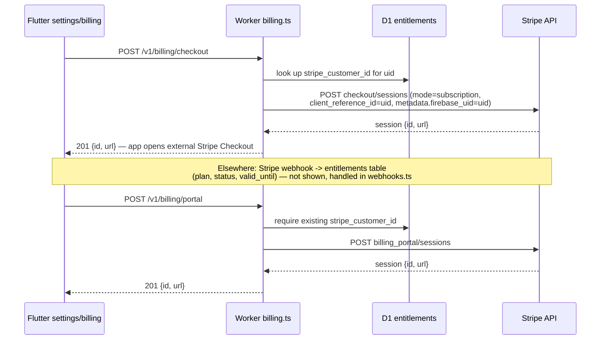

Two plans exist per `PLAN.md`: **Omi** (no managed inference — BYOK/local models only, Omi never pays the user's inference bill) and **Omi AI** (adds managed MiMo chat/ASR quotas, Stripe-gated). `worker/src/billing.ts` only opens Stripe Checkout/Billing-Portal sessions and immediately hands the URL back to the client for an external redirect — it never touches card data (`PLAN.md`'s Stripe webhook state, referenced but not read here, is what actually flips `entitlements.plan/status`). Every managed route (`assistant.ts`, `stt.ts`) re-checks `entitlements.plan === 'pro' && status === 'active'` (and non-expired `valid_until`) on every call — the plan is not cached client-side as authoritative. `AppServices._configureSelectedAssistant` (`app/lib/app_services.dart`) only configures the managed assistant route when a BYOK credential is absent *and* the account's entitlement is a currently-active `pro` plan, mirroring the server-side check. Managed cost accounting (`assistant.ts`, `assistant-admission.ts`) reserves a conservative cost/token budget before every managed call and settles it against the requested-vs-actual token usage, using published MiMo and Deepgram list pricing with fixed micro-USD-per-million-token Worker configuration that fails closed if unset or invalid (`PLAN.md` "Models and cost policy"). **Status**: implemented; requires a live Stripe account/webhook and the entitlements table populated by that webhook (not reviewed in this pass) to exercise for real.

### 3.10 macOS platform integration

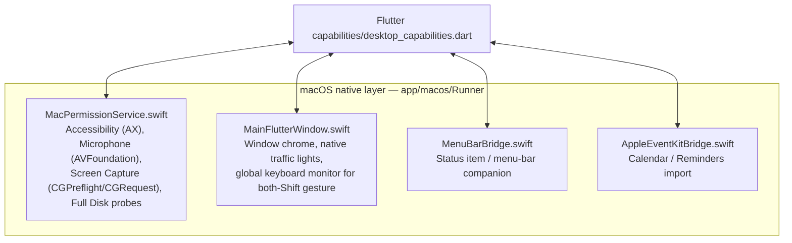

`MacPermissionService.swift` exposes raw TCC state (`AXIsProcessTrusted` for Accessibility, `AVCaptureDevice.authorizationStatus` for microphone, `CGPreflightScreenCaptureAccess`/`CGRequestScreenCaptureAccess` for screen capture) plus heuristic Full-Disk-Access probes (attempting to stat `TCC.db` and the Notes container, classifying `NSFileReadNoSuchFileError` as "absent" vs. anything else as "denied"). It also opens System Settings privacy panes directly (`x-apple.systempreferences:` URLs) for Accessibility/Microphone/Screen-Capture/All-Files. This is consumed on the Dart side by `app/lib/capabilities/desktop_capabilities.dart`, which maps raw state into the typed capability lattice described in `PLAN.md` (`unsupported/notApplicable/unknown/notDetermined/denied/requiresSettings/requiresSelection/limited/granted`). `MainFlutterWindow.swift` (442 lines) hosts window chrome — native traffic-light controls for the normal titled hub window, plus a global keyboard event monitor that reports physical left/right Shift key transitions to Flutter for the both-Shift gesture state machine (`app/lib/keyboard/shift_gesture.dart`). `MenuBarBridge.swift` implements the menu-bar status item companion referenced in `PLAN.md` as surfacing the single most important current task plus capture/listening state. `AppleEventKitBridge.swift` bridges Calendar/Reminders access for the EventKit-backed setup tasks (`app/lib/integrations/apple_eventkit.dart`, `apple_eventkit_import.dart`), importing bounded evidence into `zkr` per `PLAN.md`. **Status**: implemented; macOS v0 ships notarized, non-sandboxed direct distribution (broad workspace discovery is incompatible with App Sandbox scope, per `PLAN.md`), and Windows equivalents use different mechanisms (UI Automation, privacy-aware mic access, per-session capture selection) not reviewed in this pass.

## 4. Data / tenancy diagram

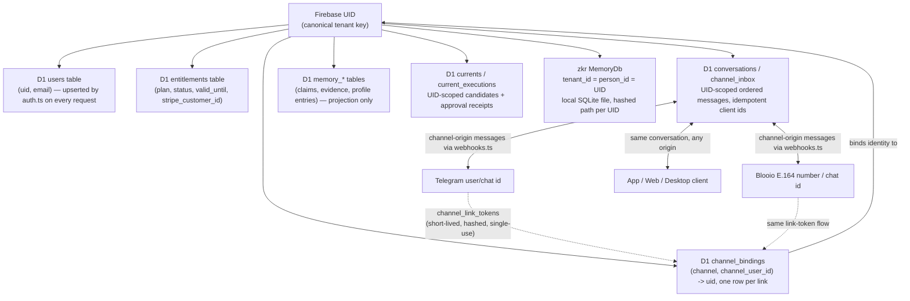

The Firebase UID is the sole tenant key on both sides of the system. On the Worker/D1 side, every table that stores user data is scoped by `uid` (`users`, `entitlements`, conversations, `channel_bindings`, `currents`/`current_executions`, memory projection tables) and nearly every query in `worker/src/*.ts` includes an explicit `uid = ?` predicate. On the Rust hub side, `zkr`'s `TenantId` and `PersonId` are both required to equal the same Firebase UID (`firebase_memory_scope` in `runtime.rs`) — there is intentionally no separate tenant/person split in v0. Channel identity (Telegram user/chat id, Blooio E.164/chat id) is mapped to a UID only through a consumed, hashed, single-use link token (`channel_link_tokens` → `channel_bindings`), never by trusting a channel-supplied identity claim directly. This is also how "same account links mobile, desktop, web, Telegram, and Blooio to one Firebase UID and assistant session" (`PLAN.md` v0 acceptance §1) is enforced structurally rather than just by convention.

## 5. Known gaps / proof still required

Directly from `PLAN.md`'s "Active build checklist," "Current release train," and "Known constraints," corroborated by the code read in this pass:

- **No credentialed live-provider proof yet.** Deepgram (managed/BYOK), Firebase, Stripe, Telegram, Blooio, and the model routes are all implemented against real protocols but have not been exercised against live provider credentials in this repository state.
- **No physical-device proof.** Omi BLE hardware capture, iOS/Android transcription lifecycle, and macOS/Windows both-Shift gesture timing are implemented but only unit/logic-tested, not run against real hardware or OS input.
- **`rx4` and `rotary` are not yet real extraction/ranking engines** in the hub — `rx4` usage is currently limited to version reporting; `rotary` integration has not started.
- **Local STT does not exist.** `TranscriptionAuth::Local` and `SttError::Unavailable` are deliberate fail-closed stand-ins until a real local STT provider (`rs_ai_local` or similar) is integrated; MiMo remains batch-only ASR.
- **Nightly Daily Review orchestration is unwired.** Currents currently only supports a single idempotent cited recommendation generated on demand when the surface loads — no scheduled nightly reflection cycle exists yet.
- **Windows computer-use (`rs_peekaboo`/UI Automation) and cross-platform release-build proof are outstanding**, per `PLAN.md`'s test-day checklist; this review did not inspect any Windows-specific native code.
- **Cloudflare bindings/secrets are still placeholders** in the reference backend; deployment proof (real D1/Stripe/Telegram/Blooio credentials in a live preview environment) has not happened.
- **Some source files referenced in the task (`chat_screen.dart`, `omi_shell.dart`, `setup_account_screens.dart`, `onboarding_screen.dart`) were noted as possibly mid-edit by concurrent sessions** and were not deep-read for this document; their described behavior above is inferred from `AppServices` and `PLAN.md` rather than from reading those UI files directly.
