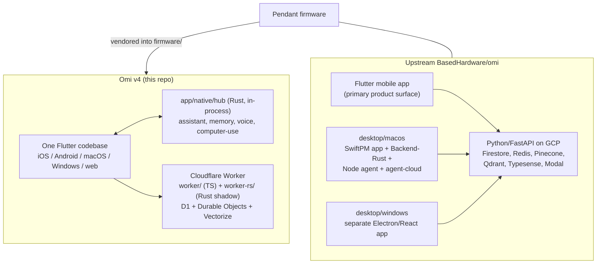

# Omi v4 compared with upstream Omi

*This document owns every comparison between this repository and the upstream `BasedHardware/omi` monorepo. The architecture documents ([`ARCHITECTURE.md`](ARCHITECTURE.md), [`app/ARCHITECTURE-mobile.md`](app/ARCHITECTURE-mobile.md), [`app/ARCHITECTURE-desktop.md`](app/ARCHITECTURE-desktop.md)) describe how this system is built and make no comparative claims; all of that lives here.*

*Method and limits: "upstream" means the `BasedHardware/omi` checkout read at `~/projects/omi`. Everything below is a statement about which code exists in which tree, read from files. Nothing here has been measured. No claim is made — in either direction — about stability, reliability, latency, cost, crash rate, transcription quality, or UI quality, because this repository contains no benchmark or field data against upstream. Surface area is not capability, and a smaller tree is not automatically a better one.*

*The relationship is not a fork. This repository shares the pendant hardware and the product concept; the app and backend are independently implemented. The one directly inherited component is the pendant firmware, vendored from upstream into `firmware/` (see [`firmware/PROVENANCE.md`](firmware/PROVENANCE.md)).*

---

## 1. Shape of the two codebases

| Area | Upstream | Omi v4 (this repo) |
| --- | --- | --- |
| Client apps | Flutter app (~593 Dart files under `app/lib`) plus a separate native desktop product (`desktop/macos`: a SwiftPM package, a `Backend-Rust` service, `agent/`, `agent-cloud/`, `acp-bridge/`; `desktop/windows`: an Electron/React app) | One Flutter codebase (173 Dart files under `app/lib`, 100 excluding generated Rinf/serde codecs) serving iOS, Android, macOS, Windows, and web, plus an embedded Rust hub (`app/native/hub/src`, 21 modules) and a macOS Runner (`app/macos/Runner`, 10 Swift files) |
| Backend | Python/FastAPI on GCP — Firestore, Cloud Storage, Cloud Tasks, Redis, Pinecone *and* Qdrant for vectors, Typesense for search, SQLAlchemy, Modal jobs; provisioned with OpenTofu (`backend/`, `infrastructure/`) | Cloudflare Workers — `worker/` (TypeScript/Hono/Bun) with `worker-rs/` (a Rust/workers-rs parity port, shadow-deployed); D1 for relational data, Durable Objects for coordination, Vectorize for embeddings, Workers AI for embedding generation |
| Auth | Firebase Auth | Firebase Auth, verified at the edge by hand-rolled JWT/JWKS checks (`worker/src/auth.ts`) |
| Memory | Vector stores (Pinecone/Qdrant) behind backend services | `zkr` evidence-backed temporal memory in-process on the client, projected to D1/Vectorize for cloud recall |
| Firmware | `omi/firmware` — production `omi/` plus legacy `devkit/` and `test/` variants | `firmware/` — the production tree vendored, with `devkit/` and `test/` included; see [`firmware/COMPARISON.md`](firmware/COMPARISON.md) |
| Also in tree | `omiGlass`, a plugins/apps ecosystem, MCP servers, SDKs, contract tests | none of these |

## 2. Mobile

Upstream's phone app is the primary product surface (bottom nav across conversations, chat, memories, apps). Ours is a companion: the phone is the pendant's modem and status panel, and the mobile home points the user at the desktop app. That is the ownership split fixed in `PLAN.md`, which is why the items below are absent by construction rather than unfinished.

### 2.1 What we deliberately skip

Each item was verified present upstream under `~/projects/omi/app/lib` and absent here by searching `app/lib`.

**Device breadth**
- **Nine other device integrations** — Apple Watch, Bee, Fieldy, Friend pendant, Limitless, Plaud, Ray-Ban Meta, OmiGlass, and a generic "custom" connector (`services/devices/connectors/`). We support exactly one device: the Omi pendant over `universal_ble`.
- **Button characteristic and voice-command sessions** — upstream binds `23ba7924-…` and implements press/long-press-to-talk.
- **Image/photo capture** (`19b10005`/`19b10006`) with a photos grid and viewer.
- **SD-card and flash-page storage sync** — the storage service (`30295780-…`) plus `pages/sdcard/` and `services/wals/{sdcard_wal_sync,flash_page_wal_sync,ring_storage_sync}.dart`.
- **Accelerometer** (`32403790-…`), **time sync** (`19b10030-…`), and the remaining settings characteristics (dim ratio, mic gain, charging status). The Device Information service (`180a`) and the capture-LED/sleep/rename characteristics *are* implemented here.

**Capture reliability**
- **A write-ahead log for offline audio** — upstream's `services/wals/` is a full WAL with a status machine, four storage tiers, a sync reconciler, rate limiter and retry ceiling. We buffer at most 8 frames in memory and abort the session on any gap.
- **Background execution** — `flutter_background_service`, `flutter_foreground_task`, `NativeMicRecorderService`. We have no foreground or background service.
- **Phone microphone as an audio source** — `services/audio_sources/phone_mic_source.dart`, `services/mic/mic_arbiter.dart`. Our mobile app has no mic capture at all, and correspondingly declares no `NSMicrophoneUsageDescription` and no `RECORD_AUDIO`.
- **On-device STT** — upstream ships a Whisper provider and an Apple on-device provider. Ours is a typed fail-closed stub.

**Product surface**
- Apps/plugins ecosystem, speech profiles and diarization onboarding, the conversations UI (list/detail/folders/audio player/geolocation), chat on mobile, action items and goals and daily summaries and knowledge graph and "Wrapped" and referrals, third-party task/health integrations (Asana, ClickUp, Todoist, Google Tasks/Calendar, Apple Health), in-app payments and creator payouts, phone calls, push notifications, ~40 locales of localization, ~40 settings pages, analytics/crash/support SDKs (PostHog, Intercom, Crashlytics), home-screen widgets and an Apple Watch companion.

Ours: one pendant page, a five-stage onboarding, a settings bottom sheet with six tiles, hard-coded English strings.

### 2.2 What we do differently

- **Transcription runs through an in-process Rust hub, not a socket to our own backend.** Upstream streams headerless packets to `<api>/v4/listen` and lets the backend do STT, VAD, diarization and conversation segmentation. We hand frames to `app/native/hub` over Rinf and the hub speaks to the STT provider directly. Consequence: our Worker never sees raw audio on the live path, and the same hub code serves desktop capture — but we inherit none of upstream's server-side conversation intelligence.
- **The phone reassembles fragments; upstream forwards packets.** Upstream's `BleDeviceSource.processBytes` strips the 3-byte header and sends one payload per BLE packet. We concatenate fragments into whole frames and assert continuity twice before anything is sent. Whether upstream reconstructs frames server-side was not read.
- **Memory is local-first.** Final transcript segments are captured into a per-UID `zkr` SQLite database on the device and only then projected to D1. Upstream's conversations and memories are server-owned records fetched over HTTP.
- **Fail-closed where upstream degrades gracefully.** Unknown codec: we throw, upstream assumes PCM8. Packet discontinuity: we end the session with a typed gap, upstream keeps streaming and lets the WAL cope. Local STT: we return a typed unavailable error rather than falling back to Whisper.
- **State management.** Upstream uses `provider` with ~30 `ChangeNotifier`s; ours is one `AppServices` facade plus widget state and a few `ValueNotifier`s. A direct consequence of surface size, not a claim about either approach.

### 2.3 Upstream mobile capabilities worth evaluating

Inclusion is not a commitment. Phases refer to `docs/mobile-companion-app.md`.

| Capability | Upstream reference | Assessment here |
|---|---|---|
| Offline write-ahead log for captured audio | `services/wals/` | **Worth adopting in reduced form.** Today one dropped packet loses the audio in flight. A bounded on-disk ring plus idempotent batch upload to `/v1/asr/transcribe` buys real durability; four storage tiers do not obviously earn their complexity at our scope. Phase 4. |
| Background execution | `flutter_background_service`, `flutter_foreground_task` | **Worth adopting.** Without it, "wear it and it captures" is only true while foregrounded. Phase 3. |
| Battery-level notifications rather than a one-shot read | upstream's battery stream | **Adopted.** `_subscribeBattery` subscribes and falls back to the one-shot read. |
| Device Information service (`180a`) reads | `services/devices/models.dart` | **Adopted.** Read on connect, surfaced in settings. |
| Automatic session restart after a transient gap | upstream keeps streaming and defers to the WAL | **Worth evaluating.** Our fail-closed abort is deliberate; the missing half is recovery. Restart should be explicit and gap-recording, never a silent re-splice. |
| Firmware OTA in-app | `nordic_dfu`, `mcumgr_flutter` | **Partly adopted.** `app/lib/device/firmware_dfu.dart` and `app/lib/features/firmware_install.dart` implement an MCUboot/SMP install path; upstream's separate OmiGlass OTA command set has no counterpart. |
| Pendant SD-card / flash-page retrieval | storage service `30295780-…` | **Defer.** Only matters once the pendant records while unpaired; a phone-side WAL covers the common case first. Phase 6. |
| Speech profile / speaker identity | `pages/speech_profile/` | **Blocked, not declined.** Requires diarization our transcription route does not provide. |
| On-device STT | `on_device_whisper_provider.dart`, `on_device_apple_provider.dart` | **Blocked on a provider.** The fail-closed stub is the right placeholder, not the end state. |
| Push notifications | `services/notifications/` | **Evaluate narrowly.** A low-battery or capture-stopped alert is useful; a general notification framework is not obviously warranted for a companion. |
| Localization | ~40 locale bundles | **Evaluate when the surface stabilises.** Extracting a small string set later is cheap; doing it now freezes copy that is still moving. |
| Other device vendors, button/photo/accelerometer, in-app payments, apps ecosystem, conversations UI, integrations breadth | §2.1 | **Out of scope by design** — they belong to a phone-as-primary-surface product. |

## 3. Desktop

### 3.1 What upstream's desktop actually is

Read for this section: `desktop/macos/README.md`, `desktop/macos/AGENTS.md`, `desktop/macos/Backend-Rust/ARCHITECTURE.md`, `desktop/macos/agent/src/ARCHITECTURE.md`, `desktop/macos/Desktop/Sources/FloatingControlBar/ARCHITECTURE.md`, `desktop/macos/e2e/SKILL.md`, `desktop/macos/Desktop/Package.swift`, `desktop/windows/README.md`, `desktop/windows/package.json`.

**macOS** (`desktop/macos/`) is four processes' worth of code in one bundle:

1. **`Desktop/`** — a SwiftPM package ("Omi Computer", macOS 14.0 floor) split into library targets, depending on Firebase, PostHog, Sentry, GRDB, Sparkle, swift-markdown-ui, onnxruntime and FluidAudio. Feature areas include `Rewind/` (continuous screen capture, video chunk encoding, OCR + embeddings, timeline player, retention, search), `FloatingControlBar/` (~50 files), `ProactiveAssistants/`, `LiveNotes/`, `FileIndexing/` with a knowledge graph, a desktop `Bluetooth/` stack, `SpatialOverlay/`, `Chat/`, a 24-step `Onboarding/`, `Automation/`, Gmail/Calendar/Notes reader services, `LocalTranscriptionService`, `SystemAudioCaptureService`, Sparkle updater, tier and trial UI.
2. **`Backend-Rust/`** — a deployed Rust control and provider-proxy plane (Firestore + Redis): auth, provider proxies, realtime session minting, desktop chat, TTS, screen-activity ingestion, release manifests, agent VM control.
3. **`agent/`** — a Node/TypeScript agent daemon bundled into the app, owning durable agent identity, execution profiles, routing, run state, physical-tool authorization and a cross-surface conversation journal, speaking a versioned JSONL protocol to Swift. Dependencies include a coding-agent runtime, the Agent Client Protocol, and Playwright MCP.
4. **`agent-cloud/`** — a separate Node service for cloud/VM-side agent runs, plus `acp-bridge/` and a `pi-mono-extension/` that registers "omi" as an OpenAI-compatible provider with a shell denylist and an audit log.

Around that: a Codemagic-signed, notarized DMG + Sparkle ZIP pipeline with a qualification runner and beta/stable pointers, an in-app HTTP automation bridge (`omi-ctl`), and a tiered E2E harness.

**Windows** (`desktop/windows/`) is a separate Electron + React + TypeScript application with its own overlay, rewind, file index, insight, memory export/import, Google OAuth integrations, and a C# UI-Automation helper. It shares Omi's Firebase project but is otherwise an independent codebase from the macOS app.

### 3.2 What we deliberately skip

- **Continuous screen recording ("Rewind").** We have no screen-recording, OCR, video store, or timeline subsystem. Our screen-derived context is the `CaptureSource::Screen` capture path and computer-use's semantic accessibility snapshots.
- **A bundled agent runtime.** No embedded coding-agent runtime, no ACP, no Playwright/MCP tool surface, no background agent sessions, no agent VM control. Our action surface is exactly two typed `praefectus` verbs.
- **On-device speech-to-text.** Upstream runs Parakeet TDT via FluidAudio/CoreML with diarization and a music gate. Ours is a deliberate fail-closed stub; all STT is remote.
- **Auto-update and a release channel system.** No updater in `app/macos`, no appcast, no beta/stable channels. Desktop releases are built by `.github/workflows/release-desktop.yml` and distributed manually.
- **Product telemetry and crash reporting.** No PostHog, Sentry, or analytics SDK anywhere in `app/`. `docs/ai-and-observability.md` records that the no-client-telemetry constraint has been lifted and that Sentry on the worker and the Flutter client is a decided but unwired next step; today nothing is wired.
- **Desktop BLE.** Upstream has a full desktop Bluetooth stack. Ours is mobile-owned by explicit decision in `PLAN.md`.
- **Proactive on-screen assistants.** Upstream runs a coordinator over Focus/Goals/Insight/TaskExtraction assistants against captured frames. Our proactive layer is Currents (generated Worker-side) plus `daily_review.rs`.
- **Cloud connectors.** Upstream has Gmail/Calendar/Notes reader services, OAuth flows, and connector form automation. We have EventKit Calendar/Reminders and read-only local Notes/Mail SQLite scans; there is no OAuth connector surface.
- **A file index + knowledge graph.** We scan for bounded evidence and write claims into `zkr`; there is no graph store or graph UI.
- **TTS, Live Notes, spatial overlay, in-app tier/trial UI.** None of these exist here; entitlements are checked server-side with no desktop trial or usage UI.
- **An in-app automation bridge and desktop E2E harness.** No equivalent of `DesktopAutomationBridge` or `omi-ctl`.

### 3.3 What we do differently

- **One Flutter codebase across all platforms vs. two native desktop apps.** Upstream maintains SwiftUI for macOS and a separate Electron/React app for Windows, with independent implementations of overlay, rewind, file indexing and automation. We ship one Dart codebase everywhere and push platform specificity into thin native runners. The cost is visible: our Windows runner is 236 lines and carries far less of the desktop experience, whereas upstream's Windows app covers its own full feature set. The benefit is that chat, gesture, onboarding, settings and task surfaces have exactly one implementation.
- **In-process Rust hub vs. out-of-process agent daemon plus deployed backend.** Upstream's authority lives in a bundled Node kernel that Swift talks to over JSONL, backed by a deployed Rust control plane and a Python product API. Ours lives in a Rinf-linked Rust crate inside the app process with no local IPC and no local server, and the only server-side component is a Cloudflare Worker. Upstream's decomposition gives process isolation, independent restarts, and a natural home for durable multi-run agent state; ours gives a single address space, no subprocess lifecycle, no packaged interpreter, no local port. Different placements of the same responsibilities, with different failure surfaces.
- **Cloudflare Workers + D1 vs. Firebase/Firestore + Redis + Typesense + a deployed Rust service.** We use Firebase strictly for identity; everything else server-side is a Worker over D1, Durable Objects and Vectorize. Both designs put managed inference behind a server proxy for cost control — upstream through its Rust proxy plane, ours through `worker/src/assistant.ts` with per-UID admission and settlement, optionally fronted by a Cloudflare AI Gateway. The storage and runtime substrates differ entirely.
- **Two typed computer-use verbs under a signed approval fence vs. a general tool runtime with a denylist.** Upstream's agent can run shell and browser tools gated by a capability check, an invocation ledger and a regex denylist. We expose only `computer_invoke` and `computer_set_value` against a uniquely-matched accessibility element, and every one requires a fresh user approval before an Ed25519 authority is minted. Upstream's surface is broader and open-ended; ours is narrower and closed.
- **Screen understanding by accessibility snapshot vs. by pixels.** Upstream's context comes substantially from captured frames plus OCR and embeddings. Ours comes from `praefectus`'s semantic accessibility tree plus bounded filesystem/app/browser-domain evidence (`evidence.rs`). Different privacy and reliability trade-offs; neither is strictly dominant.
- **Meeting audio via a CoreAudio process tap in Rust vs. a Swift capture service.** Both capture system audio on macOS; we do it in the hub through `corti-coreaudio` with a two-track WAV, upstream does it in Swift.
- **An env-driven model-tier table vs. per-call model selection.** Our five tiers (speed/balanced/smart/multimodal/search) are declared once and mirrored in three places (`app/native/hub/src/model_tier.rs`, `worker/src/model-tiers.ts`, `worker-rs/src/managed_ai.rs`), and the hub's online router picks a tier per prompt. Upstream selects models inside its provider adapters.
- **Local models are used for small jobs, not for chat.** Both projects run something on-device; the split differs. Upstream's on-device model work is transcription. Ours is the reverse: transcription is entirely remote, while Apple Foundation Models (`local_ai.rs`, macOS arm64 only) handles summarization, onboarding scan summaries, meeting extraction and daily review. Chat itself always goes to the configured cloud provider — the comment in `runtime.rs` records why: the local model refuses too much and has no tool or memory access.

### 3.4 Upstream desktop capabilities worth evaluating

Ordered by how clearly the value exceeds the cost *for this codebase*, not by upstream's investment.

1. **Auto-update.** Upstream: Sparkle plus a signed/notarized pipeline and channel pointers. Buys: the ability to ship a fix to installed users at all. Costs: a signing/notarization pipeline and an appcast host. **This earns its complexity.** Without it every desktop fix requires manual redistribution, and the gap compounds with the absence of crash reporting.
2. **On-device STT.** Upstream: Parakeet TDT via FluidAudio/CoreML. Buys: dictation and meeting transcription with no network egress and no per-minute cost. Costs: a CoreML model lifecycle, a second STT code path, platform gating mirroring `local_ai.rs`. **Strong fit**; the open questions are bundle size and clean degradation on Intel and Windows.
3. **A desktop automation/verification bridge.** Upstream: an in-app HTTP bridge plus typed flows. Buys: the ability to exercise the real desktop app programmatically instead of unit tests plus manual use. Costs: a control surface that must be hard-disabled in production builds. **Worth evaluating**, scoped to navigation and state readout rather than a general action registry.
4. **Cloud connectors (Gmail / Calendar / Drive-class sources).** Buys: evidence that is not confined to one machine — the main structural limit of `evidence.rs`. Costs: OAuth token custody, refresh, revocation, per-provider drift. `PLAN.md` already defers Worker-brokered Google sync until EventKit proves the contract. **The right shape is probably Worker-brokered**, keeping token custody off the device.
5. **Screen capture with OCR ("Rewind").** Buys: recall of anything seen on screen and richer grounding for proactive suggestions. Costs: the single largest subsystem upstream has — a video store, an OCR pipeline, an embedding index, retention policy, capture-health monitoring, continuous CPU/disk load. **Does not obviously earn its complexity here yet.** If pursued, the interesting subset is event-triggered capture (on meeting start, on a proposed action) rather than always-on recording.
6. **A general agent/tool runtime.** Buys: multi-step background work, browser automation, file/shell tools. Costs: a bundled interpreter, a versioned JSONL protocol, a second durable store, and an authorization model at least as strict as the current approval fence. **The capability is attractive; adopting the architecture is not.** Any move here should extend the typed-verb-plus-approval model rather than introduce a second runtime.
7. **Desktop BLE for Omi hardware.** Buys: hardware capture without a phone present. Costs: a second BLE implementation plus its own pairing and connection-health surface. **Revisit only if a desktop-without-phone workflow becomes a real requirement.**
8. **Crash reporting.** Upstream: Sentry, with a rule that raw prompts, paths and titles never leave the device. Buys: knowledge that a shipped build is failing. `docs/ai-and-observability.md` already picks Sentry on both the worker and the client. **Decided but unwired**; if adopted it should carry crash signatures only.
9. **File index / knowledge graph, TTS, Live Notes, spatial overlay, tier and trial UI.** **No clear case for any of them here today.** The graph store overlaps with what `zkr` already models as claims and evidence; the tier/trial UI duplicates a check the Worker already enforces server-side.

## 4. Design properties we are optimizing for

These are properties readable directly from the code in this repository, stated as intent and construction — **not** as benchmark results, and not as comparative quality claims. The bet is *lighter* (fewer moving parts), *steadier* (fewer places state can diverge), and eventually *broader* (one implementation reaching more platforms).

**Lighter.**
- One backend platform: one relational store (D1) plus Durable Objects and Vectorize, rather than a fleet of managed services. Every service removed is a failure mode removed.
- One process on the client. The hub is linked into the app (`app/native/hub/src/lib.rs`, `write_interface!()`): no sidecar daemon, no bundled interpreter, no local port, no subprocess supervision, and no runtime-handshake failure mode.
- One UI implementation per surface, reached from macOS, Windows, iOS, Android and web.
- The whole desktop platform boundary is nine native method channels and two Rinf enums — small enough to enumerate in a table, which is the point.

**Steadier.**
- One memory authority. `zkr`'s `MemoryDb` inside the hub is the single writer of durable personal memory; the Worker holds a rebuildable D1 projection. There is no second durable transcript and no local/remote write race to arbitrate.
- One assistant session. The hub's dispatcher owns the turn; the pill, the chat screen and the menu bar are views onto it.
- Generation fencing used consistently rather than ad hoc: a configuration generation on assistant dispatch, a voice generation counter around desktop and live voice, an authority generation on the approval registry and on memory capture.

**Fail-closed by construction.**
- Computer use binds to a *uniquely* matched accessibility target (ambiguous or missing fails closed), hashes the action for the user to approve against, and only then mints a process-local Ed25519 signature the engine re-verifies.
- Capture policy defaults to `OnlyDuringMeetings`, which requires both a settled state and a confirmed meeting; `Never` never requests system audio.
- Local STT is absent rather than approximated.
- Non-macOS meeting capture returns an explicit error with a test asserting it, rather than silently producing nothing.
- Channel identity binds to a UID only through a hashed, single-use, consumed link token.
- Memory is evidence-backed: every capture carries evidence and, for transcripts, a `TranscriptLocator`.

**Bounded inputs.** Every collector in `evidence.rs` and `scan.rs` has a named numeric cap, credential-shaped shell commands and sensitive URLs are filtered before prompting, and the wire paths are bounded too (`MAX_AUDIO_CHUNK_BYTES` on the Rinf audio signal, 256 KiB pending audio and a 64-event queue in `live_voice.rs`, 16 KiB values and 1 KiB target names in `computer_use.rs`).

**Enforced gates.** `app/native/hub/Cargo.toml` sets `unsafe_code = "forbid"` and denies `clippy::all`, `unwrap_used`, `expect_used` and `wildcard_imports` crate-wide — a compile-time property, not a review convention. Format, lint, typecheck and full test suites run across Flutter, Rust and the Worker in CI.

**No client telemetry today.** No PostHog, Sentry, Intercom or analytics SDK anywhere in `app/`. For a device that records ambient conversation, "there is no third-party telemetry in the binary" is a property a reader can check. The direct trade-off is that we also cannot observe field failures; `docs/ai-and-observability.md` records that the constraint has been lifted and that client error reporting is a decided, unwired next step.

**Test weight where the lifecycle has to hold.** `app/test/device/device_audio_forwarder_test.dart` covers packet-id rollover, queue saturation, concurrent start/stop, EOS-vs-stop exclusivity and reconnect resume; the mobile companion and onboarding suites cover those surfaces widget-level.

Claims deliberately **not** made: startup time, memory footprint, latency, battery, reliability, crash rate, transcription quality, BLE connection quality, or UI quality. None were measured. Security is asserted only as a structural property — a narrow, approval-fenced surface — not as an audited outcome.

## 5. Where upstream is ahead

Tracked as gaps to close or consciously decline, not as a scoreboard: the mobile feature surface (§2.1), the plugin/app extension model, translation and diarization, on-device STT, auto-update and crash reporting, screen recall, additional hardware such as `omiGlass`, and published SDK/MCP integration points. Each should be evaluated on whether it earns its complexity here before being adopted; §2.3 and §3.4 are that evaluation for the surfaces reviewed so far.
