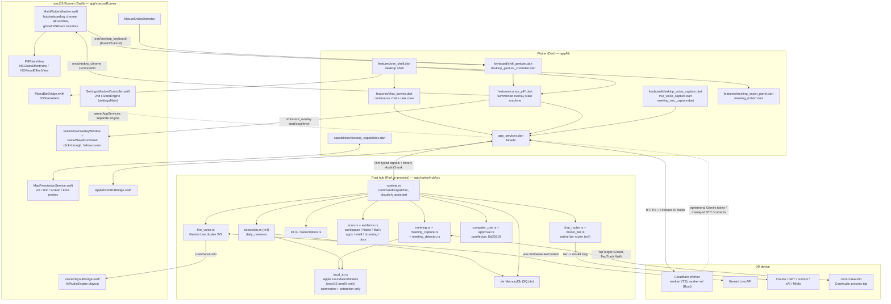

# Omi v4 Desktop Architecture

*Generated from a read-only pass over this repository, revised 2026-07-23. Every claim below is grounded in files that were actually read; paths are cited inline so each statement is checkable. This describes what exists right now, not a roadmap.*

*Scope note: this document covers the desktop surface only — macOS primarily, Windows secondarily. The whole-system view (Worker, D1, billing, channels, mobile) lives in the root [`ARCHITECTURE.md`](../ARCHITECTURE.md); this document does not repeat it and defers to it wherever the two overlap. Comparison with upstream Omi's desktop product lives entirely in [`COMPARISON.md`](../COMPARISON.md) §3.*

---

## 1. What the desktop app is

The desktop experience is not a separate application. It is the same Flutter binary that ships to iOS/Android/web, composed with two desktop-only layers:

| Layer | Language | Where | Owns |
| --- | --- | --- | --- |
| **Flutter UI** | Dart | `app/lib/` | The single continuous-chat hub, the summoned overlay pill, onboarding, settings, task rows, meeting panel, all gesture state machines |
| **The hub** | Rust | `app/native/hub/src/` (21 modules) | Assistant dispatch and online model-tier routing, Gemini Live duplex voice, memory (`zkr`), workspace/Notes/Mail/evidence scan, meetings, computer use, extraction, daily review, self-improvement |
| **macOS Runner** | Swift | `app/macos/Runner/` (10 files) | Window chrome, the summoned pill window, native voice waveform + edge-glow overlay windows, global keyboard/mouse monitoring, menu bar, the settings window (a second Flutter engine), EventKit, audio playout, accessibility context reads |

On Windows the third layer is a much thinner C++ runner (`app/windows/runner/flutter_window.cpp`, 236 lines) — see §9.

The Rust hub is linked *into the app process*, not run as a sidecar daemon. `app/native/hub/src/lib.rs` is a Rinf `write_interface!()` crate whose `main()` spawns the command dispatcher, audio dispatcher, meeting runtime, and (macOS only) the meeting-detector poll, then blocks on `dart_shutdown()`. There is no local HTTP server, no IPC socket, and no second executable in the bundle.

### 1.1 The Rinf bridge

Flutter and Rust exchange typed signals generated by Rinf (`rinf: ^8.10.0` in `app/pubspec.yaml`, `gen_output_dir: lib/native/generated`). The contract is a pair of enums in `app/native/hub/src/signals.rs`:

- `Command` (line 14) — `ConfigureMemory`, `SendMessage`, `ConfigureAssistant`, `ConfigureTrustedAssistant`, `ClearAssistant`, `StartTranscription`/`StopTranscription`, `StartLiveVoice`/`StopLiveVoice`, `CaptureEvent`, `SearchMemory`, `ExportMemory`, `ListMemoryItems`, `CorrectMemory`, `DeleteMemorySource`, `ScanOnboarding`, `ApprovalDecision`, `DeviceState`, `Cancel`, `StartMeeting`/`StopMeeting`, `JotMeetingNote`, `ProvideMeetingAuth`, `SetSystemAudioCaptureMode`.
- `NativeEvent` (line 286) — `TranscriptDelta`, `TranscriptionStatus`, `TranscriptGap`, `AssistantDelta`, `CurrentUpdate`, `ActionProposal`, `ApprovalDecisionAcknowledged`, `ToolProgress`, `Error`, `RuntimeStatus`, `MemoryCaptured`/`MemorySearchResults`/`MemoryCorrected`/`MemorySourceDeleted`/`MemoryExported`/`MemoryItems`, `OnboardingScanCompleted`, `LiveVoiceState`/`LiveVoiceTranscript`/`LiveVoiceAudio`, `MeetingStateChanged`/`MeetingInsight`/`MeetingCompleted`.

Audio travels on a separate binary signal (`AudioChunk`) with validation enforced in Rust: bounded size (`MAX_AUDIO_CHUNK_BYTES`), channel count, and sample rate are all checked before dispatch, with inline tests in `app/native/hub/src/lib.rs` (`audio_chunks_are_bounded`, `audio_metadata_is_checked`). The Dart side of the bridge is `app/lib/native/native_hub.dart` (757 lines), which re-exports the generated signal types and wraps them in narrower interfaces (`LiveVoiceHub`, `MeetingHub`, …).

Everything else — every method channel — is Flutter↔Swift, not Flutter↔Rust. There are six of them, all declared in `app/macos/Runner/`:

| Channel | Declared in | Purpose |
| --- | --- | --- |
| `omi/core_capabilities` | `MainFlutterWindow.swift:718` | TCC state and permission requests |
| `omi/desktop_keyboard` (EventChannel) | `MainFlutterWindow.swift:768` | Physical Shift transitions, mouse-move, secure-input |
| `omi/desktop_keyboard_control` | `MainFlutterWindow.swift:772` | Focus the window |
| `omi/voice_overlay` | `MainFlutterWindow.swift:803` | Start/stop/level for the native glow + waveform |
| `omi/window_chrome` | `MainFlutterWindow.swift:822` | Hub/onboarding chrome, `summonPill`, `updatePillGlass`, `restoreFromPill` |
| `omi/launcher` | `MainFlutterWindow.swift:856` | `openApp` — NSWorkspace app resolution and launch |
| `omi/menu_bar` | `MenuBarBridge.swift:13` | Status-item title/state, capture/listen/settings callbacks |
| `omi/apple_eventkit` | `AppleEventKitBridge.swift:10` | Calendar/Reminders |
| `omi/voice_playout` | `VoicePlayoutBridge.swift:34` | AVAudioEngine PCM playout for Gemini Live replies |

---

## 2. Desktop architecture diagram

---

## 3. The assistant / chat loop

The desktop hub is a single continuous-chat surface, not a multi-destination app (`app/lib/features/chat_screen.dart` renders the chat timeline, the `_TaskRow`/`_RichTaskRow` "what matters next" rows sourced from `CurrentsController`, and `_ChatInputCard`). `app/lib/features/omi_shell.dart` is the desktop shell that owns the chat key, the desktop keyboard, the gesture controller, the menu-bar controller, and the cursor pill.

### 3.1 Routing: online, tiered

A turn dispatched from either surface reaches `dispatch_assistant()` in `app/native/hub/src/runtime.rs`. **Chat always goes to the configured cloud provider.** There is no local-inference path for chat: `dispatch_assistant` explicitly discards both the `local_ai_available` flag and the message origin (`let _ = (local_ai_available, origin);`) before dispatch, and the comment above that line records the reason — Apple Foundation Models refuses too many requests and has no tool or memory access, so it is kept for small local jobs only. `chat_router.rs` no longer contains `TurnClass`, `classify`, or `should_route_local`; the local-vs-remote classifier is gone.

What remains in `chat_router.rs` is an **online model-tier router** built on `rx4::model_router`:

- `SEARCH_MARKERS` and `VISION_MARKERS` are checked first against the lowercased prompt, short-circuiting to `ModelTier::Search` and `ModelTier::Multimodal` — neither has an `rx4` `TaskTier` equivalent, so the hub detects them itself.
- Everything else is delegated to `rx4`'s `ModelRouter`, configured with extra `HEAVY_KEYWORDS` prompt heuristics (`reasoning`, `prove`, `algorithm`, `refactor`, `step by step`, …) so hard reasoning lands on Heavy rather than falling through to Standard.
- `rx4`'s Lite/Standard/Heavy/Subagent tiers map to the hub's Speed/Balanced/Smart/Balanced, and every tier is given Balanced as its fallback so a failed tier degrades to the everyday model.
- The per-tier model ids come from `model_tier.rs` rather than being re-hardcoded, and each is `OMI_MODEL_*`-overridable. The table is in root [`ARCHITECTURE.md`](../ARCHITECTURE.md) §3.3.

The resolved slug is reported to the UI as a `ToolProgress` detail alongside the online marker, so the chat surface can show which model answered. Online context is deliberately *not* de-identified — a comment in `runtime.rs` explains that the cloud side has to recognise the user across iMessage/Telegram channels, so identity has to survive the hop.

`self_improve.rs` sits on the same path: it opens its own connection to the memory database, augments the outgoing prompt with at most `LESSON_LIMIT` (3) accumulated lessons, and records a lesson from the finished turn. Both halves degrade to a clean no-op when the memory database is unavailable, and the write is fire-and-forget so it never adds latency to the turn that produced it.

### 3.2 Where the local model *is* used on desktop

`local_ai.rs` is gated at `#[cfg(all(target_os = "macos", target_arch = "aarch64"))]`; elsewhere `is_available()` is a constant `false` and `summarize`/`respond` return `None`. Its four real consumers are the onboarding scan summary, transcript claim extraction, `daily_review.rs`, and `meeting.rs` (insight classification and the end-of-meeting summary). See root [`ARCHITECTURE.md`](../ARCHITECTURE.md) §3.11.

Provider selection, endpoint validation, and the managed-vs-BYOK split are shared with mobile and are documented in root [`ARCHITECTURE.md`](../ARCHITECTURE.md) §3.3.

### 3.3 The chat surface

Two behaviours define how the hub window is navigated, and both are deliberate substitutes for chrome:

- **There is no back button.** The chat screen is the destination, not a page in a stack.
- **Overscrolling past the newest message returns to the home view.** The message list is `reverse: true`, so the newest message is at the bottom; pulling past it beyond `_homeOverscroll` (−64 logical pixels) sets `_greeterDismissed = false` and the home view — greeting, setup and starter tasks, "what matters next" rows, meeting notes — comes back. The list uses `BouncingScrollPhysics` specifically so that overscroll is possible at all, and the check runs on every scroll update rather than at gesture end because the bouncing spring returns before the gesture finishes. A `_ScrollHomeHint` ("Scroll down to go home") is shown once the greeter has been dismissed.

While the home view is showing, it is laid out to fill the viewport minus `_historyPeekExtent` (44 px), so the tail of the newest message stays visible and scrolling up reads as revealing history. Once the greeter is dismissed the conversation owns the whole viewport. A scrollbar is hung off the full-width window edge rather than inside the 680-pixel reading column.

`ScrollEdgeFade` (`app/lib/ui/scroll_edge_fade.dart`) is the shared scroll-edge treatment used across the other scrolling surfaces — the tasks screen, meeting notes, account setup, and the mobile companion. It wraps a vertical scrollable with page-coloured gradients at top and bottom, each hidden while the view is already resting against that edge, defaulting to the ambient scaffold background so the fade reads as the page dissolving content rather than as a scrim.

---

## 4. The overlay and gesture system

This is the most desktop-specific part of the product, and it is split deliberately between Swift and Dart.

### 4.1 Input detection (Swift)

`MainFlutterWindow.swift` installs four `NSEvent` monitors — local and global, for keyboard and for mouse-move (`MainFlutterWindow.swift:784-802`). Global monitors are what let the chord work while another app is frontmost. Keyboard events are reduced to physical left/right Shift transitions and pushed over the `omi/desktop_keyboard` `FlutterEventChannel`, along with a `secureInput` signal so the gesture disables itself in password fields (`keyboardEvent`, `emitSecureInput`, lines 626-658).

`MouseShakeDetector` (line 135) is a pure detector for rapid horizontal direction reversals with time-based decay; its header comment states it mirrors the Dart logic in `app/lib/keyboard/shake_gesture.dart`.

### 4.2 Gesture state machine (Dart)

`app/lib/keyboard/shift_gesture.dart` is the single owner of gesture semantics. As implemented today it is a thin *detector* that emits intents, with all real state owned by `CursorPillController`:

| Input | `ShiftGestureAction` |
| --- | --- |
| Both Shift keys down once | `openOverlay` (held back for `doubleChordWindow`, default 400 ms, so a second chord can upgrade it) |
| The chord twice inside that window | `toggleVoice` |
| Option+Space | `openOverlay` |
| Rapid cursor shake | `startVoice` (never a toggle-off) |
| Esc | `escape` |
| Secure input engaged | `cancel` |

`app/lib/keyboard/desktop_gesture_controller.dart` (70 lines) adapts the raw channel stream into that machine; `app/lib/features/cursor_pill_controller.dart` (987 lines) consumes the intents and owns the four-state pill (`CursorPillState { hidden, input, listening, working }`), the debounce, and the suggestion pipeline (Currents-derived chat/email/link suggestions, with `mailto:` drafting and verbatim-URL opening).

### 4.3 Presentation (Swift + Dart, split by ownership)

- The **pill** is a real relocation of the main window: `summonPill(width:height:)` (`MainFlutterWindow.swift:1002`) moves and resizes the window next to `NSEvent.mouseLocation` using `cursorPillFrame(...)`, saving the previous window level and collection behavior so `restoreFromPill` can put it back. The Dart side declares its geometry once (`CursorPillWindow.width = 420`, `height = 230` in `app/lib/features/cursor_pill_window.dart`).
- The **glass** under the pill is native: `PillGlassView` (`MainFlutterWindow.swift:86`) uses `NSGlassEffectView` when the class exists at runtime and falls back to an `NSVisualEffectView` with `.hudWindow` material otherwise. Flutter reports rounded-rect regions in logical points via `updatePillGlass`, and the Swift layer masks the glass to match (`CursorPillWindow.updateGlass`).
- The **voice surfaces are separate windows entirely**, so the main window never moves or changes while listening (comment in `cursor_pill_window.dart`): `VoiceGlowOverlayWindow` (a borderless, transparent, click-through full-screen edge glow) and `VoiceWaveformPanel` (a small `NSPanel` that follows the cursor), coordinated by `VoiceOverlayController`, which re-positions on both local and global mouse-move. The glow window sets `ignoresMouseEvents`, sits at `.screenSaver` level, and joins all Spaces; both override `hitTest` to return `nil` so they never take clicks. Flutter drives them with `start`/`stop`/`level(0..1)` over `omi/voice_overlay`.
- **The cursor-shake glow burst lives in that detached overlay window, not in the hub window.** `VoiceGlowOverlayWindow.burst(completion:)` flares every edge to full and fades out over `burstDuration` (0.55 s); the source comment states plainly that this is so the shake finale bursts across the whole screen instead of being clipped to the app window it used to be drawn inside. Dart reaches it through a `burst` method on `omi/voice_overlay` (`CursorPillWindow.burst()`), which routes to `VoiceOverlayController.burst`. The in-Flutter `OmiBurstGlow` widget (`app/lib/ui/burst_glow.dart`) is a *different*, shared burst used inside ordinary Flutter surfaces — account setup and the mobile companion's connect finale — and is not what draws the desktop shake glow.
- Window chrome has two modes: `enterHubChrome()` (normal titled window, native traffic lights) and `enterOnboardingChrome()` (borderless, `OnboardingBlurView`) — `MainFlutterWindow.swift:905` and `:927`, matching `PLAN.md` line 100.
- The **launcher fast path**: `app/lib/features/overlay_launcher.dart` resolves bare `open chrome` / `launch spotify` / `open github.com` inputs locally, and hands app launches to Swift's `omi/launcher` → `resolveApplicationURL` + `NSWorkspace.openApplication` (`MainFlutterWindow.swift:856-887`). Anything that is not a bare launch request falls through to the assistant as an agent instruction.

### 4.4 Menu bar and Settings

`MenuBarBridge.swift` owns an `NSStatusItem` whose title is the single most important current task, with `Capture`, a `Listening` toggle, and `Settings…` (⌘,) beneath it. `app/lib/menu_bar/desktop_menu_bar.dart` pushes `{task, listening}` on every `CurrentsController` change and handles the three callbacks.

Settings runs in a **second Flutter engine** in its own native window: `SettingsWindowController.show()` creates `FlutterEngine(name: "omi-settings")`, runs the `settingsMain` entrypoint (`app/lib/main.dart:28`), and keeps the window alive across closes.

---

## 5. Voice

Two distinct paths exist on desktop.

**Duplex conversational voice (Gemini Live).** `app/native/hub/src/live_voice.rs` (1,149 lines) is a hand-written WebSocket client for `generativelanguage.googleapis.com` `BidiGenerateContent` (host/path constants at lines 15-17). It is bounded by construction: 8 s connect timeout, 5 s final drain, 30 s GoAway drain, 16 KiB max token, 256 KiB pending-audio ceiling, 64-event queue, 16 kHz in / 24 kHz out. It emits `RealtimeVoiceEvent::{Started, TranscriptDelta, AudioChunk, Interrupted, SessionEnded, Error}`, carries session-resumption handles, and has an `OutboundAudioGate` for barge-in. Dart drives it through `app/lib/keyboard/live_voice_capture.dart` (429 lines), which captures 16 kHz PCM16 via the `record` package, tracks an RMS level for the native glow, and routes returned audio to `VoicePlayoutBridge` (`omi/voice_playout`) — an `AVAudioEngine`/`AVAudioPlayerNode` playout with an explicit `VoicePlayoutQueue` backlog counter. Output chunks that cannot be played are counted (`discardedOutputBytes`) and dropped rather than queued unboundedly.

**Dictation / long-form STT.** `stt.rs` + `transcription.rs` remain the segment-based path (managed session via the Worker, or BYOK Deepgram), driven on desktop by `app/lib/keyboard/desktop_voice_capture.dart`. Its authority-fencing and reconnect semantics are shared with mobile and described in root `ARCHITECTURE.md` §3.4.

`AppServices` (`app/lib/app_services.dart`) exposes both behind `startDesktopVoice()` / `startLiveVoice()` (lines 735, 953), each serialized through its own queue and fenced by a voice generation counter.

---

## 6. Memory, scan, and local evidence

Memory itself (`zkr`, tenant = person = Firebase UID) is shared with mobile — see root [`ARCHITECTURE.md`](../ARCHITECTURE.md) §3.2. On desktop the database file, and the computer-use ledger beside it, live under `$HOME/.omi` (`app/lib/storage/omi_directory.dart`); the home-relative dot-directory was chosen because it survives a bundle-identifier change, which an Application Support path does not. See root `ARCHITECTURE.md` §5.1.

What is desktop-only is *where the evidence comes from*.

`app/native/hub/src/scan.rs` (1,261 lines) walks approved workspace roots and, on macOS only (`#[cfg(target_os = "macos")]` at lines 488, 682), opens Apple Notes' `NoteStore.sqlite` and Mail's Envelope Index read-only.

`app/native/hub/src/evidence.rs` (1,281 lines) is a much broader local-evidence collector that exists only because the product runs on a desktop:

- `scan_apps` — installed applications and Dock labels (`parse_dock_labels`), capped at `MAX_APPS = 120`.
- `scan_developer_activity` — shell history (`parse_zsh_history`, 14-day window, `MAX_SHELL_COMMANDS = 60`), SSH hosts (`parse_ssh_hosts`, `MAX_SSH_HOSTS = 24`), VS Code and JetBrains recents (`parse_vscode_recents`, `parse_jetbrains_recents`, `MAX_EDITOR_RECENTS = 40`), Homebrew packages (`MAX_BREW = 80`), projects (`MAX_PROJECTS = 60`).
- `scan_browsing` — recent history reduced to `safe_domain(...)` only, 14-day window, `MAX_BROWSER_ROWS = 80`.
- `scan_documents` — depth-3 walk preferring most-recently-modified files, at most `MAX_DOC_READS = 120` files at `DOC_READ_BYTES = 2048` bytes each, with in-repo `docx_text` / `xlsx_strings` / `zip_extract` readers bounded at 4 MiB compressed / 8 MiB uncompressed.

Every collector is bounded by a named constant, evidence lines are capped (`EVIDENCE_LINE_CHARS = 60`, `DOC_LINE_CHARS = 200`), and there are explicit denylists — `SENSITIVE_URL_MARKERS` (`auth`, `bank`, `checkout`, `login`, `password`, `signin`, `token`) and `SHELL_SECRET_MARKERS` (`api_key`, `apikey`, `credential`, …) — so credential-shaped material is dropped before it can enter a prompt.

Downstream, `app/native/hub/src/extraction.rs` turns model output into ranked `zkr` claims via `rx4::extract_proactive_loose` + `rx4::top_n` (capped at `MAX_CLAIMS = 5`, fields at 280 chars), and `app/native/hub/src/daily_review.rs` generates one idempotent review per previous local day (`previous_local_day`, `review_exists`) using `zkr`'s `ReviewsInput`/`ExportInput` APIs.

---

## 7. Meetings

Three modules, macOS-gated where the OS is involved.

- **Detection** — `meeting_detector.rs` polls every 4 s (15 s when idle) with a `MeetingGate` that requires 8 s of continuous absence before declaring a meeting over, and a browser gate that goes idle after 60 s. The `NativeEvent::MeetingStateChanged` emitter is `#[cfg(target_os = "macos")]`.
- **Policy** — `capture_policy.rs` maps `SystemAudioCaptureMode { Always, OnlyDuringMeetings (default), Never }` plus meeting state to a `CapturePlan { microphone, system_audio }`. `OnlyDuringMeetings` requires *both* a confirmed meeting and a settled state before either stream turns on; `Never` keeps the mic but never requests system audio. Both rules are covered by inline tests.
- **Capture** — `meeting_capture.rs` uses `corti-coreaudio` (`corti-coreaudio = "=0.5.1"`, macOS-only dependency in `app/native/hub/Cargo.toml`) to open a `CaptureSession` with `TapTarget::Global` and `OutputLayout::TwoTrack`, writing a WAV into a per-run private directory whose name mixes pid, timestamp, and OS-random entropy and which is chmod 0700 (0600 on the file). The two tracks — mic and system — are averaged to mono (`mix_two_track_to_mono`) and resampled to 16 kHz by a continuity-preserving `LinearResampler`, then streamed into the normal STT path. On any non-macOS target the whole module is a `platform::start` that returns `Err("meeting system audio capture is unavailable on this platform")`, and there is a test asserting exactly that (`non_macos_capture_is_unavailable`). When the tap fails, `meeting.rs` emits a typed `meeting_system_audio_unavailable` error and Dart falls back to mic-only capture (`app/lib/keyboard/meeting_mic_capture.dart`, `AppServices._startMeetingMicFallback` at `app/lib/app_services.dart:1225`).
- **Session** — `meeting.rs` (1,240 lines) accumulates final segments and user jots, classifies utterances into `InsightKind::{Decision, Action, Response}` on a 20-second interval with a rate limiter, and emits `MeetingInsight` / `MeetingCompleted`. UI is `app/lib/features/meeting_assist_panel.dart` and `meeting_notes*.dart`.

---

## 8. Computer use and approval

Delegated to the external `praefectus` crate (pinned `=0.3.0`), compiled only for macOS/Windows/Linux and only with the default `computer-use` feature (`app/native/hub/Cargo.toml`). Every `praefectus` import in `app/native/hub/src/computer_use.rs` is individually `#[cfg(all(feature = "computer-use", any(target_os = "macos", target_os = "windows", target_os = "linux")))]`, so iOS/Android/web builds do not link it at all.

The two-phase bind → prepare → approve → sign → execute flow, the process-local Ed25519 host authority, the proposal registry bounds, and the append-only ledger are described in root `ARCHITECTURE.md` §3.5 and are unchanged here. The desktop-specific facts: the two tool schemas exposed to the assistant are `computer_invoke` and `computer_set_value` (`COMPUTER_INVOKE_TOOL` at `runtime.rs:50`), values are capped at `MAX_COMPUTER_VALUE_BYTES = 16 KiB` and target names at `MAX_TARGET_NAME_BYTES = 1 KiB`, and the approval UI is a Flutter surface fed by `NativeEvent::ActionProposal` and answered with `Command::ApprovalDecision { ApproveOnce | Reject }`.

The macOS Accessibility TCC grant is what makes any of this work; `app/macos/Runner/MacPermissionService.swift` reports its state and can open the relevant System Settings pane directly.

---

## 9. Windows, honestly

Windows is a real Flutter target but the desktop *experience* is currently a subset.

What exists (`app/windows/runner/flutter_window.cpp`, 236 lines):
- `omi/core_capabilities` — microphone check plus `ms-settings:privacy-microphone` deep link.
- `omi/desktop_keyboard` — a `WH_KEYBOARD_LL` low-level hook feeding the same Shift/secure-input event stream the gesture machine expects.
- `omi/desktop_keyboard_control` — `ShowWindow` + `SetForegroundWindow`.

What does not exist on Windows: `omi/window_chrome` (so no summoned pill window, no glass, no chrome switching), `omi/voice_overlay` (no edge glow, no follow-cursor waveform), `omi/menu_bar`, `omi/launcher`, `omi/apple_eventkit`, and `omi/voice_playout` (so Gemini Live reply audio has no playout host — `LiveVoiceCapture` counts and drops it). There is no mouse-shake monitor. `meeting_capture.rs` and `meeting_detector.rs` are macOS-gated, so meeting system-audio capture and meeting detection are unavailable. `local_ai.rs` is macOS-arm64-gated, so onboarding summaries, transcript extraction, daily review, and meeting insights produce nothing on Windows — chat is unaffected, since it always goes to the cloud provider on every platform. `scan.rs`'s Notes/Mail collectors are macOS-only. The cursor-shake glow burst is part of `VoiceGlowOverlayWindow`, so it is macOS-only too.

What is *not* platform-limited on Windows: `praefectus` computer use compiles for Windows, and `PLAN.md` line 119 states Windows computer use is intended as a first-class UI-Automation path — but that path has not been proven on real hardware (`PLAN.md` line 62, line 378 area, "Known constraints").

---

## 10. Known gaps and rough edges

- **Local Foundation Models are macOS-arm64-only.** `local_ai.rs` is `#[cfg(all(target_os = "macos", target_arch = "aarch64"))]`. On Intel Macs, Windows, and everywhere else, `is_available()` is false, so onboarding summaries, transcript extraction, daily review, and meeting insights all silently produce nothing rather than falling back to a remote model. Nothing surfaces this to the user. Chat is unaffected, because chat never used the local model.
- **Windows overlay/global-input parity is largely absent.** See §9. The Shift chord and secure-input detection work via the low-level hook, but the summoned pill, glass, edge glow, waveform, shake gesture, menu bar, launcher, and voice playout are all macOS-only. Live-voice reply audio on Windows is counted and discarded because there is no playout host.
- **Windows computer use is unproven.** `praefectus` compiles for Windows and `PLAN.md` line 119 calls it a first-class UI-Automation path, but there is no Windows-specific native code in this repository exercising it and `PLAN.md` still lists physical Windows proof as outstanding.
- **Meeting detection and system-audio capture are macOS-only** (`meeting_detector.rs` emitter is `#[cfg(target_os = "macos")]`; `meeting_capture.rs` non-macOS `start()` returns an error unconditionally). Meetings on Windows degrade to mic-only.
- **Apple Notes and Mail scanning are macOS-only** and depend on Full Disk Access; `MacPermissionService.swift` probes FDA heuristically (attempting to stat `TCC.db` and the Notes container), which is a heuristic, not an API.
- **`PLAN.md`'s gesture table is stale relative to the code.** `PLAN.md` line ~190 documents a hold-both-Shift-for-a-threshold model with hands-free continuation. `app/lib/keyboard/shift_gesture.dart` as written implements chord-once → `openOverlay`, chord-twice-within-400 ms → `toggleVoice`, plus Option+Space and a mouse-shake path, with no hold threshold. The code is authoritative; the plan text has not caught up.
- **No auto-update, no signed release channel, no crash reporting.** There is no updater in `app/macos`. Shipping a fix currently means shipping a new build by hand, and there is no mechanism to learn that a build is crashing in the field.
- **No desktop E2E or in-app automation surface.** There is no way to drive the real desktop app programmatically for verification; desktop coverage is unit/logic tests plus manual use.
- **macOS ships unsandboxed by necessity.** `app/macos/Runner/Release.entitlements` requests only audio input, calendars, and network client — App Sandbox is deliberately absent because broad workspace discovery conflicts with sandbox scope (`PLAN.md` line 117). That is a considered decision, but it means the usual sandbox containment does not apply.
- **The overscroll-to-home gesture is discoverable only through a hint.** Returning to the home view is a pull past the newest message plus a `_ScrollHomeHint` line; there is no button and no back affordance, so a user who does not read the hint has no other route.
- **The model tiers are unverified.** `chat_router.rs` picks a tier per prompt from keyword heuristics plus `rx4`'s classifier, and `model_tier.rs` says outright that the default model ids are best-effort. Neither the routing decisions nor the slugs have been checked against live provider APIs.
- **Not verified in this pass:** whether the pill/overlay behaves correctly across multiple displays or Spaces beyond what `VoiceOverlayController` and `cursorPillFrame` do with `NSScreen.screens`; whether the second Flutter engine for Settings has any measurable startup or memory cost; and any live-credential behaviour of Gemini Live, managed STT, or the Worker on desktop — the root [`ARCHITECTURE.md`](../ARCHITECTURE.md) §6 gaps all still apply here.
- **Concurrency caveat on this document.** `app/lib/`, `app/macos/`, and `app/native/hub/` were being edited by other sessions while this was written. File-level and behavioural claims were read from source, but re-check any exact line reference before relying on it.
