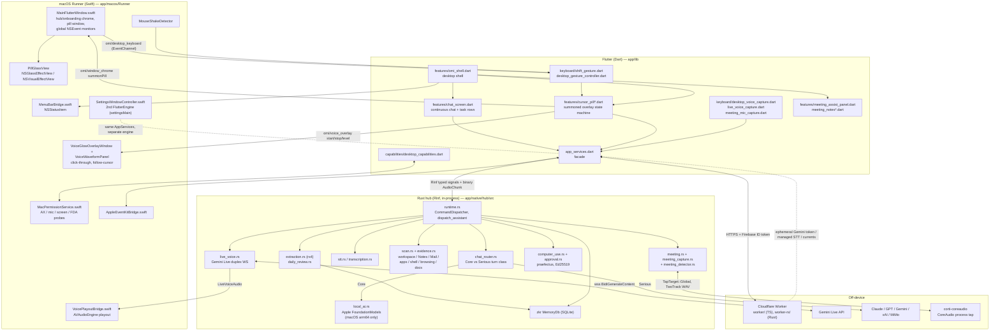

# Omi v4 Desktop Architecture

*Generated from a read-only pass over this repository and over the upstream `BasedHardware/omi` monorepo on 2026-07-23, reflecting the tree at commit `7baf8ac`. Every claim below is grounded in files that were actually read; paths are cited inline so each statement is checkable. Upstream paths are cited relative to the upstream checkout root (`desktop/…`). This describes what exists right now, not a roadmap.*

*Scope note: this document covers the desktop surface only — macOS primarily, Windows secondarily. The whole-system view (Worker, D1, billing, channels, mobile) lives in the root `ARCHITECTURE.md`; this document does not repeat it and defers to it wherever the two overlap.*

---

## 1. What the desktop app is

The desktop experience is not a separate application. It is the same Flutter binary that ships to iOS/Android/web, composed with two desktop-only layers:

| Layer | Language | Where | Owns |
| --- | --- | --- | --- |
| **Flutter UI** | Dart | `app/lib/` | The single continuous-chat hub, the summoned overlay pill, onboarding, settings, task rows, meeting panel, all gesture state machines |
| **The hub** | Rust | `app/native/hub/src/` (19 modules, ~15k lines) | Assistant dispatch, Gemini Live duplex voice, memory (`zkr`), workspace/Notes/Mail/evidence scan, meetings, computer use, extraction, daily review |
| **macOS Runner** | Swift | `app/macos/Runner/` (7 files, ~1.9k lines) | Window chrome, the summoned pill window, native voice waveform + edge-glow overlay windows, global keyboard/mouse monitoring, menu bar, the settings window (a second Flutter engine), EventKit, audio playout |

On Windows the third layer is a much thinner C++ runner (`app/windows/runner/flutter_window.cpp`, 236 lines) — see §9.

The Rust hub is linked *into the app process*, not run as a sidecar daemon. `app/native/hub/src/lib.rs` is a Rinf `write_interface!()` crate whose `main()` spawns the command dispatcher, audio dispatcher, meeting runtime, and (macOS only) the meeting-detector poll, then blocks on `dart_shutdown()`. There is no local HTTP server, no IPC socket, and no second executable in the bundle.

### 1.1 The Rinf bridge

Flutter and Rust exchange typed signals generated by Rinf (`rinf: ^8.10.0` in `app/pubspec.yaml`, `gen_output_dir: lib/native/generated`). The contract is a pair of enums in `app/native/hub/src/signals.rs`:

- `Command` (line 14) — `ConfigureMemory`, `SendMessage`, `ConfigureAssistant`, `ConfigureTrustedAssistant`, `ClearAssistant`, `StartTranscription`/`StopTranscription`, `StartLiveVoice`/`StopLiveVoice`, `CaptureEvent`, `SearchMemory`, `ExportMemory`, `ListMemoryItems`, `CorrectMemory`, `DeleteMemorySource`, `ScanOnboarding`, `ApprovalDecision`, `DeviceState`, `Cancel`, `StartMeeting`/`StopMeeting`, `JotMeetingNote`, `ProvideMeetingAuth`, `SetSystemAudioCaptureMode`.
- `NativeEvent` (line 286) — `TranscriptDelta`, `TranscriptionStatus`, `TranscriptGap`, `AssistantDelta`, `CurrentUpdate`, `ActionProposal`, `ApprovalDecisionAcknowledged`, `ToolProgress`, `Error`, `RuntimeStatus`, `MemoryCaptured`/`MemorySearchResults`/`MemoryCorrected`/`MemorySourceDeleted`/`MemoryExported`/`MemoryItems`, `OnboardingScanCompleted`, `LiveVoiceState`/`LiveVoiceTranscript`/`LiveVoiceAudio`, `MeetingStateChanged`/`MeetingInsight`/`MeetingCompleted`.

Audio travels on a separate binary signal (`AudioChunk`) with validation enforced in Rust: bounded size (`MAX_AUDIO_CHUNK_BYTES`), channel count, and sample rate are all checked before dispatch, with inline tests in `app/native/hub/src/lib.rs` (`audio_chunks_are_bounded`, `audio_metadata_is_checked`). The Dart side of the bridge is `app/lib/native/native_hub.dart` (757 lines), which re-exports the generated signal types and wraps them in narrower interfaces (`LiveVoiceHub`, `MeetingHub`, …).

Everything else — every method channel — is Flutter↔Swift, not Flutter↔Rust. There are six of them, all declared in `app/macos/Runner/`:

| Channel | Declared in | Purpose |
| --- | --- | --- |
| `omi/core_capabilities` | `MainFlutterWindow.swift:718` | TCC state and permission requests |
| `omi/desktop_keyboard` (EventChannel) | `MainFlutterWindow.swift:768` | Physical Shift transitions, mouse-move, secure-input |
| `omi/desktop_keyboard_control` | `MainFlutterWindow.swift:772` | Focus the window |
| `omi/voice_overlay` | `MainFlutterWindow.swift:803` | Start/stop/level for the native glow + waveform |
| `omi/window_chrome` | `MainFlutterWindow.swift:822` | Hub/onboarding chrome, `summonPill`, `updatePillGlass`, `restoreFromPill` |
| `omi/launcher` | `MainFlutterWindow.swift:856` | `openApp` — NSWorkspace app resolution and launch |
| `omi/menu_bar` | `MenuBarBridge.swift:13` | Status-item title/state, capture/listen/settings callbacks |
| `omi/apple_eventkit` | `AppleEventKitBridge.swift:10` | Calendar/Reminders |
| `omi/voice_playout` | `VoicePlayoutBridge.swift:34` | AVAudioEngine PCM playout for Gemini Live replies |

---

## 2. Desktop architecture diagram



---

## 3. The assistant / chat loop

The desktop hub is a single continuous-chat surface, not a multi-destination app (`PLAN.md` line 31; `app/lib/features/chat_screen.dart`, 2,219 lines, renders the chat timeline, `_TaskRow`/`_RichTaskRow` "what matters next" rows sourced from `CurrentsController`, and `_ChatInputCard`). `app/lib/features/omi_shell.dart` is the desktop shell that owns the chat key, the desktop keyboard, the gesture controller, the menu-bar controller, and the cursor pill.

A turn dispatched from either surface reaches `dispatch_assistant()` in `app/native/hub/src/runtime.rs:1565`. The distinctive part of the desktop loop is the **local-first router**:

- `app/native/hub/src/chat_router.rs` classifies each turn as `TurnClass::Core` or `TurnClass::Serious` using purely local heuristics: >400 characters, code markers (` ``` `, `fn `, `def `, `class `, `#include`, …), or any of ~40 "serious" phrases (`implement`, `refactor`, `stack trace`, `analyze`, `draft an email`, `click`, `open the`, `computer`, …).
- `should_route_local(local_available, text)` returns true only for `Core` turns when local inference exists.
- In `dispatch_assistant`, a `Core` turn is answered by `crate::local_ai::respond()` — Apple Foundation Models via `rs_ai_local`, entirely on-device — and the loop returns without any network call (`runtime.rs:1589-1615`). Anything else falls through to the configured provider.
- Overlay-originated turns (`MessageOrigin::Overlay`) are **never** routed local, because the overlay is an agent-instruction surface that needs the tool/action pipeline (`runtime.rs:1586-1589`, comment retained in source).

`local_ai.rs` is gated at `#[cfg(all(target_os = "macos", target_arch = "aarch64"))]`; on every other target `is_available()` is a constant `false` and `summarize`/`respond` return `None`, so the router degrades to the remote provider.

Provider selection, endpoint validation, and the managed-vs-BYOK split are shared with mobile and are documented in root `ARCHITECTURE.md` §3.3.

---

## 4. The overlay and gesture system

This is the most desktop-specific part of the product, and it is split deliberately between Swift and Dart.

### 4.1 Input detection (Swift)

`MainFlutterWindow.swift` installs four `NSEvent` monitors — local and global, for keyboard and for mouse-move (`MainFlutterWindow.swift:784-802`). Global monitors are what let the chord work while another app is frontmost. Keyboard events are reduced to physical left/right Shift transitions and pushed over the `omi/desktop_keyboard` `FlutterEventChannel`, along with a `secureInput` signal so the gesture disables itself in password fields (`keyboardEvent`, `emitSecureInput`, lines 626-658).

`MouseShakeDetector` (line 135) is a pure detector for rapid horizontal direction reversals with time-based decay; its header comment states it mirrors the Dart logic in `app/lib/keyboard/shake_gesture.dart`.

### 4.2 Gesture state machine (Dart)

`app/lib/keyboard/shift_gesture.dart` is the single owner of gesture semantics. As implemented today it is a thin *detector* that emits intents, with all real state owned by `CursorPillController`:

| Input | `ShiftGestureAction` |
| --- | --- |
| Both Shift keys down once | `openOverlay` (held back for `doubleChordWindow`, default 400 ms, so a second chord can upgrade it) |
| The chord twice inside that window | `toggleVoice` |
| Option+Space | `openOverlay` |
| Rapid cursor shake | `startVoice` (never a toggle-off) |
| Esc | `escape` |
| Secure input engaged | `cancel` |

`app/lib/keyboard/desktop_gesture_controller.dart` (70 lines) adapts the raw channel stream into that machine; `app/lib/features/cursor_pill_controller.dart` (987 lines) consumes the intents and owns the four-state pill (`CursorPillState { hidden, input, listening, working }`), the debounce, and the suggestion pipeline (Currents-derived chat/email/link suggestions, with `mailto:` drafting and verbatim-URL opening).

### 4.3 Presentation (Swift + Dart, split by ownership)

- The **pill** is a real relocation of the main window: `summonPill(width:height:)` (`MainFlutterWindow.swift:1002`) moves and resizes the window next to `NSEvent.mouseLocation` using `cursorPillFrame(...)`, saving the previous window level and collection behavior so `restoreFromPill` can put it back. The Dart side declares its geometry once (`CursorPillWindow.width = 420`, `height = 230` in `app/lib/features/cursor_pill_window.dart`).
- The **glass** under the pill is native: `PillGlassView` (`MainFlutterWindow.swift:86`) uses `NSGlassEffectView` when the class exists at runtime and falls back to an `NSVisualEffectView` with `.hudWindow` material otherwise. Flutter reports rounded-rect regions in logical points via `updatePillGlass`, and the Swift layer masks the glass to match (`CursorPillWindow.updateGlass`).
- The **voice surfaces are separate windows entirely**, so the main window never moves or changes while listening (comment in `cursor_pill_window.dart`): `VoiceGlowOverlayWindow` (a borderless click-through full-screen edge glow, `MainFlutterWindow.swift:254`) and `VoiceWaveformPanel` (a small `NSPanel` that follows the cursor, line 339), coordinated by `VoiceOverlayController` (line 380) which re-positions on both local and global mouse-move. Both override `hitTest` to return `nil` so they never take clicks. Flutter drives them with `start`/`stop`/`level(0..1)` over `omi/voice_overlay`.
- Window chrome has two modes: `enterHubChrome()` (normal titled window, native traffic lights) and `enterOnboardingChrome()` (borderless, `OnboardingBlurView`) — `MainFlutterWindow.swift:905` and `:927`, matching `PLAN.md` line 100.
- The **launcher fast path**: `app/lib/features/overlay_launcher.dart` resolves bare `open chrome` / `launch spotify` / `open github.com` inputs locally, and hands app launches to Swift's `omi/launcher` → `resolveApplicationURL` + `NSWorkspace.openApplication` (`MainFlutterWindow.swift:856-887`). Anything that is not a bare launch request falls through to the assistant as an agent instruction.

### 4.4 Menu bar and Settings

`MenuBarBridge.swift` owns an `NSStatusItem` whose title is the single most important current task, with `Capture`, a `Listening` toggle, and `Settings…` (⌘,) beneath it. `app/lib/menu_bar/desktop_menu_bar.dart` pushes `{task, listening}` on every `CurrentsController` change and handles the three callbacks.

Settings runs in a **second Flutter engine** in its own native window: `SettingsWindowController.show()` creates `FlutterEngine(name: "omi-settings")`, runs the `settingsMain` entrypoint (`app/lib/main.dart:28`), and keeps the window alive across closes.

---

## 5. Voice

Two distinct paths exist on desktop.

**Duplex conversational voice (Gemini Live).** `app/native/hub/src/live_voice.rs` (1,149 lines) is a hand-written WebSocket client for `generativelanguage.googleapis.com` `BidiGenerateContent` (host/path constants at lines 15-17). It is bounded by construction: 8 s connect timeout, 5 s final drain, 30 s GoAway drain, 16 KiB max token, 256 KiB pending-audio ceiling, 64-event queue, 16 kHz in / 24 kHz out. It emits `RealtimeVoiceEvent::{Started, TranscriptDelta, AudioChunk, Interrupted, SessionEnded, Error}`, carries session-resumption handles, and has an `OutboundAudioGate` for barge-in. Dart drives it through `app/lib/keyboard/live_voice_capture.dart` (429 lines), which captures 16 kHz PCM16 via the `record` package, tracks an RMS level for the native glow, and routes returned audio to `VoicePlayoutBridge` (`omi/voice_playout`) — an `AVAudioEngine`/`AVAudioPlayerNode` playout with an explicit `VoicePlayoutQueue` backlog counter. Output chunks that cannot be played are counted (`discardedOutputBytes`) and dropped rather than queued unboundedly.

**Dictation / long-form STT.** `stt.rs` + `transcription.rs` remain the segment-based path (managed session via the Worker, or BYOK Deepgram), driven on desktop by `app/lib/keyboard/desktop_voice_capture.dart`. Its authority-fencing and reconnect semantics are shared with mobile and described in root `ARCHITECTURE.md` §3.4.

`AppServices` (`app/lib/app_services.dart`) exposes both behind `startDesktopVoice()` / `startLiveVoice()` (lines 735, 953), each serialized through its own queue and fenced by a voice generation counter.

---

## 6. Memory, scan, and local evidence

Memory itself (`zkr`, tenant = person = Firebase UID) is shared with mobile — see root `ARCHITECTURE.md` §3.2. What is desktop-only is *where the evidence comes from*.

`app/native/hub/src/scan.rs` (1,261 lines) walks approved workspace roots and, on macOS only (`#[cfg(target_os = "macos")]` at lines 488, 682), opens Apple Notes' `NoteStore.sqlite` and Mail's Envelope Index read-only.

`app/native/hub/src/evidence.rs` (1,281 lines) is a much broader local-evidence collector that exists only because the product runs on a desktop:

- `scan_apps` — installed applications and Dock labels (`parse_dock_labels`), capped at `MAX_APPS = 120`.
- `scan_developer_activity` — shell history (`parse_zsh_history`, 14-day window, `MAX_SHELL_COMMANDS = 60`), SSH hosts (`parse_ssh_hosts`, `MAX_SSH_HOSTS = 24`), VS Code and JetBrains recents (`parse_vscode_recents`, `parse_jetbrains_recents`, `MAX_EDITOR_RECENTS = 40`), Homebrew packages (`MAX_BREW = 80`), projects (`MAX_PROJECTS = 60`).
- `scan_browsing` — recent history reduced to `safe_domain(...)` only, 14-day window, `MAX_BROWSER_ROWS = 80`.
- `scan_documents` — depth-3 walk preferring most-recently-modified files, at most `MAX_DOC_READS = 120` files at `DOC_READ_BYTES = 2048` bytes each, with in-repo `docx_text` / `xlsx_strings` / `zip_extract` readers bounded at 4 MiB compressed / 8 MiB uncompressed.

Every collector is bounded by a named constant, evidence lines are capped (`EVIDENCE_LINE_CHARS = 60`, `DOC_LINE_CHARS = 200`), and there are explicit denylists — `SENSITIVE_URL_MARKERS` (`auth`, `bank`, `checkout`, `login`, `password`, `signin`, `token`) and `SHELL_SECRET_MARKERS` (`api_key`, `apikey`, `credential`, …) — so credential-shaped material is dropped before it can enter a prompt.

Downstream, `app/native/hub/src/extraction.rs` turns model output into ranked `zkr` claims via `rx4::extract_proactive_loose` + `rx4::top_n` (capped at `MAX_CLAIMS = 5`, fields at 280 chars), and `app/native/hub/src/daily_review.rs` generates one idempotent review per previous local day (`previous_local_day`, `review_exists`) using `zkr`'s `ReviewsInput`/`ExportInput` APIs.

---

## 7. Meetings

Three modules, macOS-gated where the OS is involved.

- **Detection** — `meeting_detector.rs` polls every 4 s (15 s when idle) with a `MeetingGate` that requires 8 s of continuous absence before declaring a meeting over, and a browser gate that goes idle after 60 s. The `NativeEvent::MeetingStateChanged` emitter is `#[cfg(target_os = "macos")]`.
- **Policy** — `capture_policy.rs` maps `SystemAudioCaptureMode { Always, OnlyDuringMeetings (default), Never }` plus meeting state to a `CapturePlan { microphone, system_audio }`. `OnlyDuringMeetings` requires *both* a confirmed meeting and a settled state before either stream turns on; `Never` keeps the mic but never requests system audio. Both rules are covered by inline tests.
- **Capture** — `meeting_capture.rs` uses `corti-coreaudio` (`corti-coreaudio = "=0.5.1"`, macOS-only dependency in `app/native/hub/Cargo.toml`) to open a `CaptureSession` with `TapTarget::Global` and `OutputLayout::TwoTrack`, writing a WAV into a per-run private directory whose name mixes pid, timestamp, and OS-random entropy and which is chmod 0700 (0600 on the file). The two tracks — mic and system — are averaged to mono (`mix_two_track_to_mono`) and resampled to 16 kHz by a continuity-preserving `LinearResampler`, then streamed into the normal STT path. On any non-macOS target the whole module is a `platform::start` that returns `Err("meeting system audio capture is unavailable on this platform")`, and there is a test asserting exactly that (`non_macos_capture_is_unavailable`). When the tap fails, `meeting.rs` emits a typed `meeting_system_audio_unavailable` error and Dart falls back to mic-only capture (`app/lib/keyboard/meeting_mic_capture.dart`, `AppServices._startMeetingMicFallback` at `app/lib/app_services.dart:1225`).
- **Session** — `meeting.rs` (1,240 lines) accumulates final segments and user jots, classifies utterances into `InsightKind::{Decision, Action, Response}` on a 20-second interval with a rate limiter, and emits `MeetingInsight` / `MeetingCompleted`. UI is `app/lib/features/meeting_assist_panel.dart` and `meeting_notes*.dart`.

---

## 8. Computer use and approval

Delegated to the external `praefectus` crate (pinned `=0.3.0`), compiled only for macOS/Windows/Linux and only with the default `computer-use` feature (`app/native/hub/Cargo.toml`). Every `praefectus` import in `app/native/hub/src/computer_use.rs` is individually `#[cfg(all(feature = "computer-use", any(target_os = "macos", target_os = "windows", target_os = "linux")))]`, so iOS/Android/web builds do not link it at all.

The two-phase bind → prepare → approve → sign → execute flow, the process-local Ed25519 host authority, the proposal registry bounds, and the append-only ledger are described in root `ARCHITECTURE.md` §3.5 and are unchanged here. The desktop-specific facts: the two tool schemas exposed to the assistant are `computer_invoke` and `computer_set_value` (`COMPUTER_INVOKE_TOOL` at `runtime.rs:50`), values are capped at `MAX_COMPUTER_VALUE_BYTES = 16 KiB` and target names at `MAX_TARGET_NAME_BYTES = 1 KiB`, and the approval UI is a Flutter surface fed by `NativeEvent::ActionProposal` and answered with `Command::ApprovalDecision { ApproveOnce | Reject }`.

The macOS Accessibility TCC grant is what makes any of this work; `app/macos/Runner/MacPermissionService.swift` reports its state and can open the relevant System Settings pane directly.

---

## 9. Windows, honestly

Windows is a real Flutter target but the desktop *experience* is currently a subset.

What exists (`app/windows/runner/flutter_window.cpp`, 236 lines):
- `omi/core_capabilities` — microphone check plus `ms-settings:privacy-microphone` deep link.
- `omi/desktop_keyboard` — a `WH_KEYBOARD_LL` low-level hook feeding the same Shift/secure-input event stream the gesture machine expects.
- `omi/desktop_keyboard_control` — `ShowWindow` + `SetForegroundWindow`.

What does not exist on Windows: `omi/window_chrome` (so no summoned pill window, no glass, no chrome switching), `omi/voice_overlay` (no edge glow, no follow-cursor waveform), `omi/menu_bar`, `omi/launcher`, `omi/apple_eventkit`, and `omi/voice_playout` (so Gemini Live reply audio has no playout host — `LiveVoiceCapture` counts and drops it). There is no mouse-shake monitor. `meeting_capture.rs` and `meeting_detector.rs` are macOS-gated, so meeting system-audio capture and meeting detection are unavailable. `local_ai.rs` is macOS-arm64-gated, so the local-first chat router always falls through to the network. `scan.rs`'s Notes/Mail collectors are macOS-only.

What is *not* platform-limited on Windows: `praefectus` computer use compiles for Windows, and `PLAN.md` line 119 states Windows computer use is intended as a first-class UI-Automation path — but that path has not been proven on real hardware (`PLAN.md` line 62, line 378 area, "Known constraints").

---

## 10. What upstream's desktop actually is

Upstream `BasedHardware/omi` ships a real desktop product at `desktop/`. It covers substantially more surface area than ours and is decomposed completely differently. Surface area is the only thing that can be read off a repository; nothing below should be taken as a statement about upstream's stability, reliability, or quality in either direction — this pass measured neither. Read for this comparison: `desktop/macos/README.md`, `desktop/macos/AGENTS.md` (547 lines), `desktop/macos/Backend-Rust/ARCHITECTURE.md`, `desktop/macos/agent/src/ARCHITECTURE.md`, `desktop/macos/Desktop/Sources/FloatingControlBar/ARCHITECTURE.md`, `desktop/macos/e2e/SKILL.md`, `desktop/macos/Desktop/Package.swift`, `desktop/windows/README.md` and `desktop/windows/package.json`.

**macOS** (`desktop/macos/`) is four processes' worth of code in one bundle:

1. **`Desktop/`** — a SwiftPM package (no `.xcodeproj`) named "Omi Computer", macOS 14.0 floor, being incrementally split into library targets (`OmiTheme`, `OmiWAL`, `OmiSupport`, `VoiceTurnDomain`). Dependencies include Firebase iOS SDK, PostHog, Sentry, GRDB, **Sparkle**, swift-markdown-ui, **onnxruntime**, and **FluidAudio**. Feature areas under `Desktop/Sources/` include: `Rewind/` (continuous screen capture with `VideoChunkEncoder`, OCR + embeddings, a timeline player, retention, search), `FloatingControlBar/` (~50 files: the notch/compact presentation, `PushToTalkManager`, `RealtimeHubController` split across seven extension files, `GlobalShortcutManager`, `StreamingPCMPlayer`, `ScreenCaptureManager`, agent pills), `ProactiveAssistants/` (Focus, Goals, Insight, MemoryExtraction, TaskAgent, TaskExtraction assistants with a coordinator, `WindowMonitor`, `GeminiClient`), `LiveNotes/`, `FileIndexing/` (plus a knowledge graph store), `Bluetooth/` (a full desktop BLE stack for Omi hardware, including WiFi sync types), `SpatialOverlay/`, `Chat/` (kernel journal projection, agent bridge/lifecycle, stall detection), `Onboarding/` (24 step views), `RealtimeOmni/`, `Automation/` + `DesktopAutomationBridge.swift`, `MemoryExport*`, `GmailReaderService`, `CalendarReaderService`, `AppleNotesReaderService`, `LocalTranscriptionService.swift`, `SystemAudioCaptureService`, `VADGateService`, `UpdaterViewModel` (Sparkle), `TierManager`, `TrialBannerService`.
2. **`Backend-Rust/`** — a deployed Rust service (Axum-style, Firestore + Redis) described by its own `ARCHITECTURE.md` as "the desktop control and provider proxy plane… not a second implementation of the product data API". Live routes: auth, provider proxies, realtime session minting, desktop chat, TTS, screen-activity ingestion, release manifests, agent VM control, support webhooks, health/config. Old data routes remain as a state-free HTTP 410 facade (`routes/deprecated.rs`) pointing clients at the Python backend.
3. **`agent/`** — a **Node/TypeScript agent daemon** bundled into the app. Its `ARCHITECTURE.md` says it "owns durable agent identity, execution profiles, routing, context admission, run/attempt state, physical-tool authorization, and the cross-surface conversation journal. Swift is a transport and presentation client." It speaks a versioned JSONL protocol to Swift, has a `runtime/kernel.ts` facade split into `kernel-{core,sessions,runs,coordinator,artifacts}`, a `conversation-journal.ts` as sole durable writer, `run-tool-capability.ts` + `tool-invocation-ledger.ts` for physical-effect authorization, and `sqlite-store.ts`. Its dependencies are `@earendil-works/pi-coding-agent`, `@zed-industries/claude-agent-acp`, and `@playwright/mcp` — i.e. a coding-agent runtime, the Agent Client Protocol, and browser MCP.
4. **`agent-cloud/`** — a separate Node service built on `@anthropic-ai/claude-agent-sdk` with `better-sqlite3` and a WebSocket server, for cloud/VM-side agent runs. Plus **`acp-bridge/`** (prebuilt `dist`) and **`pi-mono-extension/`**, which registers "omi" as an OpenAI-compatible provider routed through the Rust proxy for server-side cost control, denies a set of dangerous shell operations, and appends every tool invocation to `~/.omi/pi-mono-audit.log`.

Around that sits considerable release and test machinery: a Codemagic-signed, notarized universal DMG + Sparkle ZIP pipeline with a self-hosted qualification runner, digest-matched evidence, and separate beta/stable pointers (`AGENTS.md` "Release Pipeline"); an in-app HTTP automation bridge (`omi-ctl navigate/state/action`) that auto-enables on non-production bundles; named side-by-side dev bundles with auth seeding; a tiered E2E harness (`e2e/CORE_E2E.md`, `e2e/flows/`); and enforced invariants (INV-6 chat continuity, collection-safety, test-quality ratchets).

**Windows** (`desktop/windows/`) is a **separate Electron + React + TypeScript application** (`electron-vite`, `electron-builder`, React 19, Tailwind, `better-sqlite3`, three.js/`d3-force-3d` for a knowledge graph view). Its main process has `overlay/` (window + global shortcut + height tween), `rewind/` (capture decision, frame hashing, OCR, retention, grouping, search), `fileIndex/`, `insight/`, `memoryExport`/`memoryImport`, `integrations/google.ts` + `oauth.ts`, `screenSynth/`, and `automation/` with a **C# helper** (`automation/helper/Program.cs`, `win-automation-helper.csproj`) for UI Automation, plus a PowerShell-built OCR helper. `src-tauri/` contains only a `gen/` directory and is not the shipping shell. It shares Omi's Firebase project but is otherwise an independent codebase from the macOS app.

---

## 11. Comparison

### 11.1 What we deliberately skip

Grounded in the upstream files listed in §10. Each of these exists upstream and does not exist here. These are load we chose not to carry, not a deficiency list — each one is a subsystem with its own storage, failure modes, permissions, and maintenance cost. §11.4 revisits the subset worth reconsidering.

- **Continuous screen recording ("Rewind").** Upstream captures the screen continuously, encodes video chunks, OCRs frames, embeds the OCR text, and gives it a searchable timeline UI with retention policy and capture-health reporting (`desktop/macos/Desktop/Sources/Rewind/{Core,Services,UI}`, mirrored on Windows in `desktop/windows/src/main/rewind/`). We have no screen-recording, OCR, or timeline subsystem at all. Our screen-derived context is limited to the `CaptureSource::Screen` capture path and computer-use's semantic accessibility snapshots.
- **A bundled agent runtime.** Upstream ships a whole Node agent kernel inside the app (`desktop/macos/agent/`), plus a cloud agent (`agent-cloud/`), an ACP bridge, and a pi-mono provider extension with a shell denylist and audit log. We have no embedded coding-agent runtime, no ACP, no Playwright/MCP tool surface, no background agent sessions, no agent pills, and no agent VM control. Our action surface is exactly two typed `praefectus` verbs.
- **On-device speech-to-text.** Upstream runs NVIDIA Parakeet TDT via FluidAudio/CoreML on the Neural Engine with source-based diarization and a SoundAnalysis music gate (`desktop/macos/Desktop/Sources/LocalTranscriptionService.swift`; `FluidAudio` + `onnxruntime` in `Package.swift`). Ours is a deliberate fail-closed stub (`TranscriptionAuth::Local`, `SttError::Unavailable`); all STT is remote.
- **Auto-update and a release channel system.** Upstream has Sparkle (`UpdaterViewModel.swift`), a signed/notarized universal DMG + Sparkle ZIP built by Codemagic, a self-hosted qualification runner, immutable manifests, and separate beta/stable pointers. We have no updater in `app/macos` at all and no release-channel machinery.
- **Product telemetry and crash reporting.** Upstream wires PostHog + Sentry throughout, with an explicit analytics-integrity contract and a `DesktopDiagnosticsManager.recordFallback` health-event schema (`AGENTS.md`). We ship neither, and the repository's rules forbid outbound telemetry.
- **Desktop BLE.** Upstream has a full desktop Bluetooth stack for Omi hardware (`Desktop/Sources/Bluetooth/`, `Audio/BleAudioService.swift`, WiFi sync types). Ours is mobile-owned by explicit decision (`PLAN.md` line 373: "upstream has no macOS/Windows BLE bridge" — note that statement is now stale for upstream's own desktop; either way we do not ship desktop BLE).
- **Proactive on-screen assistants.** Upstream runs a coordinator over Focus/Goals/Insight/MemoryExtraction/TaskAgent/TaskExtraction assistants against captured frames and a window monitor. Our proactive layer is Currents, generated server-side in the Worker, plus `daily_review.rs`.
- **Cloud connectors.** Upstream has Gmail/Calendar/Notes reader services, browser-extension setup, `CloudConnectorFormAutomation`, OAuth flows, memory export/import, and a connector roadmap (`desktop/macos/docs/cloud-connectors-roadmap.md`, `connector-checklist.md`). We have EventKit Calendar/Reminders and read-only local Notes/Mail SQLite scans; there is no OAuth connector surface on desktop.
- **A file index + knowledge graph.** Upstream indexes files into a knowledge-graph store on both platforms (`FileIndexing/KnowledgeGraph*`, `windows/src/main/ipc/kg*.ts`, with a 3D graph view). We scan for bounded evidence and write claims into `zkr`; there is no graph store or graph UI.
- **TTS, Live Notes, spatial overlay, tiering/trial UI.** Upstream has `routes/tts.rs`, `LiveNotes/`, `SpatialOverlay/`, `TierManager`, `TrialBannerService`, `UsageLimitPopupView`. We have none of these as desktop features (entitlements are checked server-side; there is no desktop trial/usage UI).
- **An in-app automation bridge and desktop E2E harness.** Upstream's `DesktopAutomationBridge.swift` + `omi-ctl` + `e2e/flows/` let an agent navigate and drive the real app in-process. We have no equivalent.

### 11.2 What we do differently (and why)

Neutral differences in approach, not claims of superiority.

- **One Flutter codebase across all platforms vs. two native desktop apps.** Upstream maintains SwiftUI for macOS and a separate Electron/React app for Windows (`desktop/windows/`), with independent implementations of overlay, rewind, file indexing, and automation. We ship one Dart codebase to macOS, Windows, iOS, Android, and web, and push platform specificity down into thin native runners. The cost is visible in §9: our Windows runner is 236 lines and consequently carries far less of the desktop experience, whereas upstream's Windows app covers its own full feature set. The consequence on our side is that chat, gesture, onboarding, settings, and task surfaces have exactly one implementation.
- **In-process Rust hub vs. out-of-process agent daemon + deployed backend.** Upstream's authority lives in a bundled Node kernel (`agent/`) that Swift talks to over JSONL, backed by a deployed Rust control plane (`Backend-Rust/`) and a Python product API. Ours lives in a Rinf-linked Rust crate inside the app process with no local IPC and no local server, and the only server-side component is a Cloudflare Worker. Upstream's decomposition gives process isolation, independent agent restarts, and a natural home for durable multi-run agent state; ours gives a single address space, no subprocess lifecycle, no packaged interpreter, and no local port. These are different placements of the same responsibilities, with different failure surfaces.
- **Cloudflare Workers + D1 vs. Firebase/Firestore + Redis + Typesense + a deployed Rust service.** Upstream's desktop authenticates against Firebase and reads/writes Firestore through `api.omi.me`, with Redis caching and Typesense search, plus the Rust proxy plane for realtime minting and provider proxying (`Backend-Rust/ARCHITECTURE.md`). We use Firebase strictly for identity, and everything server-side is a Worker (`worker/` TypeScript, `worker-rs/` Rust port) over D1. Both designs put managed inference behind a server proxy for cost control; the storage and runtime substrates differ entirely.
- **Two typed computer-use verbs under a signed approval fence vs. a general tool runtime with a denylist.** Upstream's agent can run shell/browser tools, gated by `run-tool-capability.ts`, an invocation ledger, an external-surface tool policy, and (in `pi-mono-extension/index.ts`) a regex denylist for clearly dangerous commands plus an audit log. We expose only `computer_invoke` and `computer_set_value` against a uniquely-matched accessibility element, and every one requires a fresh user approval before an Ed25519 authority is minted. Upstream's surface is much broader and open-ended; ours is much narrower and closed.
- **Local-first turn routing vs. always-remote chat.** Our `chat_router.rs` answers short personal turns entirely on-device via Apple Foundation Models. Upstream's desktop chat routes through the Rust proxy / provider adapters (`Backend-Rust/src/routes/chat`, `agent/src/adapters/`); its on-device model work is transcription, not chat.
- **Screen understanding by accessibility snapshot vs. by pixels.** Upstream's context comes substantially from captured frames + OCR + embeddings (Rewind, ProactiveAssistants). Ours comes from `praefectus`'s semantic accessibility tree plus bounded filesystem/app/browser-domain evidence. Different privacy and reliability trade-offs; neither is strictly dominant.
- **Meeting audio via a CoreAudio process tap in Rust vs. a Swift `SystemAudioCaptureService`.** Both capture system audio on macOS; we do it in the hub through `corti-coreaudio` with a two-track WAV, upstream does it in Swift (`SystemAudioCaptureService.swift`, gated `#available(macOS 14.4, *)` per `AGENTS.md`).

### 11.3 Design properties we are optimizing for

These are properties readable directly from the code in this repository. They are **not** benchmark results, and none of them is a comparative quality claim about any other project. The intent of the architecture is to be *lighter* (fewer moving parts), *steadier* (fewer places state can diverge), and eventually *broader* (one implementation reaching more platforms) — the code below is the evidence that those are the intended properties, not proof that they have been achieved in the field.

**Lighter — fewer moving parts.**
- One process. The hub is linked into the app (`app/native/hub/src/lib.rs`, `write_interface!()`); there is no sidecar daemon, no bundled interpreter, no local port, no subprocess supervision, and correspondingly no runtime-handshake or runtime-version failure mode.
- One UI implementation per surface. Chat, onboarding, settings, task rows, the gesture machine, and the pill exist once in Dart (`app/lib/features/`, `app/lib/keyboard/`) and are reached from macOS, Windows, iOS, Android, and web.
- Nine native method channels and two Rinf enums are the entire desktop platform boundary (§1.1) — small enough to enumerate in a table, which is itself the point.

**Steadier — fewer places state can diverge.**
- One memory authority. `zkr`'s `MemoryDb` inside the hub is the single writer of durable personal memory; the Worker holds only a rebuildable D1 projection (root `ARCHITECTURE.md` §3.2). There is no second durable transcript, no cross-process journal to reconcile, and no local/remote write race to arbitrate.
- One assistant session. `runtime.rs`'s dispatcher owns the turn; the pill, the chat screen, and the menu bar are all views onto it rather than independent clients.
- Generation fencing is used consistently rather than ad hoc: `configuration_generation` on assistant dispatch (`runtime.rs:1575`, re-checked before emitting), a voice generation counter around `startDesktopVoice`/`startLiveVoice` (`app/lib/app_services.dart:735, 953`), and authority generation on the approval registry.

**Fail-closed by construction.**
- Computer use: `computer_use.rs` + `approval.rs` bind an action to a *uniquely* matched accessibility target (ambiguous or missing targets fail closed), compute a `normalized_action_hash` that the user approves against, and only then mint a process-local Ed25519 signature that the engine re-verifies against session id, deadline, and hash. Nothing executes without a fresh approval.
- Capture: `capture_policy.rs`'s default `OnlyDuringMeetings` requires both a settled meeting state *and* an active meeting before the microphone turns on; `Never` never requests system audio. Both are unit-tested.
- Local STT: absent rather than approximated — `TranscriptionAuth::Local` / `SttError::Unavailable` fail closed instead of degrading silently.
- Non-macOS meeting capture returns an explicit error with a test asserting it (`non_macos_capture_is_unavailable`), rather than silently producing nothing.
- Memory is evidence-backed: every capture carries evidence and, for transcripts, a `TranscriptLocator`, so a claim can be traced to its source (root `ARCHITECTURE.md` §3.2).

**Bounded inputs.**
- Every collector in `evidence.rs` and `scan.rs` has a named numeric cap (`MAX_APPS`, `MAX_BROWSER_ROWS`, `MAX_DOC_READS`, `DOC_READ_BYTES`, `EVIDENCE_LINE_CHARS`, …), and credential-shaped shell commands and sensitive URLs are filtered before prompting (`SHELL_SECRET_MARKERS`, `SENSITIVE_URL_MARKERS`).
- Wire paths are bounded too: `MAX_AUDIO_CHUNK_BYTES` on the Rinf audio signal, 256 KiB pending audio and a 64-event queue in `live_voice.rs`, 16 KiB values and 1 KiB target names in `computer_use.rs`.

**Enforced quality gates.**
- `app/native/hub/Cargo.toml` sets `unsafe_code = "forbid"` and denies `clippy::all`, `unwrap_used`, `expect_used`, and `wildcard_imports` crate-wide. That is a compile-time property of the whole hub, not a review convention.

**No telemetry.** No PostHog, no Sentry, no analytics SDK anywhere in `app/`. Nothing leaves the machine for measurement purposes. The direct trade-off is stated honestly in §12: we also cannot observe field failures.

Claims deliberately **not** made: startup time, memory footprint, latency, and battery were not measured. Reliability and crash rate were not measured (we have no crash reporting, so they cannot be). UI quality is not compared. Security is asserted only as a structural property — a narrow, approval-fenced surface — not as an audited outcome; nothing here was externally reviewed in this pass.

### 11.4 Upstream capabilities not yet covered here

A review-derived gap list, for evaluating adoption. Each entry names the upstream implementation, what it would buy here, and what complexity it would drag in. Ordering is by how clearly the value exceeds the cost for *this* codebase, not by upstream's investment in it.

1. **Auto-update.** Upstream: Sparkle (`UpdaterViewModel.swift`) plus a signed/notarized DMG + Sparkle ZIP pipeline and beta/stable channel pointers. Buys: the ability to ship a fix to installed users at all. Costs: a signing/notarization pipeline and an appcast host. **Assessment: this earns its complexity.** Without it, every desktop fix requires manual redistribution, and the gap compounds with the absence of crash reporting (§12).
2. **On-device STT.** Upstream: Parakeet TDT via FluidAudio/CoreML with source-based diarization and a music gate (`LocalTranscriptionService.swift`). Buys: dictation and meeting transcription with no network egress and no per-minute cost, and it would complete the local-first story that `chat_router.rs` starts. Costs: a CoreML model download/lifecycle, a second STT code path, and platform gating that mirrors `local_ai.rs`'s. **Assessment: strong fit with the existing local-first design**; the main open question is model size in the bundle and whether it can be made to degrade cleanly on Intel and Windows.
3. **A desktop automation/verification bridge.** Upstream: `DesktopAutomationBridge.swift` + `omi-ctl navigate/state/action` + typed flows in `e2e/flows/`. Buys: the ability to exercise the real desktop app programmatically instead of relying on unit tests plus manual use — directly addresses a gap named in §12. Costs: a control surface that must be hard-disabled in production builds (upstream gates it off on prod bundles for exactly this reason). **Assessment: worth evaluating**, scoped narrowly to navigation and state readout rather than a general action registry.
4. **Cloud connectors (Gmail / Calendar / Drive-class sources).** Upstream: `GmailReaderService`, `CalendarReaderService`, OAuth flows, `CloudConnectorFormAutomation`, and a connector roadmap. Buys: evidence that is not confined to one machine — the main structural limit of `evidence.rs`, which can only see the local disk. Costs: OAuth token custody, refresh, revocation, and per-provider API drift. Partially anticipated already: `PLAN.md` line 310 defers Worker-brokered Google Calendar/Tasks sync until EventKit proves the contract. **Assessment: the right shape is probably Worker-brokered**, keeping token custody off the device rather than porting upstream's client-side connector layer.
5. **Screen capture with OCR ("Rewind").** Upstream: continuous capture, `VideoChunkEncoder`, OCR + embeddings, timeline UI, retention policy, on both platforms. Buys: recall of anything seen on screen, and much richer grounding for proactive suggestions. Costs: the single largest subsystem upstream has — a video store, an OCR pipeline, an embedding index, retention/privacy policy, capture-health monitoring, and continuous CPU/disk load. **Assessment: does not obviously earn its complexity here yet.** Our grounding currently comes from accessibility snapshots and bounded local evidence, which is a coherent alternative. If pursued, the interesting subset is event-triggered capture (on meeting start, on a proposed action) rather than always-on recording.
6. **A general agent/tool runtime.** Upstream: the Node kernel (`agent/`) with pi-coding-agent, ACP, Playwright MCP, an invocation ledger, and durable multi-run sessions; plus `agent-cloud/`. Buys: multi-step background work, browser automation, and file/shell tools — far beyond our two `praefectus` verbs. Costs: a bundled interpreter, a JSONL protocol with version negotiation, a second durable store, and an authorization model that must be at least as strict as the current approval fence. **Assessment: the capability is attractive; adopting the architecture is not.** Any move here should extend `praefectus`'s typed-verb-plus-approval model rather than introduce a second runtime, or the "one memory authority, one process" property in §11.3 is lost.
7. **Desktop BLE for Omi hardware.** Upstream: a full `Bluetooth/` stack with WiFi sync types. Buys: hardware capture without a phone present. Costs: a second BLE implementation alongside mobile's, plus its own pairing/firmware/connection-health surface. **Assessment: revisit only if a desktop-without-phone workflow becomes a real requirement**; `PLAN.md` line 30 currently assigns all device ownership to mobile deliberately.
8. **Crash reporting.** Upstream: Sentry, with a documented rule that raw prompts, paths, and titles never leave the device. Buys: knowledge that a shipped build is failing. Costs: an outbound reporting path, which the repository's rules currently forbid. **Assessment: genuinely in tension with the no-telemetry property in §11.3.** If adopted at all, it should be opt-in and carry crash signatures only — this is a product decision, not an architectural one.
9. **File index / knowledge graph, TTS, Live Notes, spatial overlay, in-app tier and trial UI.** Upstream has all of these (`FileIndexing/`, `routes/tts.rs`, `LiveNotes/`, `SpatialOverlay/`, `TierManager`, `TrialBannerService`). **Assessment: no clear case for any of them here today.** The graph store overlaps with what `zkr` already models as claims and evidence; the tier/trial UI duplicates a check the Worker already enforces server-side.

---

## 12. Known gaps and rough edges

- **Local Foundation Models are macOS-arm64-only.** `local_ai.rs` is `#[cfg(all(target_os = "macos", target_arch = "aarch64"))]`. On Intel Macs, Windows, and everywhere else, `is_available()` is false and every turn goes to the network. The local-first router silently becomes a no-op; nothing surfaces this to the user.
- **Windows overlay/global-input parity is largely absent.** See §9. The Shift chord and secure-input detection work via the low-level hook, but the summoned pill, glass, edge glow, waveform, shake gesture, menu bar, launcher, and voice playout are all macOS-only. Live-voice reply audio on Windows is counted and discarded because there is no playout host.
- **Windows computer use is unproven.** `praefectus` compiles for Windows and `PLAN.md` line 119 calls it a first-class UI-Automation path, but there is no Windows-specific native code in this repository exercising it and `PLAN.md` still lists physical Windows proof as outstanding.
- **Meeting detection and system-audio capture are macOS-only** (`meeting_detector.rs` emitter is `#[cfg(target_os = "macos")]`; `meeting_capture.rs` non-macOS `start()` returns an error unconditionally). Meetings on Windows degrade to mic-only.
- **Apple Notes and Mail scanning are macOS-only** and depend on Full Disk Access; `MacPermissionService.swift` probes FDA heuristically (attempting to stat `TCC.db` and the Notes container), which is a heuristic, not an API.
- **`PLAN.md`'s gesture table is stale relative to the code.** `PLAN.md` line ~190 documents a hold-both-Shift-for-a-threshold model with hands-free continuation. `app/lib/keyboard/shift_gesture.dart` as written implements chord-once → `openOverlay`, chord-twice-within-400 ms → `toggleVoice`, plus Option+Space and a mouse-shake path, with no hold threshold. The code is authoritative; the plan text has not caught up.
- **No auto-update, no signed release channel, no crash reporting.** There is no updater in `app/macos`. Shipping a fix currently means shipping a new build by hand, and there is no mechanism to learn that a build is crashing in the field.
- **No desktop E2E or in-app automation surface.** Unlike upstream's `omi-ctl` bridge and flow harness, there is no way to drive our real desktop app programmatically for verification; desktop coverage is unit/logic tests plus manual use.
- **macOS ships unsandboxed by necessity.** `app/macos/Runner/Release.entitlements` requests only audio input, calendars, and network client — App Sandbox is deliberately absent because broad workspace discovery conflicts with sandbox scope (`PLAN.md` line 117). That is a considered decision, but it means the usual sandbox containment does not apply.
- **Not verified in this pass:** whether the pill/overlay behaves correctly across multiple displays or Spaces beyond what `VoiceOverlayController` and `cursorPillFrame` do with `NSScreen.screens`; whether the second Flutter engine for Settings has any measurable startup or memory cost; and any live-credential behavior of Gemini Live, managed STT, or the Worker on desktop — the root `ARCHITECTURE.md` §5 gaps all still apply here.
- **Concurrency caveat on this document.** `app/lib/`, `app/macos/`, and `app/native/hub/` were being edited by other sessions while this was written. Line numbers cited above were accurate at commit `7baf8ac` and may drift; file-level and behavioral claims should survive, but re-check any exact line reference before relying on it.
