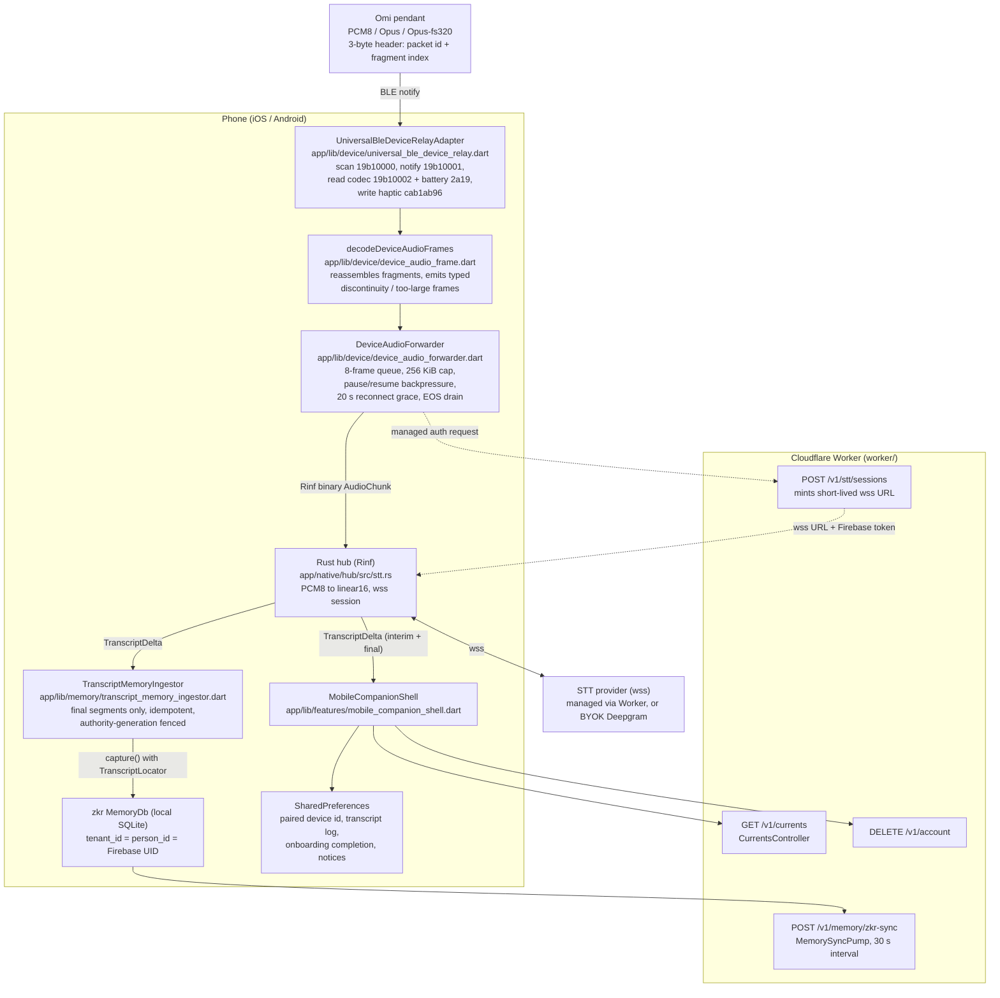

# Omi v4 Mobile Architecture

*Generated from a read-only pass over this repository, revised 2026-07-23. Every claim is grounded in files read during this pass; paths are cited inline so each statement is checkable against the source. Where a claim could not be verified from code it is marked as unverified rather than asserted. This describes what exists now, not the roadmap — the roadmap for this surface lives in `docs/mobile-companion-app.md`, and comparison with upstream Omi's mobile app lives in [`COMPARISON.md`](../COMPARISON.md) §2.*

## 1. What the mobile app is

Omi v4 ships one Flutter codebase for macOS, Windows, iOS, Android, and web (`app/pubspec.yaml`). On iOS and Android that codebase presents a deliberately narrow surface: **the phone is the pendant's modem and status panel**, not the assistant. `app/lib/main.dart` branches on `defaultTargetPlatform` (`_mobileCompanion`, lines 111-115) and routes iOS/Android to `MobileOnboardingScreen` then `MobileCompanionShell`, while every other platform gets `OnboardingScreen` / `OmiShell`. There is no chat composer, no memory management screen, and no computer-use surface on mobile — the mobile home instead carries a dismissible "Install the Omi desktop app" card (`_DesktopCta`, `app/lib/features/mobile_companion_shell.dart:1144`).

This mirrors the ownership split locked in `PLAN.md` ("Mobile owns BLE, background hardware relay, firmware, pairing, and device management; desktop owns primary assistant interaction and computer use").

### 1.1 Responsibilities

| Responsibility | Where |
|---|---|
| BLE discovery, connect, reconnect, haptics | `app/lib/device/universal_ble_device_relay.dart` |
| Role gating (mobile owns the pendant; desktop/web observe) | `app/lib/device/device_relay.dart`, `app/lib/app_services.dart:1487` (`_createDeviceRelay`) |
| 3-byte packet reassembly into audio frames | `app/lib/device/device_audio_frame.dart` |
| Bounded forwarding of frames into the Rust hub's STT session | `app/lib/device/device_audio_forwarder.dart` |
| Companion home (pendant hero doubling as the capture control, stats, tasks, transcripts) | `app/lib/features/mobile_companion_shell.dart` |
| Five-stage mobile onboarding (intro → account → pair → teach → finish) | `app/lib/features/mobile_onboarding_screen.dart` |
| Mobile settings sheet (account, consent, route, device, danger zone) | `app/lib/features/mobile_companion_shell.dart:1200-1496` |
| Account/consent, memory, currents, settings, worker HTTP | shared `app/lib/{auth,memory,currents,settings,api}` |
| Final-segment capture into `zkr` memory | `app/lib/memory/transcript_memory_ingestor.dart` |

Everything under `app/lib/keyboard/`, `app/lib/menu_bar/`, `app/lib/capabilities/`, `app/lib/features/cursor_pill*.dart` and the praefectus computer-use path is desktop-only; `app/native/hub/Cargo.toml` gates the `praefectus`/`ed25519-dalek` dependencies behind `cfg(any(target_os = "macos", "windows", "linux"))`, so iOS/Android builds never link them.

### 1.2 The Rust hub runs on mobile too

`createNativeHub()` (`app/lib/native/native_hub.dart:210`) returns the real `RinfNativeHub` on every non-web platform, so the same Rinf-bridged Rust crate (`app/native/hub`, `crate-type = ["lib", "cdylib", "staticlib"]`) is embedded in the iOS and Android binaries. On mobile the hub is used for the STT session lifecycle (`startTranscription`/`sendAudio`/`stopTranscription`) and for `zkr` memory capture; the desktop-only subsystems inside it (computer use, workspace/Notes/Mail scan) are simply never invoked. The per-user memory database path is a SHA-256 of the Firebase UID inside the `.omi` directory (`_defaultMemoryDatabasePath`, `app/lib/app_services.dart`), resolved the same way as on desktop.

## 2. Mobile data flow

## 3. BLE pendant relay and connection lifecycle

### 3.1 GATT surface actually used

`UniversalBleDeviceRelayAdapter` (`app/lib/device/universal_ble_device_relay.dart:15-21`) knows exactly seven UUIDs:

- Omi service `19b10000-e8f2-537e-4f6c-d104768a1214`
- audio stream (notify) `19b10001-…`
- audio codec (read) `19b10002-…`
- Battery service `0000180f-…` / battery level `00002a19-…`
- Speaker service `cab1ab95-…` / haptic characteristic `cab1ab96-…`

The Device Information service (`180a`) and part of the settings service (`19b10010`) are also read/written here: `universal_ble_device_relay.dart` reads model, firmware, hardware, manufacturer, and serial from `180a`, and writes the capture-state LED (`19b10015`), sleep command (`19b10014`), and device rename (`19b10016`) characteristics, each guarded so older firmware degrades gracefully. The remaining characteristics the firmware defines — button, image capture, SD-card storage, accelerometer, time sync, dim ratio, mic gain, charging status — are not referenced anywhere in `app/lib`.

Codec ids are mapped by `DeviceAudioCodec.fromFirmwareId` (`app/lib/device/device_models.dart`): `1 → pcm8`, `20 → opus`, `21 → opusFs320`, everything else `unknown`. An `unknown` codec fails closed — `DeviceAudioForwarder.start` throws "The connected Omi reported an unknown audio codec." rather than guessing a format. Note `DeviceAudioCodec.pcm16` exists in the enum and is handled downstream but is never produced by `fromFirmwareId` — no firmware id maps to it.

### 3.2 Scan

`scan()` requests BLE permissions, checks adapter power state (mapping failures to `DeviceCapabilityState.permissionRequired` / `adapterUnavailable`), then folds in system-connected peripherals *before* scanning — a pendant that is already connected at the OS level stops advertising and would otherwise be invisible (`universal_ble_device_relay.dart:82-86`). Scanning runs for a fixed `scanSettle` of 5 seconds with a service filter on the Omi UUID.

### 3.3 Connect

`connect()` retries the whole connect → discover → read → subscribe sequence up to three times total (`_maxConnectRetries = 2`, backoff 400 ms then 1000 ms), disconnecting first on each retry so a half-open GATT connection does not poison the next attempt (`universal_ble_device_relay.dart:117-214`). It resolves a device id that is not in the scan cache by first checking system-connected devices and then falling back to a fresh scan, which is what makes reconnect-after-app-restart work.

On success it reads the codec, the battery level, and the Device Information metadata, subscribes to audio notifications and to battery-level notifications (`_subscribeBattery`, falling back to the one-shot read when the characteristic does not notify), and installs a connection-state listener. A drop emits a `connecting` snapshot with "Reconnecting…"; a re-connect triggers `_restoreNotifications`, which re-discovers services and re-subscribes, retrying up to 3 times at 1-second intervals before reporting `failed` (`universal_ble_device_relay.dart:368-416`). `UniversalBle.connect(deviceId, autoConnect: true)` means the platform stack keeps trying to re-establish the link while the process lives.

### 3.4 Session-level lifecycle in AppServices

`AppServices.connectDevice` (`app/lib/app_services.dart:1315-1367`) serializes all device work through a `_lifecycle` future and layers account authority on top of the BLE connect:

- **Pairing works signed out.** If there is no production-ready session, it connects the pendant anyway (battery, status, haptics all function) and sets `deviceAudioNotice` to "Connected. Sign in to stream and transcribe audio from your Omi." Audio streaming is the only part that requires backend authority.
- **Authority is re-checked three times** — before minting transcription auth, after minting it (including that the managed session's Firebase token is still the current one), and after `deviceAudio.start` — and any drift throws and disconnects the relay.
- **Local transcription is rejected outright** (`TranscriptionAuthLocal` → `LocalTranscriptionUnavailable`), consistent with `AppServices.localTranscriptionAvailable = false`.

Managed transcription auth (`_managedTranscriptionAuthFor`, lines 1393-1427) hashes the BLE device id with SHA-256 before sending it to the Worker and derives an idempotency key from `uid + deviceId + nonce`, so the Worker never sees a raw BLE identifier.

`disconnectDevice()` stops the forwarder before dropping the link; `_stopCapture()` does the same on sign-out/dispose and only calls `deviceRelay.disconnect()` when the relay role is `mobileOwner`.

### 3.5 Haptics

`sendHaptic(level)` writes a single byte to `cab1ab96-…`, retrying with `withoutResponse: true` because some firmware revisions expose the characteristic write-without-response only (`universal_ble_device_relay.dart:303-332`). It is fired on every successful pair/reconnect from both the onboarding pair stage and the companion home.

## 4. Capture and transcript flow

### 4.1 Reassembly

`_DeviceAudioReassembler` (`app/lib/device/device_audio_frame.dart:42-155`) treats the firmware's 3-byte header as `[packet_id_lo, packet_id_hi, fragment_index]`. Fragment index 0 starts a new frame and flushes the previous one; subsequent fragments must be strictly contiguous in both packet id (mod 2^16) and fragment index, and the accumulated payload is capped at 256 KiB. Any violation emits an explicit incomplete frame carrying `DeviceAudioFrameError.discontinuity` or `.tooLarge` rather than silently concatenating across a gap.

### 4.2 Forwarding

`DeviceAudioForwarder` (`app/lib/device/device_audio_forwarder.dart`) owns one `_AudioSession` at a time:

- **Start** is a request/response over the hub's event stream with a 5-second timeout, correlated by `start-$requestId`, and rejects any status other than `TranscriptionState.started`. A concurrent `start` bumps a generation counter and cancels the superseded session.
- **Backpressure** is explicit: at most 8 pending frames; the BLE subscription is paused at 7 and resumed at 4 (`maxPendingFrames`, `_accept`/`_drain`).
- **Continuity is enforced a second time** at the session level (`_continuityGap`), including 16-bit packet-id rollover, and any gap fails the session with a typed `DeviceAudioGap` (`invalidStart`, `packetDiscontinuity`, `frameTooLarge`, `bufferCapacity`).
- **Disconnects** start a 20-second `reconnectGrace` timer; reconnecting within that window resumes the same STT session and resets packet expectations, otherwise the session is aborted.
- **Clean finish** sends a zero-length end-of-stream chunk and drains; abort paths instead send `stopTranscription` and wait for a `TranscriptionStopAcknowledgement` (5-second timeout). The code goes to some length to send exactly one of EOS or stop, exactly once — a large share of `app/test/device/device_audio_forwarder_test.dart` (995 lines) exercises those orderings.

### 4.3 Transcripts to UI and to memory

The hub emits `TranscriptDelta` events with a stable `segmentId`, an STT epoch, and a final/interim flag. Two consumers subscribe:

1. `_MobileCompanionShellState` (`mobile_companion_shell.dart:73-88`) keeps the newest 100 **final** segments in memory and mirrors them to `PreferencesTranscriptLogStore`.
2. `TranscriptMemoryIngestor` (`app/lib/memory/transcript_memory_ingestor.dart`), wired in `AppServices._handleNativeEvent` (line 1277), captures final non-empty segments into `zkr` with a `TranscriptLocator` (device, provider, stream, segment, start/end ms). The ingestion key is `sha256(personId ‖ audioStreamId ‖ segmentId)`, so replays are idempotent; a differing fingerprint for the same key raises `TranscriptCaptureConflict` instead of writing twice. Captures are fenced by an authority generation and cancelled when the account changes. Segments tagged `deviceId == 'desktop-microphone'` are skipped (that is the desktop voice path).

Captured memory is pushed to the Worker by `MemorySyncPump` on a 30-second timer (`app/lib/memory/memory_sync.dart:114-155`, `POST /v1/memory/zkr-sync`).

## 5. Persistence on mobile

All mobile-local persistence is `shared_preferences`; there is no local audio file store and no local SQLite outside the hub's `zkr` database. That database lives inside the shared `.omi` directory resolved by `omiDataDirectory()` (`app/lib/storage/omi_directory.dart`) — on iOS and Android, where there is no writable home, that resolves to a `.omi` subfolder of the platform's private application-support area. See root [`ARCHITECTURE.md`](../ARCHITECTURE.md) §5.1.

| Store | Key | File |
|---|---|---|
| Paired device id | `paired_device_id_v1` | `app/lib/device/paired_device_store.dart` |
| Recent final transcripts (cap 200) | `companion_transcripts_v1` | `app/lib/features/transcript_log_store.dart` |
| Desktop-install notice dismissal | `desktop_install_notice_dismissed_v1` | `mobile_companion_shell.dart:228` |
| Onboarding completion (local + Worker-backed layer) | — | `app/lib/onboarding/onboarding_completion.dart`, wired at `app_services.dart:310` |
| Processing-consent receipt | — | `app/lib/auth/consent_store.dart` |
| BYOK provider credentials | — | `app/lib/providers/provider_credentials.dart` (`flutter_secure_storage`) |
| Capture enabled | — | `app/lib/device/capture_enabled_store.dart` |
| Personal memory | — | `zkr` SQLite at `<.omi>/omi-memory-<sha256(uid)>.sqlite3` (`_defaultMemoryDatabasePath`, `app_services.dart`) |

`AppServices.deleteAccount()` (line 317) calls `DELETE /v1/account` when signed in, then deletes BYOK credentials, clears all SharedPreferences, signs out, and bumps a `dataWipes` notifier that `main.dart` listens to in order to re-evaluate onboarding state.

## 6. Onboarding

`MobileOnboardingScreen` is a five-stage flow (`MobileOnboardingStage`: `intro`, `account`, `pair`, `teach`, `finish`), rendered over an animated backdrop whose brightness/"searching" state tracks the BLE phase (`mobile_onboarding_screen.dart:174-261`).

- **intro** offers "I already have an account", which skips pairing, eagerly calls `AppServices.resyncAccount()`, and jumps to the tutorial (lines 91-94).
- **account** embeds the shared `AuthenticationGate` (phone OTP with an explicit Firebase phone-number disclosure checkbox, plus Google and Apple sign-in — `app/lib/features/onboarding/authentication_gate.dart:117-238`) and a separate "Allow Omi to process my data" consent button. Auth is considered satisfied either by processing authority or by Firebase being entirely unconfigured, so local/testing builds do not deadlock (lines 77-82).
- **pair** scans, auto-connects the first non-excluded result, persists the device id, fires a haptic, and auto-advances 1200 ms after a successful connect. "Not this one?" excludes that device id and rescans; "Pair later" skips the stage entirely. The pendant glow is tinted blue when connected and red when disconnected/failed, deliberately mirroring the firmware LED (comment at lines 615-624 notes charging state is not exposed over the relay, so the green charging states cannot be mirrored).
- **teach** is three static one-line cards.
- **finish** plays a `LightspeedTransition` — "lightspeed" if a pendant is connected and processing authority is granted, plain fade otherwise (lines 99-111) — then persists completion via `OnboardingCompletionStore` and the hub checklist (`main.dart:149-161`).

### 6.1 The companion home: one image, one gesture

The pendant image is the whole control surface. `_tapPendant` (`app/lib/features/mobile_companion_shell.dart`) is the only capture control:

- **Connected** — a tap toggles capture (`_setCaptureEnabled(!_captureEnabled)`), which fires a selection haptic, persists the choice through `CaptureEnabledStore` so it survives a relaunch, and writes the matching state to the pendant's capture LED (`19b10015`).
- **Disconnected** — a tap reconnects. The image is faded and desaturated in that state: `pendantFor(warmth)` ramps opacity and saturation continuously over the same 0…1, so connecting fades and saturates the asset in and disconnecting runs the identical curve backwards; fully warm is the untouched asset with the filter dropped out entirely.
- **Hold** — a long press disconnects, behind a heavy haptic plus a relay-side haptic confirm so it cannot be triggered by accident.

**There is no capture switch and no reconnect button.** The comment in the source calling out "the switch under the minutes chip" is stale; no `Switch` exists in this file. With the switch gone, the on-screen LED ring carries the state instead — blue while the pendant sits idle, recording-red the moment capture is live, mirroring the firmware LED semantics. A hint line under the image spells the gesture out: "Tap the pendant to reconnect" when disconnected, "Tap to stop · Hold to disconnect" or "Tap to start capturing · Hold to disconnect" when connected.

Capture is on by default: connecting the pendant starts streaming without further interaction, and the remembered off state is re-applied on reconnect. On the connect edge an `OmiBurstGlow` (`app/lib/ui/burst_glow.dart`) fires once behind the pendant, keyed on a connection epoch so a later reconnect produces a fresh burst; it is skipped entirely under reduced motion, where a burst that cannot animate would leave a static blob behind.

The scrolling body of the companion home is wrapped in `ScrollEdgeFade` (`app/lib/ui/scroll_edge_fade.dart`), the shared scroll-edge treatment also used by the tasks screen, meeting notes, and account setup: page-coloured gradients at the top and bottom of the scroll view, each hidden while the view is already resting against that edge.

## 7. Settings on mobile

The mobile settings surface is a modal bottom sheet, not a screen (`_SettingsSheet`, `mobile_companion_shell.dart:1200`). It contains exactly:

- **Account** — signed-in identity and sign-out; **Processing consent** — grant date + policy version, with revoke (`_AccountTiles`, line 1394).
- **Transcription route** — "Managed Omi transcription" or "Bring your own key · <model>", read-only (`_RouteTile`, line 1461).
- **App version** — from the `OMI_APP_VERSION` dart-define, defaulting to `dev`.
- **Device** (only when a device is remembered) — remembered id with a Forget button, and a confirmed "Reset pendant".
- **Calendar & Reminders** — `EventKitProactiveSyncTile` (Apple-platform EventKit opt-in, `app/lib/integrations/`).
- **Danger zone** — confirmed delete-account.

That is the entire mobile settings surface. There is no language picker, no transcription-model selector, no notification settings, no developer mode, no privacy/data-management page.

## 8. How mobile talks to the backend and the hub

- **To the hub**: in-process over Rinf typed signals (`app/lib/native/native_hub.dart`, generated codecs under `app/lib/native/generated/`). Audio travels as bounded binary `AudioChunk` signals.
- **To the Worker**: HTTPS with a Firebase ID token, through `WorkerHttpClient` (`app/lib/api/worker_http.dart`), default origin `https://omi.tsc.hk` overridable by `OMI_API_ORIGIN` (`app_services.dart:356-363`). The origin is validated to be an HTTPS origin with no credentials/path/query/fragment (`_validateWorkerOrigin`, line 1471).
- Mobile-relevant Worker routes exercised: `POST /v1/stt/sessions` (managed STT), `POST /v1/memory/zkr-sync`, `GET /v1/currents` (+ dismiss), `DELETE /v1/account`, and the onboarding-completion route behind `LayeredOnboardingCompletionStore`.
- **Conversation inbox polling is desktop-only**: `canPollInbox` is gated to macOS/Windows (`app_services.dart:133-137`), so a phone never polls the shared conversation transport.

The hub's outbound STT socket is the only path pendant audio takes; it goes to the managed Worker-minted `wss` endpoint or, with a BYOK credential, straight to Deepgram (see `ARCHITECTURE.md` §3.4). Opus is passed through to the provider as `encoding=opus` rather than decoded on the phone (`app/native/hub/src/stt.rs:131`).

## 9. Known gaps and rough edges

Honest list, all verified against the code:

- **No background operation.** `app/ios/Runner/Info.plist` declares `UIBackgroundModes: [bluetooth-central]` — enough for BLE notifications to keep arriving — but there is no CoreBluetooth state restoration identifier, and Android has no foreground service and no `FOREGROUND_SERVICE` permission in `app/android/app/src/main/AndroidManifest.xml`. In practice, capture is only dependable while the app is foregrounded. This is `docs/mobile-companion-app.md` Phase 3, unstarted.
- **One dropped BLE packet ends the capture session.** `_continuityGap` → `_fail` → `_finish(abort: true)` tears the STT session down, and nothing restarts it automatically; the user must toggle Capture (or reconnect) to resume. There is no WAL, so the audio in flight is gone. This is deliberate ("never synthesize continuity") but the recovery half — Phase 4 in `docs/mobile-companion-app.md` — does not exist yet.
- **Device metadata depends on firmware support.** `RelayDevice` carries `modelNumber`, `firmwareRevision`, `hardwareRevision`, `manufacturerName`, and `serialNumber`, populated from the Device Information service (`180a`) on connect. Pendants running firmware without that service leave the fields null and the Developer options page shows "Not reported" — expected degradation rather than a defect.
- **`DeviceAudioCodec.pcm16` is unreachable.** No firmware id maps to it in `fromFirmwareId`, though the rest of the pipeline handles it.
- **The capture toggle is asymmetric.** Turning capture off calls `deviceAudio.stop()`; turning it back on calls `connectDevice(device.id)` again — i.e. a full reconnect-and-restart rather than resuming a streaming session (`_setCapture` in `mobile_companion_shell.dart`).
- **Capture and reconnect share one gesture with no visible affordance.** Tapping the pendant image means "toggle capture" when connected and "reconnect" when not (§6.1). The only cue is the hint line under the image; there is no button, so a user who does not read it has no other route.
- **Diagnostic `print` calls ship in the BLE adapter.** Two `// ignore: avoid_print` sites in `universal_ble_device_relay.dart` log connect failures to stdout in release builds.
- **No physical-device proof.** `PLAN.md` still lists "Credentialed live Deepgram, physical iOS/Android sessions, and background recovery" as outstanding for the mobile relay slice. Everything above is logic- and widget-tested only; no run against real hardware or real STT credentials is recorded in this repository.
- **No pendant firmware coupling.** The pendant firmware is being vendored into `firmware/` as the device counterpart to this relay; it gets its own document. Nothing in `app/lib` reads or writes firmware images today.
- **Transcript review is shallow.** The session list is capped at 100 in memory / 200 on disk, is not searchable, has no conversation grouping, and is not reconciled against the Worker — it is a local log of what this phone happened to relay, not a view of the account's conversations.
