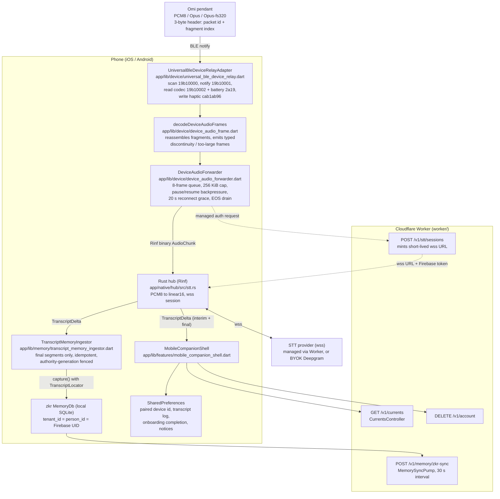

# Omi v4 Mobile Architecture

*Generated from a read-only pass over this repository and over the upstream `BasedHardware/omi` checkout at `~/projects/omi` on 2026-07-23, reflecting the repo at commit `7baf8ac`. Every claim is grounded in files read during this pass; paths are cited inline so each statement is checkable against the source. Where a claim could not be verified from code it is marked as unverified rather than asserted. This describes what exists now, not the roadmap — the roadmap for this surface lives in `docs/mobile-companion-app.md`.*

## 1. What the mobile app is

Omi v4 ships one Flutter codebase for macOS, Windows, iOS, Android, and web (`app/pubspec.yaml`). On iOS and Android that codebase presents a deliberately narrow surface: **the phone is the pendant's modem and status panel**, not the assistant. `app/lib/main.dart` branches on `defaultTargetPlatform` (`_mobileCompanion`, lines 111-115) and routes iOS/Android to `MobileOnboardingScreen` then `MobileCompanionShell`, while every other platform gets `OnboardingScreen` / `OmiShell`. There is no chat composer, no memory management screen, and no computer-use surface on mobile — the mobile home instead carries a dismissible "Install the Omi desktop app" card (`_DesktopCta`, `app/lib/features/mobile_companion_shell.dart:1144`).

This mirrors the ownership split locked in `PLAN.md` ("Mobile owns BLE, background hardware relay, firmware, pairing, and device management; desktop owns primary assistant interaction and computer use").

### 1.1 Responsibilities

| Responsibility | Where |
|---|---|
| BLE discovery, connect, reconnect, haptics | `app/lib/device/universal_ble_device_relay.dart` |
| Role gating (mobile owns the pendant; desktop/web observe) | `app/lib/device/device_relay.dart`, `app/lib/app_services.dart:1487` (`_createDeviceRelay`) |
| 3-byte packet reassembly into audio frames | `app/lib/device/device_audio_frame.dart` |
| Bounded forwarding of frames into the Rust hub's STT session | `app/lib/device/device_audio_forwarder.dart` |
| Companion home (pendant hero, capture toggle, stats, tasks, transcripts) | `app/lib/features/mobile_companion_shell.dart` |
| Five-stage mobile onboarding (intro → account → pair → teach → finish) | `app/lib/features/mobile_onboarding_screen.dart` |
| Mobile settings sheet (account, consent, route, device, danger zone) | `app/lib/features/mobile_companion_shell.dart:1200-1496` |
| Account/consent, memory, currents, settings, worker HTTP | shared `app/lib/{auth,memory,currents,settings,api}` |
| Final-segment capture into `zkr` memory | `app/lib/memory/transcript_memory_ingestor.dart` |

Everything under `app/lib/keyboard/`, `app/lib/menu_bar/`, `app/lib/capabilities/`, `app/lib/features/cursor_pill*.dart` and the praefectus computer-use path is desktop-only; `app/native/hub/Cargo.toml` gates the `praefectus`/`ed25519-dalek` dependencies behind `cfg(any(target_os = "macos", "windows", "linux"))`, so iOS/Android builds never link them.

### 1.2 The Rust hub runs on mobile too

`createNativeHub()` (`app/lib/native/native_hub.dart:210`) returns the real `RinfNativeHub` on every non-web platform, so the same Rinf-bridged Rust crate (`app/native/hub`, `crate-type = ["lib", "cdylib", "staticlib"]`) is embedded in the iOS and Android binaries. On mobile the hub is used for the STT session lifecycle (`startTranscription`/`sendAudio`/`stopTranscription`) and for `zkr` memory capture; the desktop-only subsystems inside it (computer use, workspace/Notes/Mail scan) are simply never invoked. The per-user memory database path is a SHA-256 of the Firebase UID under the app support directory (`app/lib/app_services.dart:1504`), identical to desktop.

## 2. Mobile data flow

## 3. BLE pendant relay and connection lifecycle

### 3.1 GATT surface actually used

`UniversalBleDeviceRelayAdapter` (`app/lib/device/universal_ble_device_relay.dart:15-21`) knows exactly seven UUIDs:

- Omi service `19b10000-e8f2-537e-4f6c-d104768a1214`
- audio stream (notify) `19b10001-…`
- audio codec (read) `19b10002-…`
- Battery service `0000180f-…` / battery level `00002a19-…`
- Speaker service `cab1ab95-…` / haptic characteristic `cab1ab96-…`

These match upstream's constants exactly (`~/projects/omi/app/lib/services/devices/models.dart:12-38`). The Device Information service (`180a`) and part of the settings service (`19b10010`) are also read/written here: `universal_ble_device_relay.dart` reads model, firmware, hardware, manufacturer, and serial from `180a`, and writes the capture-state LED (`19b10015`), sleep command (`19b10014`), and device rename (`19b10016`) characteristics, each guarded so older firmware degrades gracefully. Everything else upstream defines — button, image capture, SD-card storage, accelerometer, time sync, and the remaining settings characteristics (dim ratio, mic gain, charging status) — is not referenced anywhere in `app/lib`.

Codec ids map the same way as upstream (`DeviceAudioCodec.fromFirmwareId`, `app/lib/device/device_models.dart:27-32`: `1 → pcm8`, `20 → opus`, `21 → opusFs320`, everything else `unknown`), except upstream falls back to `pcm8` on an unknown id (`~/projects/omi/app/lib/services/devices/connectors/omi_connection.dart:152-154`) while we fail closed: an `unknown` codec makes `DeviceAudioForwarder.start` throw "The connected Omi reported an unknown audio codec." (`app/lib/device/device_audio_forwarder.dart:129-131`). Note `DeviceAudioCodec.pcm16` exists in the enum and is handled downstream but is never produced by `fromFirmwareId` — no firmware id maps to it.

### 3.2 Scan

`scan()` requests BLE permissions, checks adapter power state (mapping failures to `DeviceCapabilityState.permissionRequired` / `adapterUnavailable`), then folds in system-connected peripherals *before* scanning — a pendant that is already connected at the OS level stops advertising and would otherwise be invisible (`universal_ble_device_relay.dart:82-86`). Scanning runs for a fixed `scanSettle` of 5 seconds with a service filter on the Omi UUID.

### 3.3 Connect

`connect()` retries the whole connect → discover → read → subscribe sequence up to three times total (`_maxConnectRetries = 2`, backoff 400 ms then 1000 ms), disconnecting first on each retry so a half-open GATT connection does not poison the next attempt (`universal_ble_device_relay.dart:117-214`). It resolves a device id that is not in the scan cache by first checking system-connected devices and then falling back to a fresh scan, which is what makes reconnect-after-app-restart work.

On success it reads the codec, the battery level, and the Device Information metadata, subscribes to audio notifications and to battery-level notifications (`_subscribeBattery`, falling back to the one-shot read when the characteristic does not notify), and installs a connection-state listener. A drop emits a `connecting` snapshot with "Reconnecting…"; a re-connect triggers `_restoreNotifications`, which re-discovers services and re-subscribes, retrying up to 3 times at 1-second intervals before reporting `failed` (`universal_ble_device_relay.dart:368-416`). `UniversalBle.connect(deviceId, autoConnect: true)` means the platform stack keeps trying to re-establish the link while the process lives.

### 3.4 Session-level lifecycle in AppServices

`AppServices.connectDevice` (`app/lib/app_services.dart:1315-1367`) serializes all device work through a `_lifecycle` future and layers account authority on top of the BLE connect:

- **Pairing works signed out.** If there is no production-ready session, it connects the pendant anyway (battery, status, haptics all function) and sets `deviceAudioNotice` to "Connected. Sign in to stream and transcribe audio from your Omi." Audio streaming is the only part that requires backend authority.
- **Authority is re-checked three times** — before minting transcription auth, after minting it (including that the managed session's Firebase token is still the current one), and after `deviceAudio.start` — and any drift throws and disconnects the relay.
- **Local transcription is rejected outright** (`TranscriptionAuthLocal` → `LocalTranscriptionUnavailable`), consistent with `AppServices.localTranscriptionAvailable = false`.

Managed transcription auth (`_managedTranscriptionAuthFor`, lines 1393-1427) hashes the BLE device id with SHA-256 before sending it to the Worker and derives an idempotency key from `uid + deviceId + nonce`, so the Worker never sees a raw BLE identifier.

`disconnectDevice()` stops the forwarder before dropping the link; `_stopCapture()` does the same on sign-out/dispose and only calls `deviceRelay.disconnect()` when the relay role is `mobileOwner`.

### 3.5 Haptics

`sendHaptic(level)` writes a single byte to `cab1ab96-…`, retrying with `withoutResponse: true` because some firmware revisions expose the characteristic write-without-response only (`universal_ble_device_relay.dart:303-332`). It is fired on every successful pair/reconnect from both the onboarding pair stage and the companion home.

## 4. Capture and transcript flow

### 4.1 Reassembly

`_DeviceAudioReassembler` (`app/lib/device/device_audio_frame.dart:42-155`) treats the firmware's 3-byte header as `[packet_id_lo, packet_id_hi, fragment_index]`. Fragment index 0 starts a new frame and flushes the previous one; subsequent fragments must be strictly contiguous in both packet id (mod 2^16) and fragment index, and the accumulated payload is capped at 256 KiB. Any violation emits an explicit incomplete frame carrying `DeviceAudioFrameError.discontinuity` or `.tooLarge` rather than silently concatenating across a gap.

### 4.2 Forwarding

`DeviceAudioForwarder` (`app/lib/device/device_audio_forwarder.dart`) owns one `_AudioSession` at a time:

- **Start** is a request/response over the hub's event stream with a 5-second timeout, correlated by `start-$requestId`, and rejects any status other than `TranscriptionState.started`. A concurrent `start` bumps a generation counter and cancels the superseded session.
- **Backpressure** is explicit: at most 8 pending frames; the BLE subscription is paused at 7 and resumed at 4 (`maxPendingFrames`, `_accept`/`_drain`).
- **Continuity is enforced a second time** at the session level (`_continuityGap`), including 16-bit packet-id rollover, and any gap fails the session with a typed `DeviceAudioGap` (`invalidStart`, `packetDiscontinuity`, `frameTooLarge`, `bufferCapacity`).
- **Disconnects** start a 20-second `reconnectGrace` timer; reconnecting within that window resumes the same STT session and resets packet expectations, otherwise the session is aborted.
- **Clean finish** sends a zero-length end-of-stream chunk and drains; abort paths instead send `stopTranscription` and wait for a `TranscriptionStopAcknowledgement` (5-second timeout). The code goes to some length to send exactly one of EOS or stop, exactly once — a large share of `app/test/device/device_audio_forwarder_test.dart` (995 lines) exercises those orderings.

### 4.3 Transcripts to UI and to memory

The hub emits `TranscriptDelta` events with a stable `segmentId`, an STT epoch, and a final/interim flag. Two consumers subscribe:

1. `_MobileCompanionShellState` (`mobile_companion_shell.dart:73-88`) keeps the newest 100 **final** segments in memory and mirrors them to `PreferencesTranscriptLogStore`.
2. `TranscriptMemoryIngestor` (`app/lib/memory/transcript_memory_ingestor.dart`), wired in `AppServices._handleNativeEvent` (line 1277), captures final non-empty segments into `zkr` with a `TranscriptLocator` (device, provider, stream, segment, start/end ms). The ingestion key is `sha256(personId ‖ audioStreamId ‖ segmentId)`, so replays are idempotent; a differing fingerprint for the same key raises `TranscriptCaptureConflict` instead of writing twice. Captures are fenced by an authority generation and cancelled when the account changes. Segments tagged `deviceId == 'desktop-microphone'` are skipped (that is the desktop voice path).

Captured memory is pushed to the Worker by `MemorySyncPump` on a 30-second timer (`app/lib/memory/memory_sync.dart:114-155`, `POST /v1/memory/zkr-sync`).

## 5. Persistence on mobile

All mobile-local persistence is `shared_preferences`; there is no local audio file store and no local SQLite outside the hub's `zkr` database.

| Store | Key | File |
|---|---|---|
| Paired device id | `paired_device_id_v1` | `app/lib/device/paired_device_store.dart` |
| Recent final transcripts (cap 200) | `companion_transcripts_v1` | `app/lib/features/transcript_log_store.dart` |
| Desktop-install notice dismissal | `desktop_install_notice_dismissed_v1` | `mobile_companion_shell.dart:228` |
| Onboarding completion (local + Worker-backed layer) | — | `app/lib/onboarding/onboarding_completion.dart`, wired at `app_services.dart:310` |
| Processing-consent receipt | — | `app/lib/auth/consent_store.dart` |
| BYOK provider credentials | — | `app/lib/providers/provider_credentials.dart` (`flutter_secure_storage`) |
| Personal memory | — | `zkr` SQLite at `omi-memory-<sha256(uid)>.sqlite3` (`app_services.dart:1504`) |

`AppServices.deleteAccount()` (line 317) calls `DELETE /v1/account` when signed in, then deletes BYOK credentials, clears all SharedPreferences, signs out, and bumps a `dataWipes` notifier that `main.dart` listens to in order to re-evaluate onboarding state.

## 6. Onboarding

`MobileOnboardingScreen` is a five-stage flow (`MobileOnboardingStage`: `intro`, `account`, `pair`, `teach`, `finish`), rendered over an animated backdrop whose brightness/"searching" state tracks the BLE phase (`mobile_onboarding_screen.dart:174-261`).

- **intro** offers "I already have an account", which skips pairing, eagerly calls `AppServices.resyncAccount()`, and jumps to the tutorial (lines 91-94).
- **account** embeds the shared `AuthenticationGate` (phone OTP with an explicit Firebase phone-number disclosure checkbox, plus Google and Apple sign-in — `app/lib/features/onboarding/authentication_gate.dart:117-238`) and a separate "Allow Omi to process my data" consent button. Auth is considered satisfied either by processing authority or by Firebase being entirely unconfigured, so local/testing builds do not deadlock (lines 77-82).
- **pair** scans, auto-connects the first non-excluded result, persists the device id, fires a haptic, and auto-advances 1200 ms after a successful connect. "Not this one?" excludes that device id and rescans; "Pair later" skips the stage entirely. The pendant glow is tinted blue when connected and red when disconnected/failed, deliberately mirroring the firmware LED (comment at lines 615-624 notes charging state is not exposed over the relay, so the green charging states cannot be mirrored).
- **teach** is three static one-line cards.
- **finish** plays a `LightspeedTransition` — "lightspeed" if a pendant is connected and processing authority is granted, plain fade otherwise (lines 99-111) — then persists completion via `OnboardingCompletionStore` and the hub checklist (`main.dart:149-161`).

## 7. Settings on mobile

The mobile settings surface is a modal bottom sheet, not a screen (`_SettingsSheet`, `mobile_companion_shell.dart:1200`). It contains exactly:

- **Account** — signed-in identity and sign-out; **Processing consent** — grant date + policy version, with revoke (`_AccountTiles`, line 1394).
- **Transcription route** — "Managed Omi transcription" or "Bring your own key · <model>", read-only (`_RouteTile`, line 1461).
- **App version** — from the `OMI_APP_VERSION` dart-define, defaulting to `dev`.
- **Device** (only when a device is remembered) — remembered id with a Forget button, and a confirmed "Reset pendant".
- **Calendar & Reminders** — `EventKitProactiveSyncTile` (Apple-platform EventKit opt-in, `app/lib/integrations/`).
- **Danger zone** — confirmed delete-account.

That is the entire mobile settings surface. There is no language picker, no transcription-model selector, no notification settings, no developer mode, no privacy/data-management page.

## 8. How mobile talks to the backend and the hub

- **To the hub**: in-process over Rinf typed signals (`app/lib/native/native_hub.dart`, generated codecs under `app/lib/native/generated/`). Audio travels as bounded binary `AudioChunk` signals.
- **To the Worker**: HTTPS with a Firebase ID token, through `WorkerHttpClient` (`app/lib/api/worker_http.dart`), default origin `https://omi.tsc.hk` overridable by `OMI_API_ORIGIN` (`app_services.dart:356-363`). The origin is validated to be an HTTPS origin with no credentials/path/query/fragment (`_validateWorkerOrigin`, line 1471).
- Mobile-relevant Worker routes exercised: `POST /v1/stt/sessions` (managed STT), `POST /v1/memory/zkr-sync`, `GET /v1/currents` (+ dismiss), `DELETE /v1/account`, and the onboarding-completion route behind `LayeredOnboardingCompletionStore`.
- **Conversation inbox polling is desktop-only**: `canPollInbox` is gated to macOS/Windows (`app_services.dart:133-137`), so a phone never polls the shared conversation transport.

The hub's outbound STT socket is the only path pendant audio takes; it goes to the managed Worker-minted `wss` endpoint or, with a BYOK credential, straight to Deepgram (see `ARCHITECTURE.md` §3.4). Opus is passed through to the provider as `encoding=opus` rather than decoded on the phone (`app/native/hub/src/stt.rs:131`).

## 9. Comparison against upstream `BasedHardware/omi`

This section compares observable structure only — which code exists in which tree. It makes no claim about either project's stability, reliability, or quality in either direction; nothing here has been measured, and surface area is not evidence of either maturity or fragility.

Structural scale: upstream's Flutter app is 593 Dart files (543 excluding generated localizations); ours is 160 (87 excluding the generated Rinf/serde codecs). Upstream's app talks to a Python/FastAPI + Firebase backend; ours talks to a Cloudflare Workers backend (`worker/`, with a Rust port in `worker-rs/`) plus an embedded Rust hub.

### 9.1 What we deliberately skip

Every item below was verified to exist upstream by reading files under `~/projects/omi/app/lib`, and verified absent here by searching `app/lib`.

These are omissions, not deficits. Most are load this codebase chose not to carry — surfaces, SDKs, protocols, and vendor integrations each of which brings its own state, failure modes, permissions, and maintenance cost. A few are things worth evaluating for adoption; those are collected separately in §9.4 rather than mixed in here.

**Device breadth**
- **Nine other device integrations** — Apple Watch, Bee, Fieldy, Friend pendant, Limitless, Plaud, Ray-Ban Meta, OmiGlass, and a generic "custom" connector (`~/projects/omi/app/lib/services/devices/connectors/`), with matching discoverers, transports and bridges. We support exactly one device: the Omi pendant over `universal_ble`.
- **Button characteristic and voice-command sessions** — upstream binds `23ba7924-…` and implements press/long-press-to-talk with haptic feedback (`~/projects/omi/app/lib/services/capture/capture_controller.dart:840-855`).
- **Image/photo capture** (`19b10005`/`19b10006`) with orientation handling, a photos grid and a photo viewer.
- **SD-card and flash-page storage sync** — a whole storage-service protocol (`30295780-…`) plus `pages/sdcard/` and `services/wals/{sdcard_wal_sync,flash_page_wal_sync,ring_storage_sync}.dart`.
- **Accelerometer stream** (`32403790-…`), **time sync** (`19b10030-…`), and the remaining **settings service** characteristics (`19b10010`: dim ratio, mic gain, charging status). The Device Information service (`180a`) and the capture-LED/sleep/rename settings characteristics are implemented here — see §3.
- **In-app firmware OTA** — `nordic_dfu` + `mcumgr_flutter` with `pages/home/firmware_update.dart`, `firmware_update_dialog.dart`, and a separate OmiGlass OTA command set.

**Capture reliability**
- **Write-ahead log for offline audio** — `services/wals/` implements a full WAL with `WalStatus{inProgress,miss,uploaded,synced,corrupted}`, storage tiers `{mem,disk,sdcard,flashPage}`, a sync reconciler, rate limiter, retry ceiling, and a user-facing sync state machine (`~/projects/omi/app/lib/services/wals/wal.dart`). We buffer at most 8 frames in memory and abort the session on any gap.
- **Background execution** — upstream depends on `flutter_background_service` and `flutter_foreground_task` and has a `NativeMicRecorderService`. We have no foreground service and no background service of any kind.
- **Phone microphone as an audio source** — `services/audio_sources/phone_mic_source.dart`, `services/mic/mic_arbiter.dart`, `phone_mic_interface.dart`. Our mobile app has no mic capture at all (and, correspondingly, `app/ios/Runner/Info.plist` declares no `NSMicrophoneUsageDescription`, while `app/android/app/src/main/AndroidManifest.xml` declares no `RECORD_AUDIO`).
- **On-device STT** — upstream ships both a Whisper provider and an Apple on-device provider (`services/sockets/on_device_whisper_provider.dart`, `on_device_apple_provider.dart`). Ours is a typed fail-closed stub (`AppServices.localTranscriptionAvailable = false`).

**Product surface**
- **Apps / plugins ecosystem** — install, explore, create, update, review, and MCP-server registration (`pages/apps/`, `backend/http/api/apps.dart`, `mcp_api.dart`, `providers/mcp_provider.dart`).
- **Speech profile and diarization onboarding** — enrollment recording, percentage-bar progress, sample management, plus people/speaker tagging (`pages/speech_profile/`, `pages/settings/people.dart`, `backend/schema/person.dart`). We have no speaker identity concept.
- **Conversations UI** — list, detail, capturing, processing, folders, audio player, recording detail, geolocation on conversations (`flutter_map`, `geolocator`). Our mobile shows a flat list of recent final transcript segments.
- **Chat on mobile** — upstream has a full chat page with agents and TTS. Our mobile has no chat surface whatsoever.
- **Action items, goals, daily summaries, knowledge graph, announcements, "Wrapped 2025", referral program** (`pages/action_items/`, `providers/goals_provider.dart`, `pages/settings/daily_summary_*`, `knowledge_graph_api.dart`, `pages/announcements/`, `pages/settings/wrapped_2025_page.dart`, `pages/referral/`).
- **Third-party task/health integrations** — Asana, ClickUp, Todoist, Google Tasks, Google Calendar, Apple Health, Apple Reminders (`services/integrations/`). We have only Apple EventKit (`app/lib/integrations/`).
- **Payments in-app** — Stripe Connect and PayPal creator payouts, a payments page, plan pricing and a usage page (`pages/payments/`, `utils/plan_pricing.dart`, `pages/settings/usage_page.dart`). Our mobile has no billing surface at all; billing exists only as a Worker-side client used by the desktop settings screen.
- **Phone calls** (`pages/phone_calls/`, `services/phone_call_service.dart`).
- **Push notifications** — Firebase Messaging + `awesome_notifications` with dedicated handlers for action items, important conversations and merges (`services/notifications/`). We have none.
- **Localization** — ~40 locales as `.arb` + generated Dart (`~/projects/omi/app/lib/l10n/`), with an in-app language picker and primary-language onboarding. Our strings are hard-coded English.
- **Deep settings** — upstream has ~40 settings pages (developer mode, dev API keys, webhooks, custom vocabulary, conversation display/timeout, data privacy, import history, device diagnostics, permissions, transcription model selection, notification settings, fair use…). We have six tiles.
- **Analytics, crash reporting and support chat** — PostHog, Intercom, Firebase Crashlytics, `talker_flutter`, plus in-app review prompts and `upgrader` (upstream `app/pubspec.yaml`). None of these appear in our `app/pubspec.yaml` or anywhere in `app/lib`.
- **Home-screen widgets, quick actions, shortcuts, Apple Watch companion** (`services/battery_widget_service.dart`, `quick_actions_service.dart`, `shortcut_service.dart`, `widgets/apple_watch_setup_bottom_sheet.dart`).

### 9.2 What we do differently (and why)

- **Transcription runs through an in-process Rust hub, not a socket to our own backend.** Upstream opens a websocket to `<api>/v4/listen` and streams headerless packets there, letting the backend do STT, VAD, diarization, speaker auto-assignment and conversation segmentation (`~/projects/omi/app/lib/services/sockets/transcription_service.dart:98-130`). We hand frames to `app/native/hub` over Rinf, and the hub speaks directly to the STT provider — managed via a Worker-minted short-lived `wss` URL, or BYOK straight to Deepgram. Consequence: our Worker never sees raw audio bytes on the live path, and the same hub code serves desktop capture; but we also inherit none of upstream's server-side conversation intelligence.
- **The phone reassembles fragments; upstream forwards packets.** Upstream's `BleDeviceSource.processBytes` strips the 3-byte header and emits one payload per BLE packet, sending each straight to the socket (`~/projects/omi/app/lib/services/audio_sources/ble_device_source.dart:30-44`, `capture_controller.dart:877`). We concatenate fragments into whole frames and assert continuity twice before anything is sent. Whether upstream reconstructs frames server-side was not read in this pass.
- **Memory is local-first.** Final transcript segments are captured into a per-UID `zkr` SQLite database on the device and only then projected to D1 via `POST /v1/memory/zkr-sync`. Upstream's conversations and memories are server-owned records fetched over HTTP.
- **Mobile is a companion, by construction.** Upstream's phone app is the primary product surface (bottom nav with conversations / chat / memories / apps). Ours routes to a single pendant page and points the user at the desktop app. This is the ownership split in `PLAN.md`, and it is why chat, memory management, currents detail and computer use are absent from mobile rather than merely unfinished.
- **Backend shape.** Upstream: Python/FastAPI + Firebase/Firestore, with the app talking to ~26 REST modules (`~/projects/omi/app/lib/backend/http/api/`). Ours: a Cloudflare Worker with a handful of routes, and the phone using only five of them.
- **Fail-closed defaults where upstream degrades gracefully.** Unknown codec: we throw, upstream assumes PCM8. Packet discontinuity: we end the session with a typed gap, upstream keeps streaming and lets the WAL/backend cope. Local STT: we return a typed unavailable error rather than falling back to Whisper.
- **State management.** Upstream uses `provider` with ~30 `ChangeNotifier` providers; ours uses a single `AppServices` facade plus `StatefulWidget` state and a few `ValueNotifier`s. Neither is better in the abstract; it is a direct consequence of surface size.

### 9.3 What is stronger here (substantiated)

The design bet on this side is **lighter, steadier, and ultimately broader**: fewer moving parts and fewer processes now, fail-closed construction at every boundary that touches audio or account authority, and test coverage concentrated on the lifecycle that has to hold — so that breadth can be added later onto a foundation that holds, rather than assembled up front.

Each property below is readable directly from the code in this repo and is stated as a design property, **not a benchmark result** — nothing in this repository has been measured against upstream, and no comparative performance, reliability, or quality claim is made or implied. Comparisons to upstream are strictly limited to what was read in this pass.

- **No analytics, crash-reporting, or support-chat SDKs.** `app/pubspec.yaml` contains no PostHog, Intercom, Crashlytics, or equivalent, and a search of `app/lib` finds no telemetry client. For a device that records ambient conversation, "there is no third-party telemetry in the binary" is a property a reader can check for themselves rather than a policy statement they have to take on trust.
- **Audio cannot leave the phone without an explicit, versioned consent receipt.** `connectDevice` refuses to start streaming unless `productionReady` (signed in *and* `hasProcessingAuthority`), and pairing degrades to a status-only connection with a user-visible notice instead of failing (`app_services.dart:1326-1334`). The consent receipt is surfaced with its grant date and policy version, and is revocable from the settings sheet (`mobile_companion_shell.dart:1436-1453`).
- **Account-authority fencing through the whole capture path.** The UID and the exact Firebase ID token are re-verified before, during, and after starting audio (`app_services.dart:1338-1357`); `TranscriptMemoryIngestor.fence` cancels in-flight captures and drops ingestion state on any account change; the memory database path and `zkr` tenant/person ids are both derived from the UID. An account switch cannot leak one user's audio into another's memory.
- **Explicit, typed audio-gap semantics.** `DeviceAudioGapReason{invalidStart, packetDiscontinuity, frameTooLarge, bufferCapacity}` and `DeviceAudioFrameError{discontinuity, tooLarge}` make lost audio a first-class, surfaced event: the gap reason reaches the UI (`companion_error_tile` renders `deviceAudio.lastError`) instead of being absorbed into the stream. Continuity is asserted twice — once in the reassembler, once at session level — so a missing packet cannot be silently spliced over.
- **Real backpressure on the BLE producer.** An 8-frame queue that pauses and resumes the notification subscription, plus a 256 KiB per-frame ceiling (`device_audio_forwarder.dart:91-92, 256-263, 349-353`), bounds memory under a stalled hub instead of growing an unbounded send buffer.
- **Idempotent, evidence-linked memory capture.** Every captured segment carries a `TranscriptLocator` (device, provider, stream id, segment id, start/end ms) and a deterministic SHA-256 ingestion key, with fingerprint-conflict detection (`transcript_memory_ingestor.dart:75-102`). Whether upstream's server-side ingestion has an equivalent guarantee was not examined, so this is stated as a property of ours, not a deficiency of theirs.
- **The relay lifecycle is unit-tested in depth.** `app/test/device/device_audio_forwarder_test.dart` is 995 lines covering packet-id rollover, queue saturation, concurrent start/stop, EOS-vs-stop exclusivity, and reconnect resume; `app/test/features/mobile_companion_test.dart` (961 lines) and `mobile_onboarding_test.dart` (838 lines) cover the mobile surfaces widget-level. Across `app/test/device/` and the two mobile feature suites that is roughly 3,200 lines of test against roughly 3,900 lines of mobile-specific product code (`app/lib/device/` plus the two mobile screens, the transcript log store, and the Live Activity bridge).
- **Few moving parts, few processes.** 87 hand-written Dart files and 14 direct dependencies (`app/pubspec.yaml`), one capture path, one relay role, one persistence mechanism on the phone, and one outbound socket. Less code and fewer dependencies is a smaller thing to keep correct — a direct consequence of the narrower scope, not a claim that the same job is done better.

Claims deliberately **not** made: that our BLE connection is more reliable than upstream's (no physical-device evidence exists in this repo), that our transcription quality is better (no A/B evidence), that reassembling client-side is more correct than upstream's per-packet forwarding (upstream's server-side handling was not read), or anything at all about either project's stability in production.

### 9.4 Upstream capabilities not yet covered here

A review-derived list of upstream capabilities worth *evaluating* for this codebase. Inclusion here is not a commitment: each is judged on whether the behaviour it buys earns the state, permissions, and failure modes it brings. Items already scheduled in `docs/mobile-companion-app.md` are marked with their phase.

| Capability | Upstream reference | Assessment for here |
|---|---|---|
| Offline write-ahead log for captured audio | `services/wals/` (status machine, storage tiers, reconciler, retry ceiling) | **Worth adopting in reduced form.** Today a single dropped packet loses the audio in flight (§10). A bounded on-disk ring plus idempotent batch upload to `/v1/asr/transcribe` buys real durability. Upstream's four storage tiers and sync-rate reconciliation do not obviously earn their complexity at our scope. `docs/mobile-companion-app.md` Phase 4. |
| Background execution (Android foreground service, iOS state restoration) | `flutter_background_service`, `flutter_foreground_task`, `NativeMicRecorderService` | **Worth adopting.** Without it "wear it and it captures" is only true while foregrounded, which contradicts what onboarding tells the user (`mobile_onboarding_screen.dart:727`). Phase 3. |
| Battery-level notifications rather than a one-shot read | `omi_connection.dart` battery stream | **Worth adopting; low cost.** One extra subscription removes a permanently stale number from the home screen. Phase 2. |
| Device Information service (`180a`) reads | `services/devices/models.dart:40-45` | **Adopted.** Read on connect and surfaced in Settings → Developer options. |
| Automatic session restart after a transient gap | upstream keeps streaming and defers to the WAL | **Worth evaluating.** Our fail-closed abort is deliberate, but the missing half is recovery. Restart should be explicit and gap-recording, never a silent re-splice. |
| Firmware OTA in-app | `nordic_dfu`, `mcumgr_flutter`, `pages/home/firmware_update.dart` | **Defer.** Signed-image pipeline plus disconnect/resume handling is a large, sharp subsystem; it belongs with the vendored `firmware/` work, not the relay. Phase 6. |
| Pendant SD-card / flash-page retrieval | storage service `30295780-…`, `services/wals/sdcard_wal_sync.dart` | **Defer.** Only matters once the pendant is expected to record while unpaired; a phone-side WAL covers the common case first. Phase 6. |
| Speech profile / speaker identity | `pages/speech_profile/`, `backend/schema/person.dart` | **Blocked, not declined.** Requires diarization our transcription route does not currently provide; revisit when the STT path returns speaker labels. |
| On-device STT | `on_device_whisper_provider.dart`, `on_device_apple_provider.dart` | **Blocked on a provider.** `PLAN.md` keeps `TranscriptionAuth::Local` fail-closed until `rs_ai_local` supplies a real one; the fail-closed stub is the right placeholder, not the end state. |
| Push notifications | `services/notifications/` (FCM + `awesome_notifications`) | **Evaluate narrowly.** A low-battery or capture-stopped alert is genuinely useful; a general notification framework with per-type handlers is not obviously warranted for a companion surface. |
| Localization | ~40 locale bundles under `l10n/` | **Evaluate when the surface stabilises.** Our mobile string count is small enough that extracting it later is cheap; doing it now would freeze copy that is still moving. |
| Additional device vendors, button/photo/accelerometer characteristics, in-app payments, apps/plugins ecosystem, conversations UI, integrations breadth | §9.1 | **Out of scope by design**, not gaps. These belong to a different product shape (phone-as-primary-surface) than the companion role fixed in `PLAN.md`. |

## 10. Known gaps and rough edges

Honest list, all verified against the code:

- **No background operation.** `app/ios/Runner/Info.plist` declares `UIBackgroundModes: [bluetooth-central]` — enough for BLE notifications to keep arriving — but there is no CoreBluetooth state restoration identifier, and Android has no foreground service and no `FOREGROUND_SERVICE` permission in `app/android/app/src/main/AndroidManifest.xml`. In practice, capture is only dependable while the app is foregrounded. This is `docs/mobile-companion-app.md` Phase 3, unstarted.
- **One dropped BLE packet ends the capture session.** `_continuityGap` → `_fail` → `_finish(abort: true)` tears the STT session down, and nothing restarts it automatically; the user must toggle Capture (or reconnect) to resume. There is no WAL, so the audio in flight is gone. This is deliberate ("never synthesize continuity") but the recovery half — Phase 4 in `docs/mobile-companion-app.md` — does not exist yet.
- **Battery is read exactly once, at connect.** `_readFirst(deviceId, _batteryService, _batteryLevel)` is a one-shot read; the app never subscribes to battery-level notifications, so the percentage on the pendant hero goes stale for the whole session and low-battery is never surfaced.
- **Device metadata depends on firmware support.** `RelayDevice` carries `modelNumber`, `firmwareRevision`, `hardwareRevision`, `manufacturerName`, and `serialNumber`, populated from the Device Information service (`180a`) on connect. Pendants running firmware without that service leave the fields null and the Developer options page shows "Not reported" — expected degradation rather than a defect.
- **Live Activity / Dynamic Island support is scaffolding only.** `app/lib/native/live_activity_bridge.dart` is called on every relay snapshot but no iOS WidgetKit extension target exists; every invocation swallows `MissingPluginException` and no-ops. The file says so itself.
- **`DeviceAudioCodec.pcm16` is unreachable.** No firmware id maps to it in `fromFirmwareId`, though the rest of the pipeline handles it.
- **The capture toggle is asymmetric.** Turning capture off calls `deviceAudio.stop()`; turning it back on calls `connectDevice(device.id)` again — i.e. a full reconnect-and-restart rather than resuming a streaming session (`_setCapture` in `mobile_companion_shell.dart`).
- **Diagnostic `print` calls ship in the BLE adapter.** Two `// ignore: avoid_print` sites in `universal_ble_device_relay.dart` log connect failures to stdout in release builds.
- **No physical-device proof.** `PLAN.md` still lists "Credentialed live Deepgram, physical iOS/Android sessions, and background recovery" as outstanding for the mobile relay slice. Everything above is logic- and widget-tested only; no run against real hardware or real STT credentials is recorded in this repository.
- **No pendant firmware coupling.** The pendant firmware is being vendored into `firmware/` as the device counterpart to this relay; it gets its own document. Nothing in `app/lib` reads or writes firmware images today.
- **Transcript review is shallow.** The session list is capped at 100 in memory / 200 on disk, is not searchable, has no conversation grouping, and is not reconciled against the Worker — it is a local log of what this phone happened to relay, not a view of the account's conversations.
