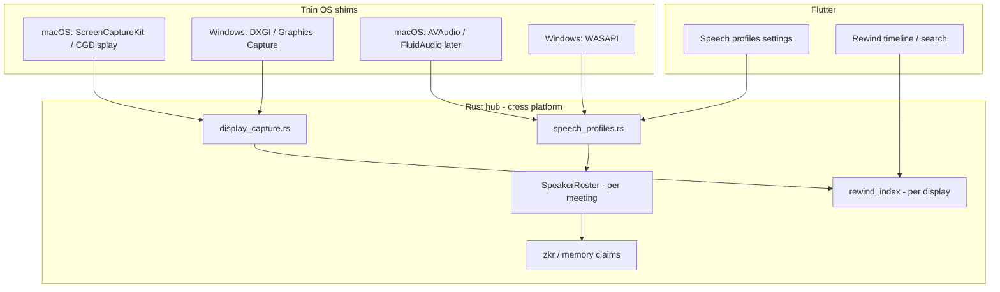

# Speech profiles & multi-display capture — plan

**Status:** plan only — do not implement until this doc is reviewed.  
**Date:** 2026-07-24  
**Goal:** (1) lasting speech profiles that learn *your* voice and *others’* voices over time, (2) honest multi-monitor screen capture for Rewind / screen understanding, (3) move the durable logic into the Rust hub so macOS / Windows / (later) Linux share one brain, with thin OS shims only for pixels and permissions.

---

## 0. Current state (what we have vs what we claim)

### Speech / speakers

| Layer | Today |
|---|---|
| **Marketing** | Site copy still says “Speech profiles, so it knows who said what” — ahead of product. |
| **Upstream gap** | `COMPARISON.md`: speech-profile / speaker identity is **blocked**, not declined. |
| **Meeting path** | Provider diarization (`diarize=true` on Deepgram) + in-meeting `SpeakerRoster` in `app/native/hub/src/meeting.rs` → `You` / `Them` / `Speaker N` **within one meeting only**. Cap: 16 diarized indices. |
| **Persistence** | No enrolled voiceprints, no cross-meeting identity, no “this is Alex” memory claim. |
| **STT note** | `docs/TODO.md` still has “drop Deepgram → grok-stt”; any profile design must not assume Deepgram forever — profiles must sit **above** the STT vendor. |

### Displays / Rewind

| Layer | Today |
|---|---|
| **Capture** | `RewindCaptureBridge.swift` → `CGDisplayCreateImage(CGMainDisplayID())` — **main display only**. |
| **Policy / storage** | Dart: `rewind_service.dart`, `rewind_policy.dart`, `rewind_platform.dart` (encode + on-device OCR via Vision on macOS). |
| **Overlay placement** | Pill / voice chrome use the screen under the cursor (`NSScreen.screens` + mouse) — positioning only, not full-desktop grab. |
| **Windows** | No Rewind capture shim yet (`InertRewindCapturePlatform` off macOS). |

### Cross-platform Rust posture

- Durable meeting / STT / memory logic already lives in `app/native/hub` (Rust).
- Screen grab + OCR + permission prompts are still **macOS Swift**.
- Speaker attribution beyond one meeting is **not** in the hub yet.

---

## 1. Product intent

### Speech profiles

1. **Owner profile** — optional short enrollment (“say these phrases”) so “You” is reliable without depending on mic-vs-system energy heuristics.
2. **Other-person profiles** — progressive: first meeting they are `Speaker 2`; after enough high-confidence clusters (or user rename), they become a named profile (“Alex”).
3. **User control** — rename, merge, forget, pause learning; never invent a name without user confirmation (or an explicit “suggest names from contacts” opt-in later).
4. **Privacy** — embeddings / voiceprints stay **on device** by default; cloud may store only opaque profile ids + display names the user chose (no raw audio upload for profiling unless user opts into managed STT that already streams audio for transcription).
5. **Scope** — meetings, pendant relay transcripts, desktop system+mic capture; Live voice can *consume* profiles later but enrollment is offline/batch-friendly first.

### Multi-display

1. Capture **every active display** the OS reports (or a user-selected subset).
2. Store / search frames **per display** with stable display ids + layout metadata (origin, size, scale, primary flag).
3. OCR / embeddings run per frame; search returns which display a hit came from.
4. AX / “screen understanding” for the overlay stays **focused display** (frontmost window / cursor screen) unless the model explicitly asks for “all screens” via a tool — don’t flood every turn with N monitors of pixels.

---

## 2. Architecture — Rust hub owns the brain



**Rule:** Swift/C#/WinRT only produce pixels, PCM, and permission state. Clustering, enrollment, merge, retention, and “which display is this?” live in Rust and are unit-tested without a GUI.

---

## 3. Speech profiles — planned implementation

### 3.1 Data model (local SQLite in hub, scoped by account uid)

New tables (names illustrative):

| Table | Purpose |
|---|---|
| `speech_profiles` | `id`, `uid`, `kind` (`owner` \| `other`), `display_name` (nullable until named), `created_at`, `updated_at`, `learning_paused`, `tombstoned_at` |
| `speech_profile_embeddings` | `profile_id`, `embedding` (blob / float vec), `quality`, `source_meeting_id`, `created_at` — capped N per profile (e.g. 32), FIFO/quality eviction |
| `speech_profile_aliases` | optional external ids (contacts) later |
| `speech_profile_sightings` | meeting-local `diarized_key` → `profile_id` soft links for one session |

**Cloud (optional Phase 3):** sync only `speech_profiles` metadata (`id`, `display_name`, `kind`) via existing memory/settings patterns — **not** embeddings — unless we later add encrypted blob sync.

### 3.2 Pipeline

1. **STT segment arrives** with optional provider speaker index (today Deepgram; tomorrow any diarizing vendor).
2. **Session roster** (`SpeakerRoster`) maps provider index → session label as today.
3. **New:** for each finalized far-end (and owner) segment of sufficient duration/SNR, extract a **speaker embedding**:
   - **Phase 1 (pragmatic):** ask the STT vendor for speaker embedding if offered; else skip progressive learning and keep numbered speakers only.
   - **Phase 2 (preferred, cross-platform):** on-device embedding model in the hub (e.g. small speaker-ID ONNX via `ort` / platform CoreML later). Audio for the segment is already in the hub’s STT path — no Swift required for the math.
4. **Match** embedding to existing profiles (cosine threshold + hysteresis).  
   - High confidence → attach segment to profile.  
   - Medium → create/keep anonymous `other` profile, accumulate.  
   - Low → leave as ephemeral `Speaker N` for this meeting only.
5. **Promotion:** when an anonymous profile has ≥ K sightings across ≥ M meetings (or user renames once), surface “Name this person?” in meeting notes / settings.
6. **Owner enrollment:** settings flow records 3–5 phrases; hub builds the owner centroid so “You” wins even when the energy heuristic is wrong.

### 3.3 Hub API (Rinf signals — planned)

| Signal | Direction | Role |
|---|---|---|
| `ListSpeechProfiles` | UI → hub | settings list |
| `RenameSpeechProfile` / `MergeSpeechProfiles` / `ForgetSpeechProfile` / `PauseSpeechLearning` | UI → hub | user control |
| `EnrollOwnerSpeech` | UI → hub | start/finish enrollment with PCM or file refs |
| `SpeechProfileMatched` | hub → UI | optional toast / note annotation |
| Meeting note composition | existing | prefer profile `display_name` over `Speaker N` when known |

### 3.4 UI (Flutter)

- Settings → **Speech profiles**: owner enroll, list others, rename/merge/forget, “learn new voices” toggle (default on).
- Meeting transcript: show `Alex` when resolved; keep `Speaker 2` until named.
- Onboarding: one optional “train your voice” step (skippable).

### 3.5 Phases

| Phase | Deliverable | Depends on |
|---|---|---|
| **S0** | Doc + schema migration stub; fix marketing copy so we don’t claim profiles until S2 | — |
| **S1** | Persist session roster soft-links + rename UI that only affects **current meeting** display names (no embeddings yet) | Flutter settings |
| **S2** | Owner enrollment + on-device or vendor embeddings; cross-meeting match for owner + anonymous others | embedding source |
| **S3** | Promote / suggest names; merge tools; pause learning; memory claim “person:Alex” optional | S2 |
| **S4** | Encrypted metadata sync to cloud (names only); multi-device profile id stability | auth/uid stable |

### 3.6 Explicit non-goals (for now)

- Identifying strangers with no meeting history.
- Uploading voiceprints to a third-party “voice ID as a service.”
- Real-time Live-API speaker ID before chat/meeting path is solid.
- Guaranteeing accuracy in heavy overlap / music (fail soft to `Speaker N`).

---

## 4. Multi-display capture — planned implementation

### 4.1 Abstraction in Rust

```rust
// planned: app/native/hub/src/display_capture.rs
pub struct DisplayId(pub String); // stable per OS session; remap on reconfigure

pub struct DisplayInfo {
    pub id: DisplayId,
    pub name: String,
    pub x: i32, pub y: i32,
    pub width: u32, pub height: u32,
    pub scale: f32,
    pub primary: bool,
}

pub struct CapturedFrame {
    pub display: DisplayId,
    pub captured_at_ms: i64,
    pub rgba_or_jpeg: bytes::Bytes, // shim may send JPEG already
    pub width: u32, pub height: u32,
}

pub trait DisplayCapturePort: Send + Sync {
    fn list_displays(&self) -> Vec<DisplayInfo>;
    fn capture(&self, id: &DisplayId) -> Option<CapturedFrame>;
    fn capture_all(&self) -> Vec<CapturedFrame>; // default: map list → capture
}
```

Flutter `RewindCapturePlatform` grows from “one preview” to “N previews / N encodes,” or the hub drives capture on a timer and Flutter only configures policy.

### 4.2 OS shims (thin)

| Platform | Planned capture API | Notes |
|---|---|---|
| **macOS** | Prefer **ScreenCaptureKit** (`SCShareableContent.displays`); fallback per-display `CGDisplayCreateImage(displayID)` for older OS | Replace `CGMainDisplayID()`-only path in `RewindCaptureBridge.swift` |
| **Windows** | Windows Graphics Capture / DXGI Desktop Duplication per output | New `RewindCaptureBridge` (Win) or Rust + `windows` crate if we pull capture into hub later |
| **Linux** | Later: PipeWire / X11 — stub `DisplayCapturePort` until needed | |

Permissions stay native (`promptScreenCapture` on macOS; Windows display-capture consent as required).

### 4.3 Storage & search

- Each kept sample is `{timestamp, display_id, jpeg?, ocr_text, layout_snapshot}`.
- Difference-hash / idle policy runs **per display** (don’t drop display B because display A was idle).
- Search hits include `display_id` + human label (“Dell U2720Q”).
- Retention caps apply to **total** bytes across displays (configurable), not infinite × N.

### 4.4 Overlay / agent screen understanding

| Path | Behavior |
|---|---|
| **AX context (pill)** | Unchanged: frontmost app / focused display text — not full framebuffer. |
| **Rewind tool / “what’s on my screens?”** | Hub tool lists displays + optional OCR snippets from last N frames on **all** displays (budgeted). |
| **Computer use** | Still targets accessibility nodes; multi-monitor only matters for coordinate mapping (origin offsets from `DisplayInfo`). |

### 4.5 Phases

| Phase | Deliverable |
|---|---|
| **D0** | Doc; settings toggle “Capture all displays” (default on when >1 display) |
| **D1** | macOS: capture all displays; store per-display; UI shows which screen |
| **D2** | Policy: per-display idle/hash; retention accounting |
| **D3** | Windows shim + same Rust index |
| **D4** | Agent tool `list_displays` / `read_display_ocr` with token budgets |

### 4.6 Explicit non-goals (for now)

- Recording continuous video of all displays (we stay on sampled frames + OCR).
- Capturing locked / secure fields (existing Rewind policy / AX secure-field rules).
- Mirroring the entire desktop into every chat turn.

---

## 5. Cross-platform move — what migrates where

| Concern | Keep in OS shim | Move / keep in Rust hub |
|---|---|---|
| Permission prompts | ✓ | — |
| Raw framebuffer / JPEG encode | ✓ (or Rust with platform crates later) | Prefer hub once Windows exists |
| On-device OCR | macOS Vision in shim **or** hub ONNX later | Long-term hub for parity |
| Idle / hash / retention policy | — | ✓ already partly Dart → move to hub |
| Speaker roster + profiles | — | ✓ |
| Meeting notes / memory citations for speakers | — | ✓ |
| Display layout math for computer-use coords | — | ✓ |

**Flutter** remains UI + settings + Rinf; avoid putting clustering or multi-display layout math in Dart.

---

## 6. Marketing / honesty

Until **S2** ships owner enrollment and at least anonymous cross-meeting profiles:

- Soften home/hardware copy that promises “Speech profiles.”
- Architecture page may describe the **plan** and link here.

Until **D1** ships:

- Do not claim “captures every monitor.”

---

## 7. Testing plan

- **Rust unit:** roster ↔ profile match thresholds; merge; eviction; multi-display retention math (no GUI).
- **macOS integration:** 2-display fixture (or mocked `DisplayCapturePort`) asserting 2 frames per tick.
- **Flutter:** settings rename/forget; meeting transcript shows resolved names from fake hub events.
- **Privacy:** embeddings never appear in Worker logs; network fixtures assert no voiceprint upload.

---

## 8. Open decisions (resolve before coding)

1. **Embedding source for S2:** vendor-provided vs on-device ONNX (recommend on-device for cross-STT-vendor survival).
2. **Default for multi-display:** capture all vs primary-only with opt-in (recommend **all**, with a clear Settings off switch and storage warning).
3. **Whether anonymous others auto-create profiles** or only after user taps “Remember this speaker” (recommend auto-create anonymous + soft prompt to name).
4. **OCR location:** keep Vision in Swift for D1 speed, or force hub OCR for Windows parity earlier.

---

## 9. Related files (touch list when implementing)

**Speech:** `app/native/hub/src/meeting.rs`, `stt.rs`, `signals.rs`, new `speech_profiles.rs`; Flutter settings under `setup_account_screens.dart` / new profiles screen; `COMPARISON.md` / site copy.

**Displays:** `app/macos/Runner/RewindCaptureBridge.swift`, `app/lib/features/rewind/*`, new hub `display_capture.rs`; Windows shim TBD.

**Docs:** this file; pointer in `docs/TODO.md`; honesty pass on `site/lib/pages/home.dart`.

---

## 10. Suggested sequencing (single roadmap)

1. D1 multi-display macOS (user-visible, smaller ML risk) **in parallel with** S0/S1 rename-in-meeting + settings shell.  
2. S2 owner enrollment + embeddings.  
3. D2 retention + D3 Windows.  
4. S3 naming/merge + D4 agent tools.  
5. S4 cloud metadata sync.

Estimated shape: multi-display D1 is a focused desktop change; speech profiles S2 is the larger ML + privacy surface — treat them as **two tracks**, one Rust module each, shared only at the hub boundary.
