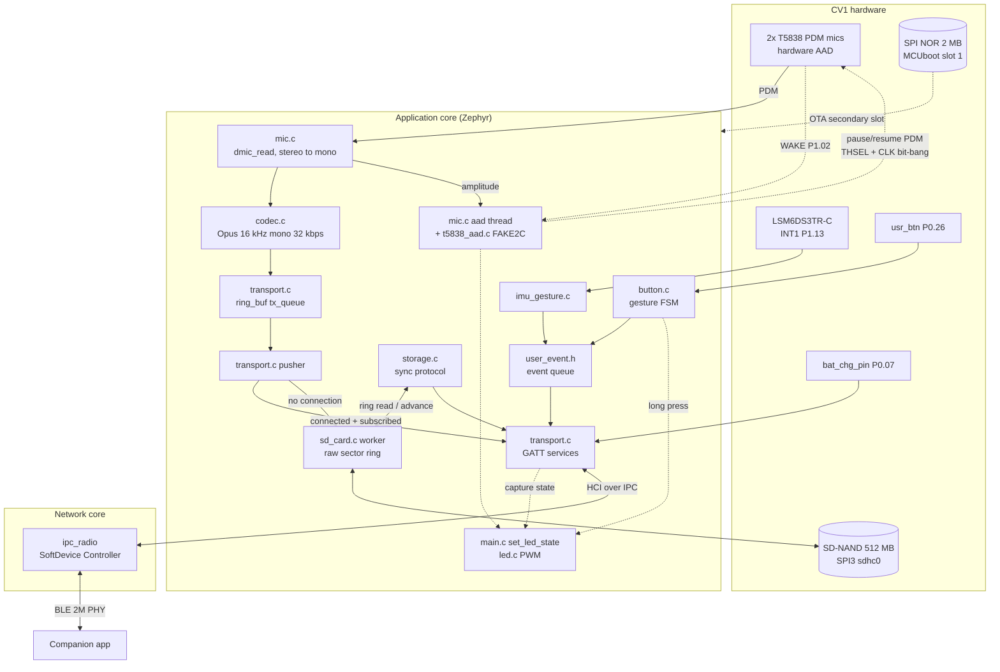

# Omi firmware architecture

*Written from a read-only pass over this vendored tree and over
`~/projects/omi` on 2026-07-23. Reflects upstream `BasedHardware/omi` commit
`ed4e513e64702b33fa088f1a0f58fc60e1935976` on branch `firmware/idle-auto-sleep`
plus the local changes committed in this branch. File paths are cited inline so
every claim is checkable against the source. Nothing here has been compiled or
run on hardware — see §5.*

Companion documents: [`PROVENANCE.md`](PROVENANCE.md) (what was vendored, how to
re-sync), [`README.md`](README.md) (build and flash), [`BLE_CONTRACTS.md`](BLE_CONTRACTS.md)
(the app-facing GATT interface).

## 1. What the firmware is

### 1.1 Devices in this tree

| Directory | Device | SoC | RTOS / SDK | Bootloader |
| --- | --- | --- | --- | --- |
| `omi/` | Omi CV1 pendant (production) | nRF5340, dual Cortex-M33 | Zephyr via nRF Connect SDK v2.9.0 | MCUboot, sysbuild, 4 images |
| `devkit/` | Seeed XIAO nRF52840 Sense DevKit, three configurations | nRF52840, single Cortex-M4F | Zephyr | Adafruit UF2 bootloader |
| `test/` | CV1 board bring-up + BLE throughput harness | nRF5340 | Zephyr, sysbuild | MCUboot |

`boards/omi/` is the out-of-tree board definition shared by `omi/` and `test/`;
`bootloader/mcuboot/` holds the MCUboot fragment and the image signing key both
use. The DevKit uses an in-tree Zephyr board and needs neither.

### 1.2 CV1 silicon and peripherals

Grounded in `boards/omi/omi_nrf5340_cpuapp.dts` unless noted.

- **nRF5340**, dual core. The application core runs the Zephyr application; the
  network core runs Nordic's SoftDevice Controller inside the `ipc_radio` image,
  reached over `bt_hci_ipc0`. Split-core Kconfig matters: `CONFIG_BT_CTLR_*`
  symbols only take effect in `omi/sysbuild/ipc_radio.conf`, not in
  `omi/omi.conf`.
- **Microphones**: two T5838 top-port PDM MEMS mics on `pdm0` (`dmic0` alias),
  16 kHz, stereo, mixed to mono in `omi/src/mic.c`. The T5838 has a hardware
  Acoustic Activity Detector; `pdm_en_pin` (P1.04) powers its 1.8 V rail,
  `pdm_thsel_pin` (P1.05) is the FAKE2C configuration line and `pdm_wake_pin`
  (P1.02) is its WAKE output.
- **IMU**: LSM6DS3TR-C on `i2c2` at 0x6A, `irq-gpios` on P1.13, powered through
  the `lsm6dsl_en_pin` fixed regulator (P1.12).
- **Storage**: SD-NAND on `spi3` as `sdhc0` (`zephyr,sdhc-spi-slot` +
  `zephyr,sdmmc-disk`), power-gated by `sdcard_en_pin` (P1.10, GPIO-hogged high
  at boot). A separate Puya P25Q16 SPI NOR (2 MB) sits on the same SPI3 bus at
  CS1 and is the MCUboot secondary slot (`nordic,pm-ext-flash = &spi_flash`).
- **nRF7002** Wi-Fi 6 companion on QSPI (`nrf7002@1`). Present in the
  devicetree, **not used**: no `CONFIG_WIFI` anywhere in `omi/omi.conf`, and no
  source file references it. See §4.6.
- **Power/UI**: three PWM LEDs on `pwm0`, a haptic motor on P0.25
  (`motor_pin`), a user button on P0.26 (`usr_btn`, pull-up, active low),
  battery sense on P0.06 via SAADC AIN0 with a divider, charge detect on P0.07
  (`bat_chg_pin`, active low), and an RF switch enable on P1.03.
- **Flash layout**: MCUboot at 0, 64 KB; `slot0` 256 KB; the partition manager
  layout in `boards/omi/pm_static.yml` places the application at `0xf200` and
  the MCUboot secondary in external flash at `0x130000`.

### 1.3 CV1 runtime structure

`omi/src/main.c` is a straight-line bring-up followed by a 1 Hz supervisor loop.
Boot order: watchdog → haptic → LEDs → suspend the SPI NOR → NVS settings → RTC
restore → IMU time-base replay → IMU gestures → battery → button → SD card →
offline storage thread → BLE transport → Opus codec → microphone. Every step
that fails calls a distinct `error_*()` LED/haptic pattern from
`omi/src/feedback.c`.

The loop then does four things every second: feed the watchdog, drive the status
LED from `is_charging` / `is_connected` / `is_capturing` / battery level /
`rtc_is_valid()`, and evaluate idle auto-sleep.

Concurrency is a handful of long-lived threads rather than a scheduler
abstraction:

| Thread | Defined in | Job |
| --- | --- | --- |
| `main` | `omi/src/main.c` | supervisor loop, LED, idle timer |
| mic | `omi/src/mic.c` | `dmic_read()` → stereo-to-mono → VAD bookkeeping → codec |
| `aad` | `omi/src/mic.c` | T5838 hardware sleep/wake transitions |
| codec | `omi/src/lib/core/codec.c` | Opus encode, 19 KB stack |
| pusher | `omi/src/lib/core/transport.c` | ring buffer → GATT notifications, or → SD when offline |
| storage | `omi/src/lib/core/storage.c` | offline sync protocol state machine |
| SD worker | `omi/src/sd_card.c` | the only thread that touches the SD, 8 KB stack, two message queues (normal + priority) |
| button work | `omi/src/lib/core/button.c` | 25 Hz polled gesture FSM |

### 1.4 Audio and control data flow

The single most important structural fact: **audio goes to exactly one of BLE or
SD, never both**. `pusher()` in `omi/src/lib/core/transport.c` streams to GATT
when a central is connected and subscribed, writes to the SD ring when there is
no connection at all, and drops the frame when connected but unsubscribed.

### 1.5 Audio path

`omi/src/lib/core/config.h` and `omi/src/lib/core/codec.c`: 16 kHz, mono, Opus
1.2.1 (vendored under `omi/src/lib/core/lib/opus-1.2.1/`), 20 ms frames,
32 kbps unconstrained VBR, `OPUS_APPLICATION_RESTRICTED_LOWDELAY`,
`OPUS_SIGNAL_VOICE`, complexity 3, **DTX off**, no in-band FEC. The encoder is a
static 7180-byte buffer, no heap.

DTX off means silence costs full bitrate. Silence suppression happens at the
microphone instead (§3.2), which is strictly better for power because it stops
the PDM peripheral as well as the encoder.

### 1.6 Storage

`omi/src/sd_card.c` does **not** use a filesystem. It writes raw 512-byte
sectors through `disk_access_*`: 64 metadata sectors holding a
generation-numbered round-robin of ring pointers, then fixed 32-sector (16 KiB)
batches of 36 packets each. A packet is 444 bytes: a 4-byte big-endian UTC
second followed by 440 bytes of length-prefixed Opus frames.

The SD-NAND is a 512 MB managed part (bad-block management and ECC behind an SD
controller), which is why it presents as an SDMMC disk over SPI. Usable ring
capacity works out to roughly 480 MB, about 35 hours of continuous 32 kbps
audio; `MAX_STORAGE_BYTES` in `omi/src/lib/core/sd_card.h` encodes the same
budget. It is a **ring**: once full, the oldest audio is overwritten and the
loss is only visible as a rising `dropped_packets` counter.

Two hard preconditions, both worth knowing before debugging "it isn't
recording":

1. **No clock, no recording.** `process_write_data_req()` returns early unless
   `rtc_is_valid()` and the epoch is at least `1700000000`, because every packet
   is timestamped. The red-blinking LED in `set_led_state()` is the signal.
2. **No connection, or nothing.** See §1.4.

The separate 2 MB SPI NOR is not audio storage: `omi/src/spi_flash.c` suspends
it at boot, and its only role is as the MCUboot secondary slot for OTA.

### 1.7 BLE

`omi/src/lib/core/transport.c` registers the audio service (`19B10000`),
settings (`19B10010`), features (`19B10020`), time sync (`19B10030`) and, when
offline storage is enabled, the storage service (`30295780` from
`omi/src/lib/core/storage.c`). `button.c` and `haptic.c` register their own.
Zephyr's BAS (`0x180F`) and DIS (`0x180A`) come from Kconfig. OTA is Zephyr's
SMP-over-BLE via `CONFIG_NCS_SAMPLE_MCUMGR_BT_OTA_DFU`.

On connect the peripheral requests 7.5–15 ms interval, 2M PHY, maximum data
length and a large ATT MTU, retrying the MTU exchange up to six times. Audio and
bulk sync notifications share a TX-slot semaphore that always reserves two
buffers for short control notifications, so a long sync cannot starve battery or
status updates.

Full per-characteristic detail is in [`BLE_CONTRACTS.md`](BLE_CONTRACTS.md).

### 1.8 Power management

Layered, from cheapest to deepest:

1. **Hardware AAD** (`omi/src/mic.c`, `omi/src/t5838_aad.c`): after
   `CONFIG_OMI_VAD_HOLD_MS` of silence the PDM peripheral is stopped and the
   T5838 is bit-banged into its own detector; the mic draws tens of microamps
   and the WAKE pin brings it back. SD power is dropped too when no phone is
   connected. Nothing reaches the codec, BLE or the SD ring while asleep.
2. **Peripheral gating**: SD suspend/resume around each batch flush, SPI NOR
   suspended at boot, the SD chip-select disconnected entirely on full shutdown.
3. **Idle auto-sleep** (`update_idle_sleep()` in `omi/src/main.c`): after
   `CONFIG_OMI_IDLE_SLEEP_TIMEOUT_MIN` minutes with no audio subscriber and no
   charger, `turnoff_all()` runs and the SoC enters system off.
4. **System off**: `sys_poweroff()`. Wake sources are the user button
   (`GPIO_INT_LEVEL_LOW` on `usr_btn`) and, new in this branch, IMU motion. The
   radio is unpowered, so BLE cannot wake it — see §4.

Timekeeping survives system off by a trick in `omi/src/imu.c`: the IMU's
free-running timestamp counter and the current epoch are written to NVS on the
way down and the elapsed delta is replayed on boot.

### 1.9 DevKit differences

`devkit/` is a separate, older codebase, not a build variant of `omi/`. It has
its own `transport.c`, `button.c`, `mic.c`, `storage.c` and `sdcard.c`. Notable
divergences:

- Offline storage is FATFS over an external SPI SD module, not a raw ring, and
  only in the `-spisd` configuration.
- OTA is the Nordic legacy DFU service (`00001530`) handled by the Adafruit UF2
  bootloader, not MCUboot.
- It has an accelerometer streaming service (`32403790`) that the CV1 build
  compiles out.
- Its microphones (XIAO Sense onboard PDM on v1, Adafruit PDM BFF on v2) have no
  hardware activity detector.
- The button is an external switch the user wires between D4 and D5; see
  `README.md`.

## 2. What we skip versus upstream

Upstream `~/projects/omi` is a full product monorepo (`app`, `backend`,
`desktop`, `sdks`, `plugins`, `web`, `mcp`, `infrastructure`, `omiGlass`, …).
This tree vendors only the firmware subtree, and only part of it.

**Vendored**: `omi/firmware/{omi,devkit,test,boards/omi,bootloader/mcuboot}`
plus `.clang-format` and `BUILD_AND_OTA_FLASH.md`.

**Deliberately not vendored:**

| Upstream path | Why not |
| --- | --- |
| `omi/firmware/FLASH_3.0.8/` | ~40 MB of prebuilt `.hex` images and Windows `.exe` flashing tools for a 2024-era release. Superseded by building from source. |
| `omi/firmware/bootloader/bootloader0.9.0.uf2`, `bootloader/deprecated/` | XIAO nRF52840 Adafruit bootloader images. Not built here and unrelated to the nRF5340. |
| `omi/firmware/omi/src/lib/evt/` | An EVT-hardware bring-up variant. Not referenced by `omi/CMakeLists.txt`, so it never compiled into any image. |
| `omi/firmware/bootloader/mcuboot/enc-rsa2048-{priv,pub}.pem` | MCUboot image **encryption** keys. Encryption is not enabled anywhere (no `SB_CONFIG_BOOT_ENCRYPTION`, no reference in any `.conf`), so the private key is not carried. |
| `omi/firmware/AGENTS.md` | Upstream repository's own agent instructions. |
| `omiGlass/` | Different product, different architecture — see §2.1. |
| everything outside `omi/firmware` | Application, backend, SDKs, web — out of scope for a firmware tree. |

Note the earlier plan excluded `devkit/` and `test/` as well. That was reversed:
both are now vendored and the DevKit carries a port of the feature work (§3).

### 2.1 The glasses firmware: assessed, not vendored

`omiGlass/firmware` upstream is a **Seeed XIAO ESP32-S3 Sense** application:
`platformio.ini` targets `platform = espressif32`, `framework = arduino`, with a
`firmware.ino`, `camera_pins.h`, `mulaw.h` and a `partitions_ota.csv`. There is
a near-identical public sibling, `BasedHardware/OpenGlass`, same board, built
with the Arduino IDE / arduino-cli rather than PlatformIO.

**Recommendation: do not vendor it here.** Reasons, in order of weight:

1. **Nothing ports.** Every feature in this branch is Zephyr-specific — Kconfig
   symbols, devicetree bindings, `bt_gatt_*`, `sys_poweroff()`, the nRF5340
   sysbuild image set. An ESP32 Arduino sketch shares none of it. The BLE
   contracts in `BLE_CONTRACTS.md` do not apply to it either; it is a camera
   device with its own protocol.
2. **A second toolchain.** It would put PlatformIO/Arduino-ESP32 next to nRF
   Connect SDK in the same directory, and any CI matrix would have to install
   both.
3. **The upstream tree carries a build cache.** `omiGlass/firmware/.pio/libdeps/`
   is a committed copy of NimBLE-Arduino and friends — hundreds of files of
   vendored third-party library, not source we would maintain.
4. **Two candidate upstreams, unresolved.** OpenGlass and omiGlass target the
   same board and are plausibly fork and productization of each other. Vendoring
   before establishing which is current would bake in the wrong one.

If glasses firmware is wanted in-tree later, vendor it as a clearly separate
top-level directory (not under `firmware/`, which is Zephyr), settle the
OpenGlass/omiGlass question first, exclude `.pio/`, and give it its own CI job.

`BasedHardware/Whomane` is a Raspberry Pi wearable driven by Python, not MCU
firmware, and is out of scope entirely.

## 3. What we changed over upstream

Upstream branch `firmware/idle-auto-sleep` already contained, relative to
upstream `main`: idle auto-sleep, the BLE sleep command (`19B10014`), the
capture-state LED and characteristic (`19B10015`), the writable persisted device
name (`19B10016`), the battery-low LED, and DIS firmware/hardware revision
reporting. Those were vendored as-is; the list below is what this branch adds on
top.

### 3.1 Button gestures with timestamps — CV1 and DevKit

*Upstream*: single and double tap notify the legacy button service
(`23BA7925`) with an 8-byte `int[2]` carrying only an event code — no timestamp,
no sequence number, and nothing at all if the app is not connected at that
instant. `LONG_TAP` and `BUTTON_PRESS` codes exist but are never emitted.

*Ours*: a new user-event characteristic `19B10017` in the settings service
carrying code, source, a 16-bit sequence number and a UTC timestamp from the
existing RTC. Single tap is defined as **bookmark / "mark this moment"** (`0x01`)
and double tap as **assistant trigger** (`0x02`); long press still powers off
but now emits `POWER_OFF` (`0x03`) first, so an app sees an intentional shutdown
instead of an unexplained disconnect. Events raised while disconnected are held
in a 16-deep ring and flushed in order on subscribe. The legacy button service
is untouched, so existing app builds keep working.

`omi/src/lib/core/user_event.h`, `omi/src/lib/core/transport.c`,
`omi/src/lib/core/button.c`; DevKit equivalent in `devkit/src/omi_ext.c`.

**Limitation, stated plainly**: the queue is RAM only. A tap made while
disconnected survives a reconnect but not a reboot or a system-off cycle.
Persisting it would require bumping `RAW_LAYOUT_VERSION` in `omi/src/sd_card.c`
and was left out deliberately.

### 3.2 Hardware VAD gating — CV1 only

*Upstream*: `omi/src/t5838_aad.c` and the AAD thread in `omi/src/mic.c` already
existed and already worked; the mode-A bandwidth and threshold were hard-coded
constants (`0x02`, `0x06`).

*Ours*: those two are now `CONFIG_OMI_AAD_A_LPF` and
`CONFIG_OMI_AAD_A_THRESHOLD`, with the original values as defaults and as
fallbacks if the symbols are absent, so wake sensitivity is retunable from
`omi.conf` without patching the driver. Separately, the capture LED no longer
shows blue while the mic is in AAD sleep — the app is subscribed but no audio is
flowing, which previously read as "recording" — and the AAD transitions emit
user events `0x10`/`0x11` so the app can distinguish "silent" from "gone".

*DevKit*: **not ported, and not faked.** The XIAO Sense onboard PDM mic and the
Adafruit PDM BFF have no acoustic activity detector. Instead
`CONFIG_OMI_ENABLE_SW_VAD_GATE` (default off) adds an explicitly labelled
software gate in `devkit/src/main.c` that suppresses the codec, the BLE stream
and SD writes during silence but leaves the microphone and PDM peripheral
running. Its Kconfig help says so; it is a fraction of the CV1 saving.

### 3.3 Accelerometer wake and gestures — CV1 only

*Upstream*: `omi/src/imu.c` used the LSM6DS3TR-C only as a timekeeping counter
across system off. `omi/src/lib/core/accel.c` streams samples over BLE but is
not listed in `omi/CMakeLists.txt`, so it has never built.

*Ours*: new `omi/src/imu_gesture.c` programs the IMU's embedded activity
detector, routes it latched to INT1 (P1.13, already declared as `irq-gpios` in
the board DTS), and re-arms it as a level interrupt before `sys_poweroff()` so
the nRF5340 GPIO SENSE block wakes the SoC. **The pendant can now come back from
idle auto-sleep on movement alone.** While running, motion emits user event
`0x20` and resets the idle timer, so a worn pendant does not fall asleep.
Double-tap-the-pendant (`0x21`) is implemented but defaults off: it needs the
accelerometer at 416 Hz instead of 26 Hz and its thresholds are unvalidated.

*DevKit*: **not ported.** The DevKit configs set
`CONFIG_LSM6DSL_TRIGGER_GLOBAL_THREAD=y`, so Zephyr's driver owns INT1 while
this implementation needs to own it directly, and the XIAO Sense board DTS
routing of `irq-gpios` could not be checked without the SDK installed. It needs
hardware in hand.

### 3.4 Charging state over BLE

*Upstream*: the characteristic `19B10013` existed with notify, but the only
thing that ever notified it was the 5-second battery work item, so the app
mirrored the green charging LED up to five seconds late. Worse,
`notify_charging_status()` and `charging_status_last_notified` were compiled only
under `CONFIG_OMI_ENABLE_BATTERY` while being called unconditionally from the
CCC handler, and the read handler dereferenced an `is_charging` that was only
declared in the battery build.

*Ours*: the `bat_chg_pin` GPIO interrupt now schedules an immediate,
deduplicated notification through the system workqueue
(`transport_notify_charging_changed()`), and both symbols moved out of the
battery-only block. The 1-byte payload is unchanged.

*DevKit*: exposed only when `CONFIG_OMI_ENABLE_USB=y`, because the DevKit's only
charge signal is the VBUS detect in `devkit/src/usb.c`; without it the
characteristic would report a constant 0.

### 3.5 Offline storage contract

*Upstream*: fully implemented — a raw sector ring with `RING_INFO` / `RING_READ`
/ `RING_ADVANCE` / `RING_CLEAR` opcodes, incremental checkpointing of the read
pointer as the phone confirms receipt, and a cached status characteristic. It
was **undocumented**.

*Ours*: verified against the implementation and documented completely in
`BLE_CONTRACTS.md` §7 — every opcode, every notification layout, the
endianness split between the control characteristic (big-endian) and the status
characteristic (little-endian), the packet framing, ring-overwrite semantics,
and the recommended sync flow. Two behavioural fixes:

- `send_ring_info_response()` now retries on `-ENOMEM` within the existing 5 s
  deadline instead of silently dropping the reply. The app issues `RING_INFO`
  once per sync, so a transient missing TX buffer used to stall the whole sync.
- `push_to_gatt()` sized audio notifications as `ATT_MTU` bytes when the maximum
  payload is `ATT_MTU − 3`. Harmless above MTU 163 because a codec frame is at
  most 160 bytes, but between the MTU floor of 100 and 163 every notification
  would be rejected and dropped after three retries.

### 3.6 Build-derived firmware version

*Upstream*: `CONFIG_BT_DIS_FW_REV_STR` was a hand-maintained literal — `"3.0.20"`
on CV1, and three divergent strings (`"1.0.5"`, `"1.0.5"`, `"2.0.10"`) across the
DevKit configs.

*Ours*: a Zephyr `VERSION` file per application, parsed by `CMakeLists.txt`
before `find_package(Zephyr)` into a generated Kconfig fragment appended to
`EXTRA_CONF_FILE`, which overrides the `.conf` value. The DIS `0x2A26` contract
is unchanged. The `.conf` files keep `"0.0.0+unset"` as a loud sentinel. On CV1
the same file also feeds imgtool's image version, which is what MCUboot's
downgrade prevention actually compares.

### 3.7 Power and latency tuning

*Upstream*: connection parameters were the literals `{6, 12, 0, 400}` in
`transport.c` while `omi.conf` advertised a 6 s supervision timeout; 2M PHY was
already requested by `update_phy()`.

*Ours*: those became `CONFIG_OMI_CONN_INTERVAL_FAST_MIN/MAX` and
`CONFIG_OMI_CONN_SUPERVISION_TIMEOUT`, and `CONFIG_BT_PERIPHERAL_PREF_TIMEOUT`
was aligned to the value actually requested. `CONFIG_BT_CTLR_PHY_2M=y` is now
stated in `omi/sysbuild/ipc_radio.conf`, where controller symbols take effect,
and `CONFIG_BT_CTLR_PHY_CODED` is turned off there because nothing requests
coded PHY and it costs network-core flash.

A new `CONFIG_OMI_ENABLE_ADAPTIVE_CONN_PARAMS` relaxes the link to 30–50 ms with
peripheral latency 4 whenever audio is unsubscribed and no sync is running.
**It defaults to off**: an earlier attempt to force slow parameters from the AAD
sleep path caused dropped connections on some phones — the comment recording
that is still in `omi/src/mic.c` `enter_hw_aad()` — so it needs per-phone
validation before shipping enabled.

### 3.8 Lean configuration pass

Every removal from `omi/omi.conf` was justified against the sources; the full
list with reasoning is in the commit `perf(firmware): connection-parameter
tuning and a lean config pass`. The largest is `CONFIG_FILE_SYSTEM` and
`CONFIG_FILE_SYSTEM_LITTLEFS`: `omi/src/sd_card.c` uses raw `disk_access_*` and
there is not a single `fs_*` call anywhere under `omi/src/`, so the whole VFS and
LittleFS stack was dead flash and RAM. Also removed: `CONFIG_INIT_STACKS` (a
debug aid), `CONFIG_CBPRINTF_FP_SUPPORT` (after converting the only two `%f` log
lines to integer math), `CONFIG_ADC_ASYNC` (only `adc_read()` is used),
`CONFIG_POSIX_CLOCK` (unused), `CONFIG_NORDIC_QSPI_NOR` (no `nordic,qspi-nor`
node exists), the inert `CONFIG_BT_CTLR_*` block, a `CONFIG_I2C=n` that
contradicted `CONFIG_I2C=y` earlier in the same file, and sixteen duplicate
assignments.

Left alone deliberately: `CONFIG_HEAP_MEM_POOL_SIZE=40000` (no way to measure
the BT/SD demand without a build), `CONFIG_BT_SMP`, the BLE buffer sizes, and
`CONFIG_SERIAL`/`CONFIG_CONSOLE` (the production line parses `BLE_ADDR` from
UART, see `log_local_ble_addresses()`).

### 3.9 Upstream bug fixed in the DevKit

`devkit/prj_xiao_ble_sense_devkitv1-spisd.conf` set
`CONFIG_OMI_OFFLINE_STORAGE=y`, but the symbol declared in `devkit/Kconfig` is
`OMI_ENABLE_OFFLINE_STORAGE`. The SPI-SD build — the entire point of that
configuration — was silently compiled with no offline storage at all.

## 4. Per-device support matrix

`—` means the feature does not exist on that target. Reasons for every `—` in
the DevKit columns are in §3.

| Feature | CV1 `omi/` | DevKit v1 | DevKit v1-spisd | DevKit v2-adafruit |
| --- | --- | --- | --- | --- |
| Opus 16 kHz mono audio stream (`19B10001`) | yes | yes | yes | yes |
| Codec id (`19B10002`) | yes | yes | yes | yes |
| Speaker (`19B10003`) | off | off | off | yes |
| LED dim ratio (`19B10011`) | yes | — | — | — |
| Mic gain (`19B10012`) | yes | — | — | — |
| Charging state (`19B10013`) | yes | — | — | yes |
| BLE sleep command (`19B10014`) | yes | needs button | needs button | yes |
| Capture state (`19B10015`) | yes | yes | yes | yes |
| Writable device name (`19B10016`) | yes | — | — | — |
| User events (`19B10017`) | yes | yes | yes | yes |
| — single tap = bookmark | yes | needs button | needs button | yes |
| — double tap = assistant | yes | needs button | needs button | yes |
| — power-off warning | yes | needs button | needs button | yes |
| — mic sleep/wake | yes | — | — | — |
| — IMU motion / tap | yes | — | — | — |
| Features bitmap (`19B10021`) | yes | yes | yes | yes |
| Time sync (`19B10031`/`32`) | yes, NVS-backed | yes, RAM only | yes, RAM only | yes, RAM only |
| Offline storage (`30295780`) | yes, raw ring | — | yes, FATFS | yes, FATFS |
| Legacy button service (`23BA7925`) | yes | needs button | needs button | yes |
| Haptic (`CAB1AB96`) | yes | — | — | yes |
| Accelerometer stream (`32403790`) | — | — | — | yes |
| Battery level (BAS `0x2A19`) | yes | yes | yes | yes |
| DIS (`0x180A`), build-derived `0x2A26` | yes | yes | yes | yes |
| OTA | MCUboot / SMP over BLE | UF2 + legacy DFU | UF2 + legacy DFU | UF2 + legacy DFU |
| Hardware AAD VAD | yes (T5838) | — | — | — |
| Software VAD gate | — | opt-in | opt-in | opt-in |
| IMU wake-on-motion from system off | yes | — | — | — |
| Idle auto-sleep | yes | needs button | needs button | yes |
| Battery-low LED | yes | — | — | — |
| Adaptive connection params | opt-in | — | — | — |

"needs button" means the code is present but `CONFIG_OMI_ENABLE_BUTTON` is off
in that configuration because the DevKit button is an external switch the user
wires themselves; see `README.md`.

**Other Omi hardware is architecturally unrelated.** The glasses firmware
(`omiGlass`, and the `OpenGlass` sibling repository) is a Seeed XIAO ESP32-S3
Sense Arduino application and Whomane is a Raspberry Pi Python wearable. Neither
runs Zephyr, neither implements any characteristic in
[`BLE_CONTRACTS.md`](BLE_CONTRACTS.md), and no feature in this tree ports to
either. Apps must not assume a shared GATT profile across them.

## 5. Known gaps and caveats

**Nothing in this branch has been compiled.** No Zephyr SDK and no nRF Connect
SDK is installed on the machine where the changes were made — `west`, `nrfutil`
and `arm-zephyr-eabi-gcc` are all absent. What was done instead: every
`CONFIG_OMI_*` referenced in the C sources or in `CMakeLists.txt` was checked to
exist in the corresponding `Kconfig`, every `CONFIG_OMI_*` set in a `.conf` was
checked to be declared, and every `DT_NODELABEL` / `DT_ALIAS` used in the
sources was checked to resolve against `boards/omi/omi_nrf5340_cpuapp.dts` or
the nRF5340 SoC DTSI. That catches missing symbols and typos; it does not catch
type errors, link errors or anything about runtime behaviour. Build all four
targets (`README.md`) before trusting any of it.

**BLE cannot wake the device from system off.** This is physics, not a missing
feature: in nRF5340 system off the radio is unpowered and only the GPIO SENSE
block and a handful of wake sources remain. The wake sources are the user button
and, new here, IMU motion. Any app UX that assumes "reconnect to wake the
pendant" is wrong; the `POWER_OFF` user event (`0x03`) exists so the app can say
so honestly.

**Retention is a ceiling, and the ring overwrites silently.** About 480 MB of
usable ring at 32 kbps ≈ 35 hours of continuous audio. Past that the oldest
audio is overwritten; the only signal is the `dropped_packets` counter in the
`RING_INFO` response. Hardware AAD gating should push real-world retention well
past 35 hours because silence is never encoded, but that is a behavioural
argument, not a measured one — nobody has run it on hardware from this branch.

**Enabling Opus DTX is an open question, not a decision.** DTX is explicitly off
(`OPUS_SET_DTX(0)` in `omi/src/lib/core/codec.c`). Turning it on would shrink
the encoded stream during low-level speech pauses that the AAD threshold does
not catch, at the cost of comfort-noise artefacts and a decoder that must handle
DTX frames. It was left unchanged deliberately: it changes the wire format the
app decodes, so it needs an app-side decision and an A/B on real recordings.

**The adaptive connection-parameter path is untested.** Off by default, for the
regression reason in §3.7.

**IMU double-tap thresholds are guesses.** The register values in
`omi/src/imu_gesture.c` are datasheet-plausible defaults, not measured ones,
which is why `CONFIG_OMI_ENABLE_IMU_DOUBLE_TAP` defaults to off.

**Connected-but-unsubscribed loses audio.** If the app holds a connection
without subscribing to `19B10001`, audio is neither streamed nor stored. That is
intentional — it is how "capture off" is expressed — but it also means a long
sync session with audio unsubscribed loses that period.

**The DevKit clock is volatile.** `devkit/src/omi_ext.c` keeps the epoch in RAM
as base + `k_uptime_get()`, because no DevKit configuration enables
`CONFIG_SETTINGS`/NVS. Timestamps on DevKit user events are correct while it is
running and zero after a reboot until the app writes `19B10031` again.

**The DevKit board identifier is unresolved in-tree.**
`devkit/CMakeLists.txt` says `seeed_xiao_nrf52840_sense`,
`devkit/CMakePresets.json` says `xiao_ble_sense`, and NCS v2.9.0 wants
`xiao_ble/nrf52840/sense`. `README.md` recommends passing `-b` explicitly and
confirming with `west boards`; this cannot be settled without the SDK.

**nRF7002 Wi-Fi is present and unused.** Whether a direct Wi-Fi upload path is
worth building is analysed below.

### 5.1 nRF7002: is a direct Wi-Fi upload path feasible?

Feasible, but a significant project rather than a configuration change.

*What exists*: the nRF7002 is on QSPI in `boards/omi/omi_nrf5340_cpuapp.dts`
with the full `nrf70_common.dtsi` / `nrf70_common_5g.dtsi` binding pulled in,
and `boards/omi/omi_nrf5340_cpuapp_defconfig` enables QSPI. `CONFIG_MPSL_CX=y`
in `omi/sysbuild/ipc_radio.conf` shows coexistence with BLE was at least
considered.

*What is missing*: no `CONFIG_WIFI`, `CONFIG_WIFI_NRF700X`,
`CONFIG_NET_L2_WIFI_MGMT`, `CONFIG_NETWORKING` or any TLS/socket configuration
anywhere in `omi/omi.conf`, and no source file references Wi-Fi.

*What it would take*, roughly in order:

1. Enable the nRF70 driver, the Zephyr networking stack, DHCP, DNS, and mbedTLS
   with a certificate store. That is on the order of 150–250 KB of flash and
   tens of KB of RAM; the current application-core slot is 256 KB
   (`boards/omi/omi-cpuapp_partitioning.dtsi`) and the last recorded build used
   about 263 KB of a 982 KB region and 54% of RAM
   (`BUILD_AND_OTA_FLASH.md`). Partition sizing needs re-checking.
2. Credential provisioning and storage — SSID/PSK or WPA-Enterprise — over BLE
   into NVS, plus a UI for it in the app.
3. An upload protocol: HTTPS POST of ring segments, resumable, with the same
   `read_seq` checkpointing the BLE path already has so the two cannot double-
   free ring space.
4. Radio coexistence. The nRF7002 and the BLE controller share the antenna path
   through the RF switch (`rfsw_en_pin`) and MPSL coexistence; syncing over
   Wi-Fi while streaming audio over BLE needs deliberate scheduling.
5. Power budgeting. Wi-Fi TX is orders of magnitude above BLE. It would only
   make sense as a docked/charging-time bulk sync, which is exactly when
   `is_charging` is true and the device is not idle-sleeping — a natural trigger.

*Assessment*: the payoff is real (35 hours of backlog moves in minutes rather
than hours), and the natural design is "bulk-sync while charging". But it is a
multi-week firmware plus app project with a flash-budget risk, and it should not
be started before the current BLE sync path is validated on hardware.
**Not implemented here.**
